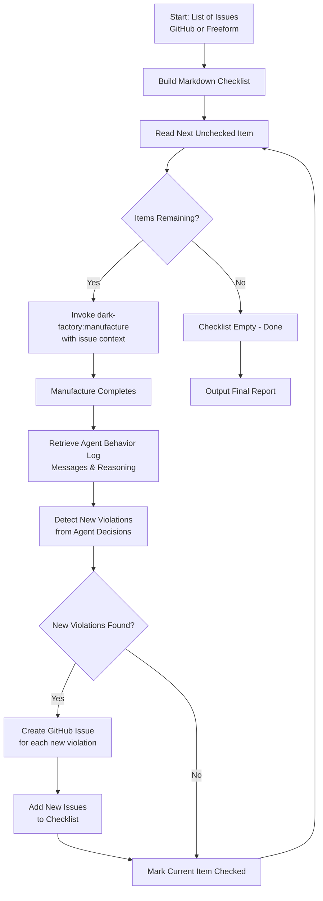

# Implementation Plan: dark-factory:improve Orchestrator

## System Intent

The `dark-factory:improve` orchestrator is a standalone command that continuously fixes pipeline instruction violations. It takes a list of issues (either GitHub issue numbers OR freeform descriptions of problems with the agent flow), builds a markdown checklist, iteratively resolves each issue by invoking `/dark-factory:manufacture`, and automatically detects new failures introduced during the fixes.

**Key characteristics:**
- Standalone: self-contained, deletable when no longer needed
- Flexible input: accepts both GitHub issue numbers and freeform violation descriptions
- Iterative: loops through unchecked items until the checklist is empty
- Self-correcting: scans work after each manufacture invocation for new instruction violations
- Feedback loop: creates new GitHub issues for newly discovered violations and adds them to the checklist

## Goals

1. Create a new command `dark-factory:improve` registered in `commands/improve.md`
2. Implement `improve-orchestrator.md` agent that manages the improvement workflow
3. Build helper scripts for:
   - Issue input parsing (GitHub numbers or freeform descriptions)
   - Checklist management (markdown format)
   - Violation detection from agent behavior logs (agent messages, reasoning, decisions)
4. Implement violation detection logic that analyzes agent decision-making and pipeline compliance
5. Ensure the orchestrator integrates cleanly with existing dark-factory infrastructure

## Mermaid Diagram



## Flows

### Flow 1: Initialization and Checklist Building

**Inputs:**
- `--issues` or stdin: comma-separated list of GitHub issue numbers OR freeform violation descriptions (e.g., `#42, "missing Co-Authored-By in repair-agent", #123`)

**Process:**
1. Parse the issue list, distinguishing between GitHub issue numbers (starting with `#`) and freeform descriptions
2. For GitHub issues:
   - Fetch issue metadata using `gh issue view <number> --json title,body,state`
   - Extract violation description from issue body
3. For freeform descriptions:
   - Use the description text directly as the violation context
4. Build markdown checklist file: `$WORK_DIR/improve-checklist.md`
5. Format:
   ```markdown
   # Improvement Checklist
   
   - [ ] #42 — [Title] (violation description)
   - [ ] "missing Co-Authored-By in repair-agent" — (freeform violation)
   - [ ] #123 — [Title] (violation description)
   ...
   ```
6. Output checklist path and summary

**Error handling:**
- If GitHub issue does not exist: log and skip
- If checklist is empty after parsing: warn user and exit
- Validate that all items relate to something wrong with the agent flow

### Flow 2: Main Improvement Loop

**Process:**
1. Read current checklist from `$WORK_DIR/improve-checklist.md`
2. Find first unchecked item (regex: `^- \[ \]`)
3. Extract issue number or description from line
4. Invoke `/dark-factory:manufacture` with:
   - taskDescription: "Fix violation described in GitHub issue #N" (for issues) or "Fix violation: [description]" (for freeform)
   - Additional context: issue URL (if applicable), violation description
5. Wait for manufacture to complete
6. Capture the work directory created by manufacture

**Error handling:**
- If manufacture returns hard-stop: log the failure and mark item as checked with note (optional: skip to next or halt)
- If manufacture succeeds: proceed to violation detection

### Flow 3: Violation Detection

**Process:**
1. After manufacture completes, retrieve the full manufacture run log and transcript, including ALL agent execution traces:
   - Capture the top-level feature-agent's complete reasoning and decision-making process
   - Extract ALL messages, tool calls, and reasoning traces from feature-agent's invocation
   - Retrieve execution-agent's messages, decisions, and sub-agent delegations
   - Retrieve implementation-agent's code generation decisions and tool usage
   - Retrieve pr-agent's PR composition and messaging decisions
   - Retrieve code-review-agent's review logic and decisions
   - Retrieve any other sub-agents invoked in the chain (repair-agent, investigation-agent, etc.)
   - Retrieve the final PR output and metadata (if applicable)

2. Run detection logic by analyzing the COMPLETE agent behavior chain:
   - For EACH agent in the invocation chain (feature-agent → execution-agent → implementation-agent → pr-agent → code-review-agent → etc.):
     - Scan that agent's messages and reasoning for statements indicating pipeline instruction violations
     - Inspect that agent's tool call decisions and validate they follow pipeline rules
     - Identify points where the agent deviated from or failed to follow pipeline instructions:
       - Agent explicitly stated it skipped a step marked as required
       - Agent made a decision that contradicts pipeline rules (e.g., "I will skip the pre-commit hook check")
       - Agent reasoned itself into a shortcut that violates instructions
       - Agent acknowledged a step should be done but failed to do it
       - Agent misinterpreted or misapplied a pipeline instruction
       - Multi-step sequences the agent was supposed to follow were interrupted or reordered incorrectly
     - Trace sub-agent delegations: when agent A calls agent B, verify agent B's behavior and flag violations in agent B's logic
   - Extract context: what instruction was violated, which agent violated it, which step in that agent's reasoning, what the agent said about it

3. Return list of detected violations (each includes instruction reference, violating agent name, agent quote/reasoning, violation type, path through the agent chain)

**Violation categories:**
- Missing Co-Authored-By footers (agent acknowledged but didn't create)
- Skipped required pre-commit hooks (agent decided to bypass)
- Commits without proper atomic structure (agent grouped unrelated changes)
- Missing test coverage (agent created code without tests)
- Incomplete documentation updates (agent skipped docs even when instructed)
- Tool calls made in wrong order (e.g., committed before review)
- AskUserQuestion depth violations (agent asked at wrong depth)
- Sub-agent delegation failures (parent agent failed to audit child agent behavior)
- Pipeline instruction propagation failures (instruction required at depth-2 not enforced at depth-3)
- Agent reasoning contradictions (agent reasoning contradicts its own actions or other agents' actions)
- Other pipeline instruction deviations (extensible)

**Detection approach:**
The violation detector is essentially a "behavior auditor" that:
1. Replays the ENTIRE agent execution chain (not just the top-level agent)
2. For each agent in the chain, identifies where that agent's own words or actions contradicted the pipeline rules it was supposed to follow
3. Verifies that parent agents properly audited and enforced pipeline compliance in child agents they delegated to
4. Flags violations at the agent-specific level so fixes can target the right agent
5. Catches both intentional shortcuts and honest mistakes in interpretation, across all agents in the pipeline

### Flow 4: Issue Creation and Checklist Update

**Process:**
1. For each newly detected violation:
   - Create GitHub issue with:
     - Title: "Pipeline violation: [category] in [agent name]"
     - Body: description of violation, direct quote/reference from the violating agent's messages, the agent's reasoning, which agent in the chain violated it, suggested fix
     - Label: `pipeline-violation`
   - Capture issue number from created issue
2. Add new violations to checklist BEFORE marking the current item as checked:
   - Append new issue to checklist: `- [ ] #NEW_NUMBER — [Title]`
3. Mark original item as checked:
   - Update `^- \[ \]` to `^- [x]` for the current issue
4. Write updated checklist back to file

**Error handling:**
- If issue creation fails: log and continue (violation tracking may be incomplete)
- Ensure checklist file is always updated before moving to next item

### Flow 5: Completion and Reporting

**Process:**
1. When all items are checked:
   - Generate summary report:
     - Total issues fixed: count of checked items
     - Total new violations found: count of newly created issues
     - Iteration count (number of improvement cycles)
     - Agent violation breakdown: count of violations per agent
2. Output final checklist to stdout with stats
3. Return checklist path and report
4. Clean up work directory (optional, or leave for inspection)

## Implementation Stages

### Stage 1: Command Registration
- Create `commands/improve.md` with proper frontmatter
- Register in `plugin.json` (if needed)

### Stage 2: Agent Skeleton
- Create `agents/improve/agents/improve-orchestrator.md`
- Define agent frontmatter and tools
- Outline main orchestration loop

### Stage 3: Helper Scripts
- `scripts/parse-issues.sh` — Parse issue list (GitHub or freeform) and fetch metadata
- `scripts/build-checklist.sh` — Create initial markdown checklist
- `scripts/detect-violations.sh` — Scan agent behavior log for violations (across all agents in chain)
- `scripts/create-issue.sh` — Create GitHub issue
- `scripts/update-checklist.sh` — Mark items checked, add new issues

### Stage 4: Integration
- Implement main loop in improve-orchestrator
- Wire scripts together
- Test with sample issue list
- Verify violation detection includes sub-agent inspection

### Stage 5: Documentation
- Document violation detection rules (including sub-agent inspection)
- Create examples and usage guide
- Document CLI interface
- Document agent chain violation format

## Testing Strategy

1. Unit tests for violation detection logic (parsing agent messages from all agents)
2. Integration test with mock agent execution chains showing feature-agent → execution-agent → implementation-agent violations
3. Integration test verifying sub-agent delegation auditing (parent agent inspects child agent)
4. Manual test with real issues (in a test repo)
5. Smoke test: run with empty issue list (should exit cleanly)
6. Test case: inject a violation into a sub-agent and verify it's detected

## Success Criteria

- Orchestrator accepts list of issue numbers or freeform descriptions via CLI or stdin
- Builds valid markdown checklist
- Iterates through each unchecked item
- Successfully invokes manufacture for each issue
- Detects violations across ALL agents in the execution chain (feature-agent, execution-agent, implementation-agent, pr-agent, code-review-agent, etc.)
- Detects at least the following violations:
  - Agent statements about skipping required steps
  - Agent reasoning that contradicts pipeline rules
  - Sequence violations (steps done in wrong order)
  - Sub-agent delegations where the child agent violated pipeline rules
  - Parent agent failures to enforce pipeline compliance in delegated sub-agents
- Creates GitHub issues for new violations with the violating agent name in the issue
- Updates checklist as it progresses (adding new violations before marking items checked)
- Reports final statistics with per-agent violation breakdown
- Handles errors gracefully (no data loss)

## Out of Scope

- Integration with dark-factory metrics/monitoring
- Automatic PR merging
- Custom detection rules (extensibility can be added later)
- Concurrent processing of issues

## Dependencies

- GitHub CLI (`gh`) installed and authenticated
- Git repository with remote
- Access to `/dark-factory:manufacture` skill
- Bash, jq, git
- Manufacture run logs/transcripts must be accessible to detect violations
- Agent execution transcripts (feature-agent, execution-agent, implementation-agent, pr-agent, code-review-agent, etc.) must be retrievable

## Risks and Mitigations

| Risk | Mitigation |
|------|-----------|
| Infinite loop if violations always detected | Implement max-iteration counter, manual bailout |
| GitHub API rate limits | Check rate limit before operations, with backoff |
| Manufacture fails silently | Capture and check manufacture output explicitly |
| Checklist file corruption | Use atomic writes, validate JSON before/after |
| New violations introduce regressions | Mark failed items with timestamp, allow manual review |
| Difficulty accessing agent behavior logs | Define clear interface for retrieving manufacture run logs from all agents in chain |
| Sub-agent messages not accessible | Ensure manufacture transcript includes full execution trace for all agents (not just top-level) |
| Too much noise from detailed agent tracing | Implement violation filtering to focus on actual rule violations, not all agent messages |

---

**Status:** Planning Phase - Flows Review (Flow 3 Updated)
**Created:** 2026-04-30  
**Last Updated:** 2026-04-30
