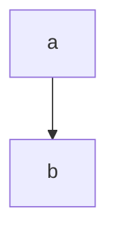

# Bug Title

## Metadata

- Date: `YYYY-MM-DD`
- Status: `open` | `investigating` | `fixed` | `verified`
- Severity: `low` | `medium` | `high` | `critical`
- Related issue/ticket: `N/A`
- Owner: `N/A`

## About

**Overview**:
- What exactly is the bug?
- Why is this bug important?

**Technical Questions**:
- Are we making assumptions about this bug?
- How old is this bug?
- Is there anything obvious we might have missed?
- Are there specific system states required to reproduce it?

**Resources**:
- Link relevant code paths, logs, dashboards, tickets, and PRs.

## Steps to cause failure

> Use the skill at `skills/create-mermaid-diagram/SKILL.md` to generate this diagram.

## System

> Use the skill at `skills/create-mermaid-diagram/SKILL.md` to generate this diagram.

Notes about the system can go here.

## Reproduction Details

1.
2.
3.

Reproduction test (unit preferred): `N/A`

## Notes for PR

A final review detailing the root cause and how it was addressed.

## Audit Log

| ID | Action | Note | Context |
| --- | --- | --- | --- |
| 1 | Create audit log | Initialize bug investigation | issue created |

## Verification

- [ ] Reproduced failure before fix
- [ ] Reproduction test fails before fix
- [ ] Root cause identified with evidence
- [ ] Fix applied at source (no workaround-only patch)
- [ ] Reproduction test passes after fix
- [ ] Reproduction path now passes
- [ ] Regression test added/updated (or `N/A` with reason)
- [ ] Verified no duplicate solved-bug log exists for same root cause
