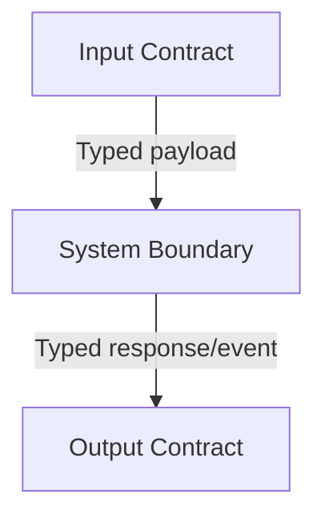

# Plan Title

## Plan Metadata

- Plan type: `plan` | `sub-plan`
- Parent plan: `required for sub-plan; otherwise N/A`
- Depends on:  `N/A`
  - `plan-link`
  - `plan-link`
- Status: `draft` | `approved` | `documentation`

Status semantics:
- `draft`: Plan is being created or updated and is not final.
- `approved`: Plan is approved but not yet applied in code.
- `documentation`: Code currently exists and matches the plan contract.


Update rule:
- When an existing plan is edited, set status to `draft` until re-approved.

## System Intent

- What is being built:
- Primary consumer(s):
- Boundary (black-box scope only):

## Stage Gate Tracker

- [ ] Stage 1 Mermaid approved
- [ ] Stage 2 I/O contracts approved
- [ ] Stage 3 pseudocode/technical details approved or skipped

## 1. Mermaid Diagram

Reference: `.agent/skills/create-mermaid-diagram/SKILL.md`



ONCE YOU GET APPROVAL FROM THE DEVELOPER, DELETE THIS LINE AND UPDATE THE STAGE GATE TRACKER

## 2. Black-Box Inputs and Outputs

Keep this short. Define types in JSON-style blocks and capture each flow with path-level rows.
- Flow naming rule: each flow uses this format:
  - ``### Flow: `<flowname>` ``
  - ``- Test files: <path/to/test_file.ext>, ...`` (or `N/A` when no automated test is required)
  - ``- Core files: <path/to/core_file.ext>, ...``
- `N/A` means explicit no-test-required waiver for that flow (not a missing mapping).

### Global Types

Define shared types used across multiple flows.

```txt
Identifier {
  value: string (stable unique identifier)
}

RequestMetadata {
  trace_id: string (request trace identifier)
  requested_at: timestamp (request timestamp)
}

StandardError {
  status: number (HTTP status)
  code: string (stable machine-readable code)
  message: string (human-readable summary)
}
```

### Flow: `createResource`
- Test files: `tests/test_create_resource.py`
- Core files: `src/resource_service.py`

#### Type Definitions

```txt
CreateResourceInput {
  id: Identifier (required)
  metadata: RequestMetadata (required)
}

CreateResourceOutput {
  result_id: Identifier (identifier for created/updated result)
  status: string (domain-specific success status)
}
```

#### Paths

| path-name | input | output/expected state change | path-type | notes | updated |
| --- | --- | --- | --- | --- | --- |
| `createResource.success` | `CreateResourceInput` | `CreateResourceOutput; primary resource is created/updated` | `happy path` | `use real business rule notes here` | `Y` |
| `createResource.validation-failure` | `CreateResourceInput` | `StandardError status=400 code=invalid-input` | `error` | `no state change on validation failure` | |

### Flow: `transitionResource`
- Test files: `tests/test_transition_resource.py`
- Core files: `src/resource_state.py`

#### Type Definitions

```txt
TransitionResourceInput {
  source_id: Identifier (required)
  metadata: RequestMetadata (required)
}

TransitionResourceOutput {
  state: string (resulting state label)
  updated_at: timestamp (state transition timestamp)
}
```

#### Paths

| path-name | input | output/expected state change | path-type | notes | updated |
| --- | --- | --- | --- | --- | --- |
| `transitionResource.success` | `TransitionResourceInput` | `TransitionResourceOutput; resource transitions to expected state` | `happy path` | `document downstream effects if any` | `Y` |
| `transitionResource.not-allowed` | `TransitionResourceInput` | `StandardError status=409 code=state-conflict` | `error` | `state transition is rejected` | |

### Flow: `linkChildToParent`
- Test files: `tests/test_link_child_to_parent.py`
- Core files: `src/resource_links.py`

#### Type Definitions

```txt
LinkChildToParentInput {
  parent_id: Identifier (required)
  child_id: Identifier (required)
}

LinkChildToParentOutput {
  linked: boolean (whether relationship exists after operation)
}
```

#### Paths

| path-name | input | output/expected state change | path-type | notes | updated |
| --- | --- | --- | --- | --- | --- |
| `linkChildToParent.success` | `LinkChildToParentInput` | `LinkChildToParentOutput linked=true; relationship is stored` | `happy path` | `idempotent behavior can be documented here` | `Y` |
| `linkChildToParent.already-linked` | `LinkChildToParentInput` | `LinkChildToParentOutput linked=true; no additional state change` | `subpath` | `example idempotent subpath` | |
| `linkChildToParent.missing-parent` | `LinkChildToParentInput` | `StandardError status=404 code=not-found` | `error` | `parent resource must exist` | |

## 3. Pseudocode / Technical Details for Critical Flows (Optional)

Use this section for implementation-oriented details that are too low-level for System Intent, including:
- Deployment/build prerequisites (required inputs, generated artifacts, external setup steps).
- Required secrets/config injection steps and ownership/sign-off checkpoints.
- Critical execution strategy details needed for successful implementation.

- Flow name::
```
pseudocode goes in here
```
- Implementation notes:

ONCE YOU GET APPROVAL FROM THE DEVELOPER, DELETE THIS LINE AND UPDATE THE STAGE GATE TRACKER

## 4. Handoff to Related Plan Reconciliation

After all stages are approved, apply `.agent/skills/reconcile-plans/SKILL.md` to propagate contract updates across linked plans.
