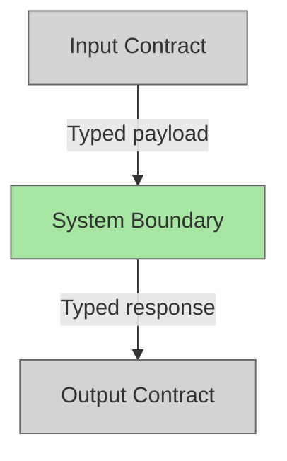

# Plan Title

## System Intent

- What is being built:
- Primary consumer(s):
- Boundary (black-box scope only):

## Stage Gate Tracker

- [ ] Stage 1 Mermaid approved
- [ ] Stage 2 Flows approved
- [ ] Stage 3 Logs + Deployment approved or skipped

## Mermaid Diagram

> Use the skill at `skills/create-mermaid-diagram/SKILL.md` to generate this diagram.



ONCE YOU GET APPROVAL FROM THE DEVELOPER, DELETE THIS LINE AND UPDATE THE STAGE GATE TRACKER

## Flows

- Flow naming rule: ``### Flow: `<flowname>` ``
- `N/A` for test files means explicit no-test-required waiver (not a missing mapping).

### Global Types

```txt
StandardError {
  message: string (human-readable description of what went wrong)
}
```

### Flow: `exampleFlow`
- Test files: `tests/test_example.py`
- Core files: `src/example.py`

#### Types

```txt
ExampleInput {
  id: string (required)
}

ExampleOutput {
  result: string (description)
}
```

#### Paths

| path | input | output | path-type | notes | updated |
| --- | --- | --- | --- | --- | --- |
| `exampleFlow.success` | `ExampleInput` | `ExampleOutput` | `happy path` | | |
| `exampleFlow.not-found` | `ExampleInput` | `StandardError` | `error` | | |

#### Pseudocode

> Only include if this flow has non-obvious implementation details worth preserving.

```
omit this section if not needed
```

ONCE YOU GET APPROVAL FROM THE DEVELOPER, DELETE THIS LINE AND UPDATE THE STAGE GATE TRACKER

## Logs

| Source | Location |
|--------|----------|
| example | `CloudWatch: /aws/lambda/example` |

## Deployment

- Mechanism: `SAM` | `docker` | `Lambda direct` | `local only` | other
- Deploy command:
  ```bash
  # command here
  ```
- Notes:

ONCE YOU GET APPROVAL FROM THE DEVELOPER, DELETE THIS LINE AND UPDATE THE STAGE GATE TRACKER

## Handoff to Related Plan Reconciliation

After all stages are approved, apply `.agent/skills/reconcile-plans/SKILL.md` to propagate contract updates across linked plans.
