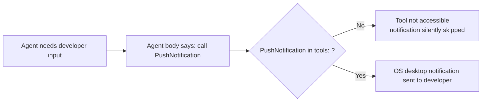
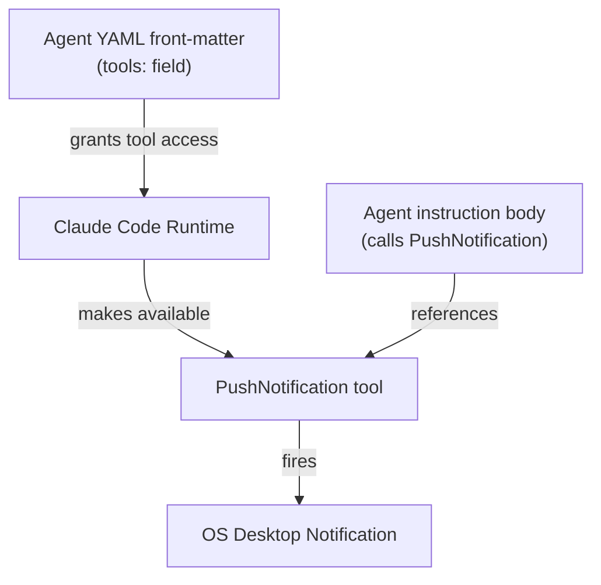

# PushNotification Not Firing — Tool Not Declared in Agent Front Matter

## Metadata

- Date: `2026-04-25`
- Status: `fixed`
- Severity: `high`
- Related issue/ticket: `N/A`
- Owner: `N/A`

## About

**Overview**:
- Desktop notifications are never delivered when agents need developer input. The `PushNotification` native Claude Code tool is referenced in the body of 8 agent instruction files (and 1 skill), but none of those agents declare `PushNotification` in their `tools:` YAML front-matter field. Claude Code only grants an agent access to a tool when it is explicitly listed in `tools:`, so the call silently has no effect or is never reached.
- This breaks the entire "notify before blocking on user input" contract across the dark-factory pipeline. Developers working away from the terminal receive no OS-level notification that the agent is waiting for them.

**Technical Questions**:
- The tool itself (`PushNotification`) is a valid Claude Code native tool confirmed in session logs (appears in `deferred_tools_delta` addedNames lists) and gated by the `tengu_kairos_push_notifications` GrowthBook feature flag (set to `true` in cached features).
- This is not intermittent — every agent invocation that needs to fire a notification will silently skip it because the tool is simply not accessible to those agents.
- No workaround exists at the instruction level; the fix must be in the YAML front-matter of each affected agent.

**Resources**:
- `/home/lewibs/github/dark_factory/dark_factory-fix-desktop-notification/agents/featurework/agents/feature-agent.md`
- `/home/lewibs/github/dark_factory/dark_factory-fix-desktop-notification/agents/featurework/planning/agents/planning-agent.md`
- `/home/lewibs/github/dark_factory/dark_factory-fix-desktop-notification/agents/featurework/execution/agents/execution-agent.md`
- `/home/lewibs/github/dark_factory/dark_factory-fix-desktop-notification/agents/fix-flow/agents/fix-flow-orchestrator.md`
- `/home/lewibs/github/dark_factory/dark_factory-fix-desktop-notification/agents/fix-flow/agents/ralph-fix-and-push.md`
- `/home/lewibs/github/dark_factory/dark_factory-fix-desktop-notification/agents/dark-factory/agents/dark-factory-agent.md`
- `/home/lewibs/github/dark_factory/dark_factory-fix-desktop-notification/agents/documentation/agents/detect-drift-agent.md`
- `/home/lewibs/github/dark_factory/dark_factory-fix-desktop-notification/agents/documentation/agents/update-documentation-agent.md`
- `/home/lewibs/.claude/plugins/cache/dark-factory/dark-factory/1.1.1/docs/docs/desktop-notification-user-input.md`

## Steps to cause failure

## System

The `tools:` front-matter field is the access-control gate. If a tool is not listed there, the agent cannot call it regardless of what the instruction body says.

## Reproduction Details

1. Run any dark-factory agent that reaches a point requiring developer input (e.g. `feature-agent` with a complete plan ready for approval, or `fix-flow-orchestrator` with no flow name provided).
2. Observe: no OS-level desktop notification appears.
3. Root cause confirmed: `PushNotification` is absent from each agent's `tools:` YAML front-matter.

Reproduction test: `tests/test_push_notification_declared.py`

## Notes for PR

Root cause: `PushNotification` was added to the instruction body of 8 agents but was never added to their `tools:` YAML front-matter. Claude Code uses the `tools:` list as an access-control gate — tools not listed there are not available to the agent at runtime.

Fix: Added `PushNotification` to the `tools:` field in the front-matter of all 8 affected agent files. No logic changes were required. The deviation-protocol skill runs inside the `execution-agent` context, so fixing `execution-agent`'s front-matter covers that path as well.

## Audit Log

| ID | Action | Note | Context |
| --- | --- | --- | --- |
| 1 | Create audit log | Initialize bug investigation | Desktop notifications not working |
| 2 | Read all agent files using PushNotification | Confirmed none declare it in tools: front-matter | All 8 agent files inspected |
| 3 | Confirmed PushNotification is a valid Claude Code native tool | Found in session jsonl deferred_tools_delta; feature flag tengu_kairos_push_notifications=true | ~/.claude session logs |
| 4 | Wrote reproduction test | tests/test_push_notification_declared.py | Parses YAML front-matter, checks tools: field |
| 5 | Confirmed test fails before fix | All 8 agents fail the assertion | Pre-fix state |
| 6 | Added PushNotification to tools: in all 8 agent files | Front-matter only change, no logic modified | Fix applied |
| 7 | Confirmed test passes after fix | All 8 agents pass | Post-fix state |
| 8 | Removed fix and confirmed test fails again | Causality verified | Fix re-applied |

## Verification

- [x] Reproduced failure before fix
- [x] Reproduction test fails before fix
- [x] Root cause identified with evidence
- [x] Fix applied at source (no workaround-only patch)
- [x] Reproduction test passes after fix
- [x] Reproduction path now passes
- [x] Regression test added/updated
- [x] Verified no duplicate solved-bug log exists for same root cause
