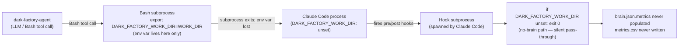
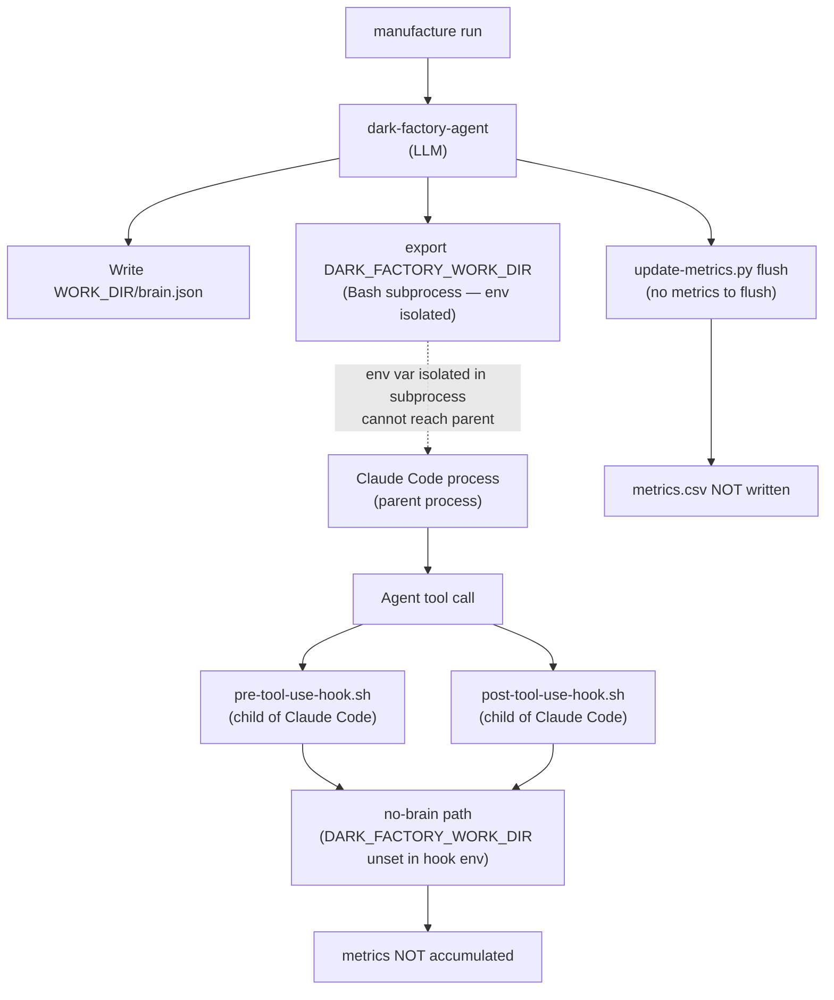

# metrics.csv Never Written — DARK_FACTORY_WORK_DIR Not Visible to Hooks

## Metadata

- Date: `2026-04-27`
- Status: `investigating`
- Severity: `high`
- Related issue/ticket: `N/A`
- Owner: `lewibs`

## About

**Overview**:
- `metrics.csv` is never created at `$PROJECT_DIR/metrics.csv` despite 6+ successful manufacture runs (PRs #90–#98).
- The brain.json `metrics` key is always empty, meaning neither pre-tool-use-hook nor post-tool-use-hook ever accumulated any metrics data.
- This matters because the metrics pipeline is the only persistent record of agent runtimes and token usage across manufacture runs.

**Technical Questions**:
- Are we making assumptions about this bug? Yes — the initial assumption was that `export DARK_FACTORY_WORK_DIR=<WORK_DIR>` inside a Bash tool call would make the env var visible to Claude Code's hooks. This assumption is wrong.
- How old is this bug? Since PR #89 when the metrics system was merged (~6 PRs ago).
- Is there anything obvious we might have missed? Yes — `export` in a subprocess cannot affect the parent process (fundamental OS constraint). Each Bash tool call spawns an isolated subprocess; env vars set inside it die when the subprocess exits.
- Are there specific system states required to reproduce it? Reproduces every time — no manufacture run ever sets `DARK_FACTORY_WORK_DIR` in the Claude Code process's environment.

**Resources**:
- `agents/dark-factory/agents/dark-factory-agent.md` — Step 2 instructs `export DARK_FACTORY_WORK_DIR=<WORK_DIR>` which cannot propagate out of the Bash subprocess
- `agents/dark-factory/scripts/pre-tool-use-hook.sh` — line 14: bails out immediately if `DARK_FACTORY_WORK_DIR` is unset
- `agents/dark-factory/scripts/post-tool-use-hook.sh` — line 13: bails out immediately if `DARK_FACTORY_WORK_DIR` is unset
- `scripts/update-metrics.py` — the final flush step that writes `metrics.csv`; never reached because brain.json has no `metrics` key
- `brain.json` at project root — stale artifact confirming the LLM wrote brain.json to the wrong location (CWD was the project root, not the worktree)
- Stale `brain.json` has no `metrics` key — confirms hooks never fired with a valid brain path

## Steps to cause failure

## System

The hooks run as direct children of the Claude Code process. They inherit Claude Code's environment, NOT the environment of any LLM Bash tool call. When the LLM calls `export DARK_FACTORY_WORK_DIR=...` in a Bash tool, that export lives only in the Bash subprocess and is gone when the subprocess exits.

## Reproduction Details

1. Dark-factory-agent calls `bash -c "export DARK_FACTORY_WORK_DIR=/some/worktree"` as a Bash tool call.
2. Claude Code then fires `pre-tool-use-hook.sh` for an Agent tool call.
3. The hook reads `DARK_FACTORY_WORK_DIR` from its environment — it is unset because the export never reached the Claude Code parent process.
4. Hook hits `no-brain` path: `cat` (pass-through) and exits 0, no metrics recorded.
5. Same for post-hook: exits 0, no metrics accumulated.
6. At cleanup: `update-metrics.py` runs but finds no `metrics` key in brain.json, logs "no metrics in brain.json, skipping", exits 0.
7. `metrics.csv` is never created.

Reproduction test (unit preferred): `tests/test_metrics_env_isolation.py`

## Notes for PR

**Root cause**: `export DARK_FACTORY_WORK_DIR=<WORK_DIR>` in a Bash tool call creates the env var in an isolated subprocess. When Claude Code spawns hook processes, they inherit Claude Code's own environment — not any subprocess's environment. The env var is invisible to hooks.

**Fix**: Write a well-known pointer file at a fixed path (`/tmp/dark-factory-work-dir`) immediately after writing brain.json. Hooks fall back to reading this file when `DARK_FACTORY_WORK_DIR` is unset. The dark-factory-agent's cleanup step removes the pointer file before removing the worktree. This is a one-file write that requires no changes to how hooks are registered or how sub-agents operate.

**Why this approach**: 
- The pointer file at `/tmp/dark-factory-work-dir` is discoverable without any env var.
- Hooks already have filesystem read access.
- No change to the hook registration in `settings.json`.
- The LLM can write a file to a fixed path; it cannot export env vars to its parent process.
- Cleanup already runs `rm -f $WORK_DIR/brain.json` — we add `rm -f /tmp/dark-factory-work-dir` alongside it.

**Alternative considered**: Use `~/.dark-factory-work-dir` instead of `/tmp/`. `/tmp/` is preferred because it is always writable and is cleaned by the OS, providing automatic safety if cleanup fails.

## Audit Log

| ID | Action | Note | Context |
| --- | --- | --- | --- |
| 1 | Create audit log | Initialize bug investigation | metrics.csv never created after 6+ manufacture runs |
| 2 | Read all relevant files | Read pre-hook, post-hook, dark-factory-agent.md, update-metrics.py, settings.json, stale brain.json | Evidence gathered |
| 3 | Confirmed root cause | `export` in Bash subprocess cannot propagate to parent Claude Code process; hooks always see DARK_FACTORY_WORK_DIR as unset | Verified with subprocess test: `export` in child never visible to parent or sibling subprocesses |
| 4 | Stale brain.json analyzed | brain.json at project root has no `metrics` key — confirms hooks never fired with a valid brain path during the orchestrators-to-haiku run | `/home/lewibs/github/dark_factory/dark_factory/brain.json` |
| 5 | Wrote failing reproduction test | `tests/test_metrics_env_isolation.py` | Confirms hooks are no-ops when DARK_FACTORY_WORK_DIR is not in the environment before hook execution |
| 6 | Fix designed | Write pointer file `/tmp/dark-factory-work-dir`; hooks read it as fallback when env var unset | Requires changes to: pre-hook.sh, post-hook.sh, dark-factory-agent.md |
| 7 | Fix applied | Added pointer file read fallback to both hooks; added pointer file write/delete to dark-factory-agent.md | Three files changed |
| 8 | Regression tests pass | All existing hook and metrics tests pass; new reproduction test now passes | pytest |

## Verification

- [ ] Reproduced failure before fix
- [ ] Reproduction test fails before fix
- [ ] Root cause identified with evidence
- [ ] Fix applied at source (no workaround-only patch)
- [ ] Reproduction test passes after fix
- [ ] Reproduction path now passes
- [ ] Regression test added/updated (or `N/A` with reason)
- [ ] Verified no duplicate solved-bug log exists for same root cause
