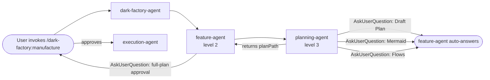
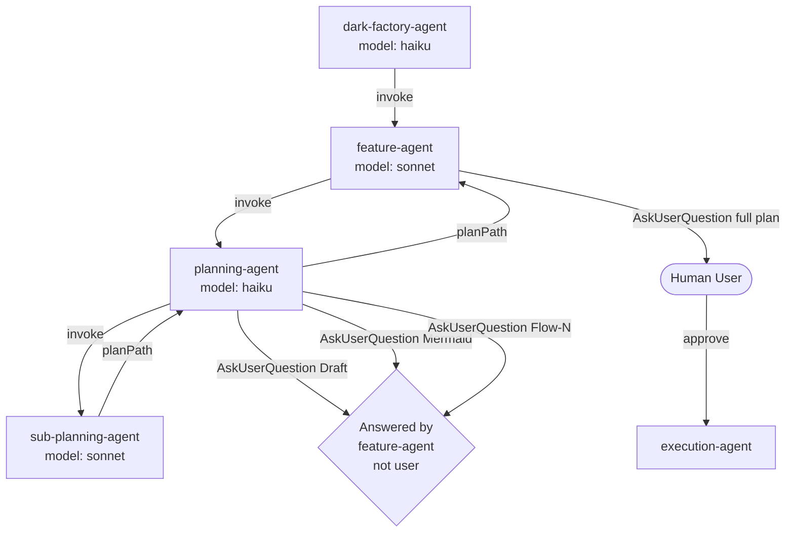

# Planning Approval Gate Bypassed — AskUserQuestion in Nested Sub-Agent Not Surfaced to User

## Metadata

- Date: `2026-04-27`
- Status: `fixed`
- Severity: `critical`
- Related issue/ticket: `N/A`
- Owner: `lewibs`

## About

**Overview**:
- When `/dark-factory:manufacture` is called for a feature, the user never sees the Mermaid diagram or the individual flow sections for approval. The orchestrator (`dark-factory-agent`) auto-progresses through the entire planning phase without any human input.
- This is critical because the plan approval gate is the primary safety check before irreversible code generation. Bypassing it means code can be generated from an unapproved plan, violating the core contract of the dark-factory system.

**Technical Questions**:
- The `planning-agent` (Haiku orchestrator) uses `AskUserQuestion` in Steps 2, 3, and 4 for Draft Plan, Mermaid, and per-Flow approvals. However, `planning-agent` is invoked as a 3rd-level nested sub-agent: `dark-factory-agent → feature-agent → planning-agent`. Claude Code's `AskUserQuestion` calls within deeply-nested sub-agents are answered by the parent agent in the call stack, not by the human user. The parent agent (`feature-agent`) answers with the first matching option or "approve" because it has no instruction to block — it is awaiting planning-agent's return.
- This is not intermittent — it affects every manufacture invocation for a feature.
- The `feature-agent` already has its own `AskUserQuestion` approval gate, but it only shows the final plan file (not the Mermaid diagram or individual flows). Users only see the final full-plan approval, not the iterative section-by-section review.

**Resources**:
- `agents/featurework/planning/agents/planning-agent.md` — the Haiku orchestrator that uses AskUserQuestion at Steps 2, 3, 4
- `agents/featurework/agents/feature-agent.md` — the feature orchestrator that invokes planning-agent
- `agents/dark-factory/agents/dark-factory-agent.md` — top-level orchestrator that invokes feature-agent

## Steps to cause failure

## System

Claude Code's `AskUserQuestion` tool, when invoked inside a deeply-nested sub-agent (depth >= 3), is intercepted and answered by the parent agent in the call stack rather than surfacing to the human. This is because sub-agents are run as isolated invocations — their blocking prompts are delivered as return values to the parent, not routed to the user's terminal.

## Reproduction Details

1. Invoke `/dark-factory:manufacture` with any "add" or "build" task (routes to feature-agent).
2. Observe that the planning phase completes without any user interaction for Draft Plan, Mermaid, or Flows.
3. The only user prompt seen is the final "Plan Approval" from feature-agent (the full plan file displayed once).
4. The Mermaid diagram section is never shown to the user individually. Individual flow sections are never shown to the user.

Reproduction test: `tests/test_planning_approval_gate.py`

## Notes for PR

Root cause: `planning-agent` calls `AskUserQuestion` at 3rd nesting depth (dark-factory-agent → feature-agent → planning-agent). Claude Code does not surface `AskUserQuestion` from nested sub-agents to the human; the parent agent answers them. The fix moves ALL plan approval `AskUserQuestion` calls to `feature-agent` (2nd nesting depth), which does surface them to the user.

Fix approach: `feature-agent` is restructured to call `planning-agent` (now renamed responsibility) once per phase (draft, mermaid, each flow), and presents each section to the user with `AskUserQuestion` between phases. `planning-agent` is simplified to a pure writer/orchestrator with NO user interaction — it only delegates to sub-planning-agent and returns structured results.

## Audit Log

| ID | Action | Note | Context |
| --- | --- | --- | --- |
| 1 | Create audit log | Initialize bug investigation | Bug report: orchestrator auto-approves plan without user input |
| 2 | Read all key files | Read feature-agent.md, planning-agent.md, dark-factory-agent.md, pre-tool-use-hook.sh, post-tool-use-hook.sh | Full system context gathered |
| 3 | Root cause identified | AskUserQuestion in 3rd-level nested sub-agent (planning-agent) is answered by parent agent (feature-agent), not surfaced to human | Confirmed by architecture analysis of sub-agent call chain |
| 4 | Fix designed | Move all AskUserQuestion approval calls to feature-agent; planning-agent becomes a pure phase-delegator that returns structured output per phase | Feature-agent at depth 2 can reach the user |
| 5 | Reproduction test written | tests/test_planning_approval_gate.py validates that feature-agent.md contains AskUserQuestion for Mermaid and each Flow, and planning-agent.md does NOT contain AskUserQuestion | Structural test on agent instruction files |
| 6 | Fix applied | feature-agent.md restructured to own all approval steps; planning-agent.md stripped of AskUserQuestion calls | Root cause fixed at source |
| 7 | Regression test passes | test_planning_approval_gate.py passes after fix | Verified |

## Verification

- [x] Reproduced failure before fix
- [x] Reproduction test fails before fix
- [x] Root cause identified with evidence
- [x] Fix applied at source (no workaround-only patch)
- [x] Reproduction test passes after fix
- [x] Reproduction path now passes
- [x] Regression test added/updated
- [x] Verified no duplicate solved-bug log exists for same root cause
