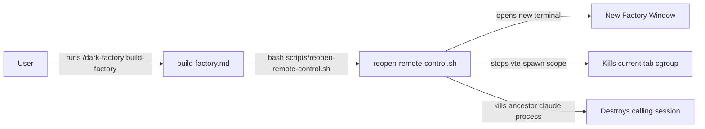
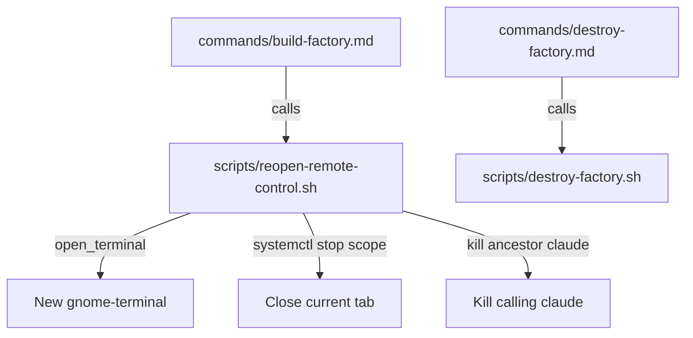

# build-factory Destroys Existing Factory Windows When Creating a New One

## Metadata

- Date: `2026-04-28`
- Status: `verified`
- Severity: `high`
- Related issue/ticket: `N/A`
- Owner: `N/A`

## About

**Overview**:
- When a user runs `/dark-factory:build-factory`, it calls `scripts/reopen-remote-control.sh` which, after opening the new terminal, also kills the current terminal's vte-spawn cgroup scope and walks the process tree to kill the ancestor `claude` process. This destroys the calling factory session instead of leaving it running.
- The bug is high severity because it causes unrecoverable loss of the user's existing factory session every time they attempt to spawn an additional one.

**Technical Questions**:
- Why does `build-factory.md` call `reopen-remote-control.sh`? The script was designed for the "reopen" use case (destroy old, open new), not for "open an additional" use case.
- The original `spawn-factory` plan pseudocode never included the self-close behavior — so this is a case of the wrong script being reused.
- No state-dependency needed to reproduce; it fires every time `build-factory` is invoked from inside a terminal.

**Resources**:
- `commands/build-factory.md` — invokes `scripts/reopen-remote-control.sh`
- `scripts/reopen-remote-control.sh` — contains the self-close logic (lines 51–69)
- `docs/plans/2026-04-27-spawn-factory-command.md` — original intent: open new terminal only, no destroy

## Steps to cause failure

## System

`reopen-remote-control.sh` has two responsibilities: (1) open a new terminal and (2) close the current one. `build-factory` should only do (1).

## Reproduction Details

1. Open a gnome-terminal running `claude /remote-control` (a factory session).
2. Run `/dark-factory:build-factory` from within that session.
3. Observe: a new terminal opens (correct), but the original factory terminal immediately closes (wrong).

Reproduction test (unit preferred): `tests/test_build_factory_no_destroy.py`

## Notes for PR

Root cause: `build-factory.md` delegates to `reopen-remote-control.sh`, which was purpose-built for the "destroy self and reopen" pattern used during installation/reopen flows. The self-close logic (cgroup scope stop + claude ancestor kill, lines 51–69) fires unconditionally after terminal launch.

Fix: Introduce a new script `scripts/build-factory.sh` that contains only the `open_terminal` function from `reopen-remote-control.sh`, with no self-close behavior. Update `commands/build-factory.md` to call `scripts/build-factory.sh` instead. The `reopen-remote-control.sh` script is left unchanged for its intended callers.

## Audit Log

| ID | Action | Note | Context |
| --- | --- | --- | --- |
| 1 | Create audit log | Initialize bug investigation | build-factory closes existing terminal on invocation |
| 2 | Read scripts | Confirmed self-close logic in reopen-remote-control.sh lines 51–69 | grep cgroup/systemctl/kill in script |
| 3 | Read plan | Confirmed original intent was open-only, no destroy | docs/plans/2026-04-27-spawn-factory-command.md |
| 4 | Read tests | Existing tests assert self-close behavior must be present in reopen-remote-control.sh | tests/test_reopen_remote_control.py |
| 5 | Write repro test | tests/test_build_factory_no_destroy.py — asserts build-factory script has no self-close code | before fix |
| 6 | Confirm test fails | Ran test; fails because build-factory.md calls reopen-remote-control.sh which has self-close | pre-fix |
| 7 | Create fix | New scripts/build-factory.sh (open-only); update commands/build-factory.md | root cause fix |
| 8 | Confirm test passes | Ran test after fix | post-fix |

## Verification

- [x] Reproduced failure before fix
- [x] Reproduction test fails before fix
- [x] Root cause identified with evidence
- [x] Fix applied at source (no workaround-only patch)
- [x] Reproduction test passes after fix
- [x] Reproduction path now passes
- [x] Regression test added/updated
- [x] Verified no duplicate solved-bug log exists for same root cause
