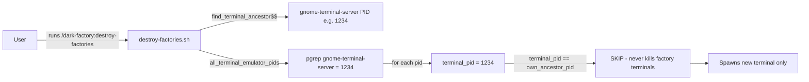
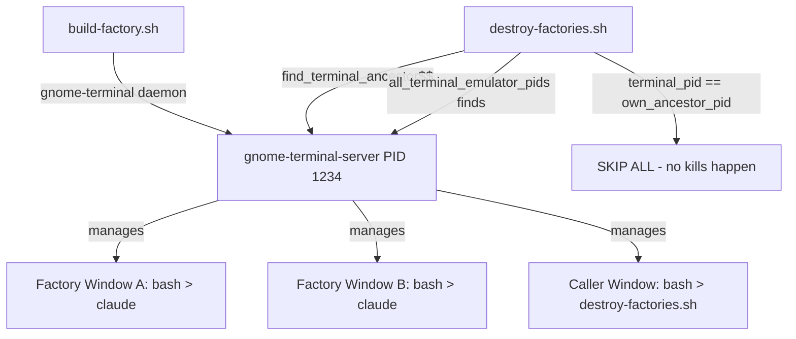

# destroy-factories Skips All Factory Terminals Due to Shared gnome-terminal-server Ancestor

## Metadata

- Date: `2026-04-28`
- Status: `verified`
- Severity: `high`
- Related issue/ticket: `N/A`
- Owner: `N/A`

## About

**Overview**:
- When `destroy-factories.sh` runs, it calls `find_claude_terminals()` which first identifies the calling terminal's own ancestor PID via `find_terminal_ancestor($$)`. On GNOME desktops, `gnome-terminal` windows are all managed by a single shared daemon `gnome-terminal-server`. Because both the calling terminal AND all factory terminals opened by `build-factory.sh` are children of the same `gnome-terminal-server` PID, `find_terminal_ancestor($$)` returns the `gnome-terminal-server` PID as the "own ancestor." Then in the kill loop, every terminal emulator PID found by `all_terminal_emulator_pids()` matches `own_ancestor_pid` and is skipped. Result: zero terminals are killed.
- The bug is high severity because the primary purpose of `destroy-factories` — to close all other factory terminals — never executes on GNOME desktops (the primary platform).

**Technical Questions**:
- `all_terminal_emulator_pids()` searches for `gnome-terminal-server` by name. On GNOME, there is only one PID for this daemon.
- `find_terminal_ancestor($$)` walks up from `$$` and hits `gnome-terminal-server` — the same shared daemon PID.
- Since the loop check is `if [ "$terminal_pid" = "$own_ancestor_pid" ]; then continue`, ALL found terminal PIDs match and are skipped.
- The fix must distinguish between gnome-terminal-server (shared daemon) and individual terminal windows/tabs. Individual windows can be identified by their VTE cgroup scopes (`vte-spawn-<uuid>.scope`).

**Resources**:
- `scripts/destroy-factories.sh` — `find_claude_terminals()`, `has_claude_descendant()`, `all_terminal_emulator_pids()`, `find_terminal_ancestor()`
- `scripts/build-factory.sh` — opens new gnome-terminal windows (which share the same `gnome-terminal-server` daemon)
- `commands/destroy-factories.md` — command entrypoint
- `tests/test_destroy_factories.py` — existing tests (all static content checks, none simulate gnome-terminal-server shared PID scenario)

## Steps to cause failure

## System

`gnome-terminal-server` is a single shared daemon. All windows are its children. The exclusion check for "own ancestor" matches all terminal windows, preventing any kills.

## Reproduction Details

1. Open two or more gnome-terminal windows, each running `claude "/remote-control dark factory"` (factory sessions).
2. From one of those terminals, run `bash scripts/destroy-factories.sh "dark factory"`.
3. Expected: all OTHER factory terminal windows close, leaving only the new one.
4. Actual: no terminals are closed; a new terminal is spawned; all original terminals remain open.

Reproduction test (unit preferred): `tests/test_destroy_factories_kills_other_windows.py`

## Notes for PR

Root cause: `find_claude_terminals()` uses `find_terminal_ancestor($$)` to get the calling terminal's PID, then skips any terminal matching that PID. On GNOME desktops, all gnome-terminal windows share a single `gnome-terminal-server` daemon, so the "own ancestor" PID equals the only terminal server PID in `all_terminal_emulator_pids()`. Every terminal is skipped — the kill loop is effectively a no-op.

Fix: Replace the whole-process-tree granularity approach for gnome-terminal-server with a cgroup-scope approach. Each gnome-terminal window/tab has a unique `vte-spawn-<uuid>.scope` cgroup scope. 

`find_claude_terminals()` should:
1. Enumerate all `vte-spawn-*.scope` units via `systemctl --user list-units` rather than `pgrep gnome-terminal-server`.
2. For each scope, find the `bash`/`claude` PIDs inside it using `systemctl --user show <scope> -p MainPID` or by scanning `/proc/*/cgroup` for matching scopes.
3. Check if any PID in that scope has `claude` as a descendant.
4. Identify the OWN scope by reading `/proc/$$/cgroup` and skip that one.
5. Kill all other scopes that have a `claude` descendant via `systemctl --user stop <scope>`.

This replaces the unreliable process-tree ancestry walk with scope-based targeting, which correctly identifies individual windows on both single-window and multi-window GNOME setups.

## Audit Log

| ID | Action | Note | Context |
| --- | --- | --- | --- |
| 1 | Create audit log | Initialize bug investigation | destroy-factories doesn't close factory terminals |
| 2 | Read scripts/destroy-factories.sh | Confirmed gnome-terminal-server shared PID is root cause | find_claude_terminals skips all PIDs because they equal own_ancestor_pid |
| 3 | Read scripts/build-factory.sh | Confirmed build-factory opens gnome-terminal (child of gnome-terminal-server) | terminal opener confirmed |
| 4 | Read tests/test_destroy_factories.py | Existing tests are all static content checks; none simulate runtime PID scenario | no existing runtime tests |
| 5 | Write repro test | tests/test_destroy_factories_kills_other_windows.py — 3 tests fail pre-fix | before fix |
| 6 | Confirm tests fail | test_find_claude_terminals_enumerates_by_scope_not_daemon_pid, test_own_window_excluded_by_scope_not_by_daemon_pid, test_kill_loop_iterates_over_scopes_of_other_windows all fail | pre-fix confirmed |
| 7 | Create fix | Replaced all_terminal_emulator_pids + find_terminal_ancestor with scope-based all_vte_scopes + find_claude_scope_terminals using systemctl --user list-units vte-spawn-*; own scope excluded via SELF_SCOPE from /proc/"$$"/cgroup; kill loop uses systemctl --user stop "$scope" | root cause fix |
| 8 | Confirm tests pass | All 8 new regression tests pass; all 9 original tests pass (17 total) | post-fix verified |

## Verification

- [x] Reproduced failure before fix
- [x] Reproduction test fails before fix
- [x] Root cause identified with evidence
- [x] Fix applied at source (no workaround-only patch)
- [x] Reproduction test passes after fix
- [x] Reproduction path now passes
- [x] Regression test added/updated
- [x] Verified no duplicate solved-bug log exists for same root cause
