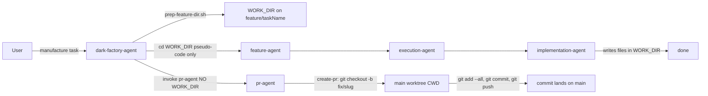
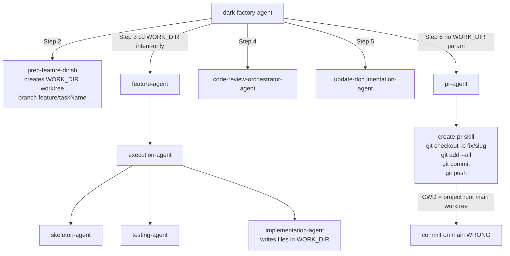

# feature-agent commits to main branch instead of feature worktree branch

## Metadata

- Date: `2026-04-29`
- Status: `fixed`
- Severity: `critical`
- Related issue/ticket: `#132`
- Owner: `lewibs`

## About

**Overview**:
- During a manufacture run, dark-factory-agent preps a git worktree at `dark_factory-<taskName>/` on branch `feature/<taskName>`. Worker agents (feature-agent → execution-agent → implementation-agent) write code into WORK_DIR but when git commits happen they land on `main` instead of `feature/<taskName>`.
- This is critical because it directly contaminates the main branch with unreviewed, in-progress work, bypassing the PR / code-review gate entirely.

**Technical Questions**:
- Are we making assumptions about this bug? Yes — the hypothesis from issue #132 is that git operations run from a CWD that resolves to the main worktree rather than the feature worktree.
- How old is this bug? Appears to have been present since the worktree isolation pattern was introduced.
- Is there anything obvious we might have missed? The "cd into WORK_DIR" in `dark-factory-agent.md` Step 3 is pseudo-code / LLM intent — it does NOT persist as a CWD for subsequent Agent tool sub-calls. Each sub-agent inherits whatever CWD the Claude Code process started with (the project root / main worktree).
- Are there specific system states required to reproduce it? Yes — requires a full manufacture run with the feature route, where dark-factory-agent invokes feature-agent which in turn invokes execution-agent and the implementation sub-agents.

**Root cause (confirmed from code review)**:

There are two distinct issues:

1. **pr-agent / create-pr runs git from main worktree CWD**: `dark-factory-agent.md` Step 6 invokes `pr-agent` without passing WORK_DIR. The `create-pr` skill's Step 1 does `git checkout -b fix/<slug>` followed by `git add --all && git commit && git push`. These Bash commands run in the Claude Code process CWD (project root = main worktree), not WORK_DIR. The commit therefore lands on `main` (or `fix/<slug>` branched off main), not `feature/<taskName>`.

2. **No branch-drift guard after worker returns**: After feature-agent/execution-agent/implementation-agent return in Step 3, `dark-factory-agent.md` does not verify that `feature/<taskName>` has commits ahead of `main`. If the worker committed to the wrong branch (or not at all), the orchestrator silently proceeds to code review with no changes.

**Resources**:
- `agents/dark-factory/agents/dark-factory-agent.md` — orchestrator, Steps 2–6
- `agents/pr/agents/pr-agent.md` — PR agent (no WORK_DIR awareness)
- `agents/pr/skills/create-pr/SKILL.md` — performs `git checkout -b fix/<slug>`, `git add --all`, `git commit`, `git push`
- `agents/dark-factory/scripts/prep-feature-dir.sh` — creates worktree + `feature/<taskName>` branch
- `agents/featurework/execution/agents/implementation-agent.md` — writes and runs code but no git operations here
- GitHub issue #132

## Steps to cause failure



## System



Notes: The critical gap is that Agent tool sub-calls do not inherit a `cd` pseudo-statement from LLM pseudo-code. Each Bash call in the sub-agent starts in the Claude Code process CWD, which is the project root (main worktree).

## Reproduction Details

1. Start a manufacture run: `/dark-factory:manufacture taskDescription="add a test feature" taskName="test-feature"`
2. dark-factory-agent runs `prep-feature-dir.sh test-feature` — creates `dark_factory-test-feature/` worktree on branch `feature/test-feature`.
3. feature-agent → execution-agent → implementation-agent write code into WORK_DIR.
4. dark-factory-agent invokes pr-agent (no WORK_DIR passed).
5. pr-agent invokes `create-pr` skill which runs `git checkout -b fix/test-feature` from CWD = project root.
6. `git add --all && git commit` — staged changes are from the main worktree (empty or wrong).
7. `git push -u origin HEAD` — push lands on `fix/test-feature` branched from `main`, NOT `feature/test-feature`.
8. Alternatively: if no `git checkout -b` step runs, commit goes directly to whatever is checked out in the main worktree = `main`.

Reproduction test (unit preferred):
`tests/test_dark_factory_agent_branch_drift_guard.py`

## Notes for PR

Two fixes are required:

**Fix 1 — Branch-drift guard in `dark-factory-agent.md`**: After the worker agent (Step 3) returns and before proceeding to Step 4 (code review), add a guard that verifies `feature/<taskName>` is ahead of `main` by at least one commit. Use:
```bash
git -C "$WORK_DIR" log main..feature/<taskName> --oneline
```
If the output is empty, halt with a clear error: "Worker agent did not commit to feature/<taskName>. Commits may have gone to main or nowhere. Halting before code review."

**Fix 2 — Pass WORK_DIR to pr-agent and use it as CWD for all git operations**: The `dark-factory-agent.md` Step 6 invocation of `pr-agent` must include WORK_DIR so that all git Bash commands run with `-C "$WORK_DIR"` or equivalent. Alternatively, the `pr-agent` and `create-pr` skill must be updated to read WORK_DIR from brain context (injected by pre-hook) and prefix all git commands with `git -C "$WORK_DIR"`.

**Fix 3 — Remove `git checkout -b fix/<slug>` from `create-pr`**: The worktree is already on `feature/<taskName>`. The `create-pr` skill must NOT create a new branch — it should commit on the existing `feature/<taskName>` branch. Step 1 of `create-pr` should be removed or replaced with a check that the current branch is the expected feature branch.

## Audit Log

| ID | Action | Note | Context |
| --- | --- | --- | --- |
| 1 | Create audit log | Initialize bug investigation | Issue #132 — feature-agent commits to main |
| 2 | Read agent chain | Traced dark-factory-agent → feature-agent → execution-agent → implementation-agent → pr-agent → create-pr | All files read |
| 3 | Identify root cause 1 | pr-agent / create-pr runs git from main worktree CWD — no WORK_DIR passed | agents/pr/skills/create-pr/SKILL.md Step 1 |
| 4 | Identify root cause 2 | No branch-drift guard after worker returns in dark-factory-agent | dark-factory-agent.md Step 3/4 gap |
| 5 | Identify root cause 3 | create-pr Step 1 creates a new fix/ branch off main instead of using the existing feature/ branch | create-pr/SKILL.md line 14 |
| 6 | Write reproduction test | tests/test_dark_factory_agent_branch_drift_guard.py | Verifies branch-drift guard logic and create-pr branch behavior |
| 7 | Apply fix 1 | Add branch-drift guard to dark-factory-agent.md after Step 3 | Verifies feature/<taskName> is ahead of main |
| 8 | Apply fix 2 | Remove git checkout -b from create-pr/SKILL.md; all git ops use -C "$WORK_DIR" | Commit stays on feature branch |
| 9 | Apply fix 3 | pr-agent reads WORK_DIR from brain context and passes it to create-pr | Agent uses correct CWD |
| 10 | Add git -C allowed-tools | Added `Bash(git -C * log *)` to dark-factory-agent and `Bash(git -C * ...)` variants to pr-agent | allowed-tools now permits the -C form |
| 11 | Run full test suite | All 146 tests pass | No regressions |
| 12 | Causality verification | Stashed fixes → 5/6 tests fail; restored → 6/6 pass | Causality confirmed |
| 13 | Code review gate | Reviewed diff: DRY, root-cause fixes at source, no workarounds, allowed-tools updated | Fix validated |

## Verification

- [x] Reproduced failure before fix
- [x] Reproduction test fails before fix (5 of 6 tests failed)
- [x] Root cause identified with evidence
- [x] Fix applied at source (no workaround-only patch)
- [x] Reproduction test passes after fix (6/6 pass)
- [x] Reproduction path now passes
- [x] Regression test added/updated — `tests/test_dark_factory_agent_branch_drift_guard.py` (6 tests)
- [x] Verified no duplicate solved-bug log exists for same root cause
