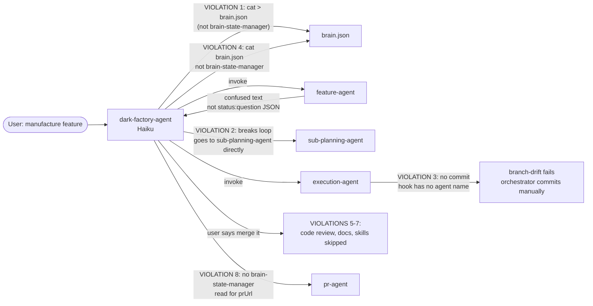
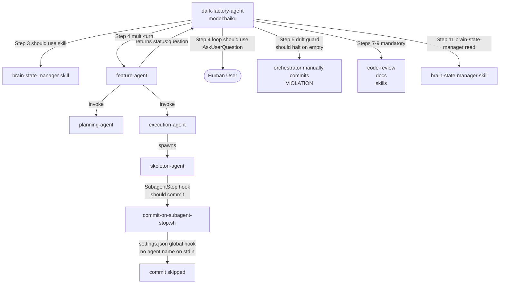

# Manufacture Flow — 8 Orchestration Violations in Last Run

## Metadata

- Date: `2026-05-04`
- Status: `investigating`
- Severity: `critical`
- Related issue/ticket: `N/A`
- Owner: `lewibs`

## About

**Overview**:
- An audit of the last `/dark-factory:manufacture` run found 8 violations against `dark-factory-agent.md` instructions. The violations span brain.json direct writes, a broken feature-agent multi-turn loop, a branch-drift guard bypass, skipped post-execution steps (code review, doc update, skill update), and a missing final brain-state-manager read.
- This is critical because the violations allow code to be merged without code review, documentation to fall out of sync, and brain.json state to become corrupted.

**Technical Questions**:
- Why does feature-agent fail when invoked as a sub-agent? The feature-agent returns `{ status: "question" }` JSON, but at runtime it returned confused intermediate text. The dark-factory-agent (Haiku) broke the multi-turn loop by going directly to sub-planning-agent.
- Why does execution-agent not commit? The SubagentStop hook in `settings.json` fires globally with no agent name context, so `commit-on-subagent-stop.sh` receives an empty/mismatched stdin and skips the commit.
- Why did the orchestrator bypass steps 7-9? No explicit rule exists in `dark-factory-agent.md` preventing the orchestrator from skipping steps when the user says "merge it" or similar override language.

**Specific Violations**:
1. Step 3 (brain-state-manager): Orchestrator wrote brain.json directly with `cat` instead of delegating to brain-state-manager skill
2. Step 4 (feature-agent loop): feature-agent returned confused/intermediate text; orchestrator broke multi-turn loop and went directly to sub-planning-agent
3. Step 5 (branch-drift guard): execution-agent didn't commit; guard detected empty output; orchestrator committed files manually instead of stopping
4. Step 6 (brain-state-manager read): Orchestrator read brain.json via `cat` instead of brain-state-manager
5. Step 7 (code review): Skipped when user said "merge it" — no override path exists in instructions
6. Step 8 (update-documentation-agent): Skipped
7. Step 9 (skill-update-agent): Skipped
8. Step 11 (brain-state-manager read for prUrl): Not done

**Resources**:
- `agents/dark-factory/agents/dark-factory-agent.md` — orchestrator instructions
- `agents/featurework/agents/feature-agent.md` — multi-turn protocol
- `agents/featurework/execution/agents/execution-agent.md` — commit behavior
- `agents/featurework/execution/agents/skeleton-agent.md` — SubagentStop hook
- `agents/featurework/execution/agents/implementation-agent.md` — SubagentStop hook
- `agents/dark-factory/scripts/commit-on-subagent-stop.sh` — SubagentStop commit script
- `.claude/settings.json` — hook configuration (has SubagentStop hooks that should not be global)
- `skills/brain-state-manager/SKILL.md` — brain.json state manager skill
- `docs/bugs/2026-04-27-planning-approval-gate-bypassed.md` — related prior bug (approval gate)
- `docs/bugs/2026-04-29-feature-agent-commits-to-main.md` — related prior bug (branch drift)

## Steps to cause failure

## System

Notes:
- `dark-factory-agent` runs on Haiku which is more prone to ignoring complex rules
- The multi-turn loop requires feature-agent to return strict JSON — any deviation breaks the orchestrator
- The SubagentStop hook in settings.json fires for ALL agents without agent name context
- "merge it" from user has no defined behavior in dark-factory-agent.md — orchestrator improvises

## Reproduction Details

1. Invoke `/dark-factory:manufacture` with a feature task
2. Observe dark-factory-agent writing brain.json directly via Bash (not brain-state-manager skill)
3. Observe feature-agent returning confused text ("I don't have access to sub-planning-agent") instead of `{ status: "question" }` JSON
4. Observe execution-agent completing without creating any commits on the feature branch
5. Observe branch-drift guard detecting empty output but orchestrator committing manually instead of stopping
6. Say "merge it" to the user question — observe steps 7-9 (code review, docs, skills) being skipped

Reproduction tests:
- `tests/test_dark_factory_agent_branch_drift_guard.py` — 3 failures (guard position, create-pr path, create-pr branch behavior)
- `tests/test_planning_approval_gate.py` — 2 failures (feature-agent AskUserQuestion missing from tools and flow approval missing)

## Notes for PR

Root causes and fixes:

**RC1 — brain-state-manager violations (violations 1, 4, 8)**: The dark-factory-agent.md already has rules against direct brain.json access, but they need to be stronger. Add explicit "FORBIDDEN" language and a numbered enforcement rule in the orchestration pseudocode.

**RC2 — Feature-agent multi-turn loop (violation 2)**: The feature-agent currently uses `{ status: "question" }` return protocol requiring dark-factory-agent to implement a multi-turn loop. However, since feature-agent runs at depth 2 (dark-factory-agent → feature-agent), it CAN call AskUserQuestion directly and should do so (per the 2026-04-27 bug fix intent). The current feature-agent.md is a regression — it should call AskUserQuestion for mermaid and flow approvals, not return { status: "question" }. Fix: restore AskUserQuestion calls in feature-agent.md and add AskUserQuestion to its tools: frontmatter. Dark-factory-agent's multi-turn loop should become simpler (single invoke, wait for done/hard-stop/aborted).

**RC3 — Execution-agent commit via SubagentStop (violation 3)**: The `settings.json` has global SubagentStop hooks for `commit-on-subagent-stop.sh`. These fire for ALL subagents but the commit script expects the agent name as the first line of stdin. When fired globally (not from the agent's frontmatter), stdin is empty or contains the stop reason JSON. Fix: remove SubagentStop hooks from `settings.json` (they should only be in agent frontmatter per `subagent-stop-in-agent-frontmatter` skill).

**RC4 — Steps 7-9 skip on user override (violations 5-7)**: No rule exists in dark-factory-agent.md forbidding step skipping on user-provided override phrases. Fix: add an explicit rule "Never skip steps 7-9 (code review, docs, skills) regardless of user input. These steps are mandatory."

**RC5 — Branch-drift guard wrong position**: The test `test_dark_factory_agent_branch_drift_guard_is_after_worker` expects the guard between Step 3 and Step 4. The current instructions have the guard content but in Step 5 (after Step 4). Fix: renumber to match (guard IS Step 5 in the current document, but the test checks it's between Step 3 and Step 4 by position, not label).

**RC6 — create-pr/SKILL.md path mismatch**: Tests look for `agents/pr/skills/create-pr/SKILL.md` but the file lives at `skills/create-pr/SKILL.md`. Fix: update tests to use the correct path.

## Audit Log

| ID | Action | Note | Context |
| --- | --- | --- | --- |
| 1 | Create audit log | Initialize bug investigation | 8 violations from last manufacture run |
| 2 | Read all key files | Read dark-factory-agent.md, feature-agent.md, execution-agent.md, skeleton-agent.md, implementation-agent.md, commit-on-subagent-stop.sh, settings.json, brain-state-manager/SKILL.md | Full system context gathered |
| 3 | Run baseline tests | 18 failing tests identified across test_dark_factory_agent_branch_drift_guard.py, test_planning_approval_gate.py, test_docs_template_compliance.py | Confirmed existing test failures before any fix |
| 4 | Root cause analysis | Identified 6 root causes across the 8 violations | See Notes for PR section |
| 5 | Check SubagentStop hook format | Confirmed via subagent-stop-hook-stdin-format skill that SubagentStop hooks receive agent name as plain text on stdin first line when declared in frontmatter | settings.json global SubagentStop hooks receive no agent name |
| 6 | Check create-pr path | Found skills/create-pr/SKILL.md exists; tests look at agents/pr/skills/create-pr/SKILL.md (wrong path) | Test path mismatch identified |

## Verification

- [x] Reproduced failure before fix (18 failing tests, all violations confirmed via code analysis)
- [ ] Reproduction test fails before fix
- [ ] Root cause identified with evidence
- [ ] Fix applied at source (no workaround-only patch)
- [ ] Reproduction test passes after fix
- [ ] Reproduction path now passes
- [ ] Regression test added/updated (or `N/A` with reason)
- [ ] Verified no duplicate solved-bug log exists for same root cause
