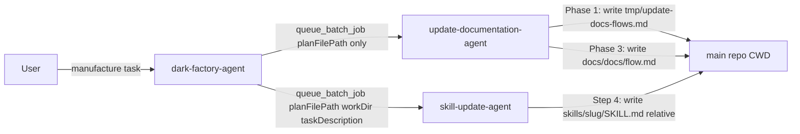
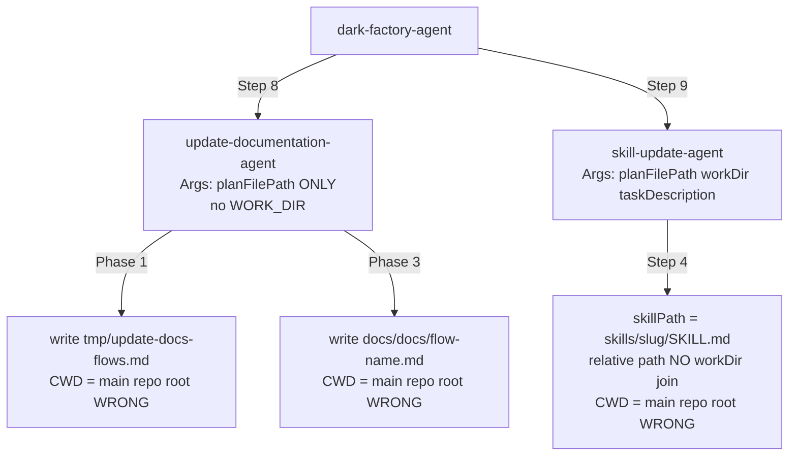

# update-documentation-agent and skill-update-agent write files to main repo instead of worktree

## Metadata

- Date: `2026-05-06`
- Status: `fixed`
- Severity: `high`
- Related issue/ticket: `N/A`
- Owner: `lewibs`

## About

**Overview**:
- During a manufacture run, `update-documentation-agent` writes `docs/docs/*.md` to the main repo CWD (e.g. `/home/lewibs/github/dark_factory/dark_factory/docs/docs/`) instead of the isolated worktree (`/home/lewibs/github/dark_factory/dark_factory-<taskname>/docs/docs/`).
- `skill-update-agent` has the same problem: it constructs `skillPath = "skills/<slug>/SKILL.md"` as a relative path and does not anchor writes to `workDir`.
- The dark-factory orchestrator then has to manually copy the files back to the worktree and restore main, introducing race conditions and contaminating the main branch.

**Technical Questions**:
- Are we making assumptions? No — the root causes are confirmed from static code analysis of the agent instruction files.
- How old is this bug? Present since update-documentation-agent and skill-update-agent were introduced without WORK_DIR awareness for file writes.
- Is there anything obvious we might have missed? Two distinct gaps found: (1) `update-documentation-agent` never receives or uses WORK_DIR for doc file writes; (2) `skill-update-agent` receives `workDir` as input but the orchestration pseudocode constructs a relative `skillPath` without joining it to `workDir`.
- Are there specific system states required? Yes — only triggered when `update-documentation-agent` or `skill-update-agent` run in a manufacture flow where an isolated worktree exists.

**Root cause (confirmed from static analysis)**:

Two distinct root causes:

1. **`update-documentation-agent` never receives or uses WORK_DIR for doc writes**: 
   - `dark-factory-agent.md` calls `queue_batch_job("update-documentation-agent", {planFilePath})` — WORK_DIR is NOT in the agent args.
   - The agent instruction file has no step to resolve WORK_DIR before writing docs.
   - Phase 1 writes to `tmp/update-docs-flows.md` (relative to CWD, which is the main repo root).
   - Phase 3 writes to `docs/docs/<flow-name>.md` (also relative to CWD = main repo root).
   - WORK_DIR is only used in the Completion section to write `brain-patch.json`, not for actual doc files.

2. **`skill-update-agent` constructs skill paths relative to CWD, not workDir**:
   - The agent does receive `workDir` as an input parameter.
   - Step 4 builds `skillPath = "skills/<slug>/SKILL.md"` as a relative string.
   - The write/edit operation uses that relative path without joining to `workDir`, so the write goes to `CWD/skills/<slug>/SKILL.md` = main repo root.
   - The WORK_DIR resolution block (Brain Patch section) correctly uses WORK_DIR for `brain-patch.json` but is never used for skill file writes.

**Resources**:
- `agents/documentation/agents/update-documentation-agent.md` — Phase 1, Phase 2, Phase 3 (bare relative paths)
- `agents/skill-update/agents/skill-update-agent.md` — Step 4 (relative skillPath without workDir join)
- `agents/dark-factory/agents/dark-factory-agent.md` — Step 8 batch invocation missing workDir arg for update-documentation-agent

## Steps to cause failure



## System



Notes: The WORK_DIR resolution block exists in both agents for `brain-patch.json` writes only — it is never applied to the actual doc/skill file writes.

## Reproduction Details

1. Start a manufacture run with any task.
2. dark-factory-agent creates worktree at `dark_factory-<taskname>/` on branch `feature/<taskname>`.
3. dark-factory-agent invokes `update-documentation-agent` with only `{planFilePath}` — no WORK_DIR.
4. `update-documentation-agent` resolves CWD = main repo root, writes `docs/docs/*.md` there.
5. dark-factory-agent invokes `skill-update-agent` with `{planFilePath, workDir, taskDescription}`.
6. `skill-update-agent` resolves `skillPath = "skills/<slug>/SKILL.md"` (relative).
7. Write lands in `CWD/skills/<slug>/SKILL.md` = main repo root, NOT `workDir/skills/<slug>/SKILL.md`.

Reproduction test: `tests/test_agent_workdir_isolation.py`

## Notes for PR

Three fixes are required:

**Fix 1 — `update-documentation-agent`: Add WORK_DIR resolution before any file write**

At the top of the agent instructions (before Phase 1), add:
```
Resolve WORK_DIR:
  WORK_DIR = $DARK_FACTORY_WORK_DIR
  if WORK_DIR is empty: WORK_DIR = contents of /tmp/dark-factory-work-dir (if the file exists)
  if WORK_DIR is still empty: WORK_DIR = "." (fallback, log a warning)
```
Then replace all bare path references:
- `tmp/update-docs-flows.md` → `$WORK_DIR/tmp/update-docs-flows.md`
- `docs/docs/<flow-name>.md` → `$WORK_DIR/docs/docs/<flow-name>.md`

**Fix 2 — `dark-factory-agent`: Pass WORK_DIR to update-documentation-agent batch invocation**

In Step 8, change:
```
queue_batch_job("update-documentation-agent", {planFilePath})
```
to:
```
queue_batch_job("update-documentation-agent", {planFilePath, workDir: WORK_DIR})
```

**Fix 3 — `skill-update-agent`: Join skillPath to workDir before all file operations**

In Step 4, change:
```
skillPath = "skills/<slug>/SKILL.md"
if skillPath already exists in workDir:
  read existing skill ...
  write updated file
else:
  write new SKILL.md
```
to:
```
skillPath = workDir + "/skills/<slug>/SKILL.md"
if skillPath already exists:
  read existing skill ...
  write updated file to skillPath
else:
  write new SKILL.md to skillPath
```

## Audit Log

| ID | Action | Note | Context |
| --- | --- | --- | --- |
| 1 | Create audit log | Initialize bug investigation | Task: agents write docs/files to main repo instead of worktree |
| 2 | Read update-documentation-agent.md | Phase 1 writes `tmp/update-docs-flows.md` (relative), Phase 3 writes `docs/docs/<flow>.md` (relative) — no WORK_DIR prefix | agents/documentation/agents/update-documentation-agent.md |
| 3 | Read skill-update-agent.md | Step 4 builds `skillPath = "skills/<slug>/SKILL.md"` as relative string, no workDir join | agents/skill-update/agents/skill-update-agent.md |
| 4 | Read dark-factory-agent.md | Step 8 invokes `queue_batch_job("update-documentation-agent", {planFilePath})` — WORK_DIR not in args | agents/dark-factory/agents/dark-factory-agent.md line 70, 85, 97 |
| 5 | Identify root cause 1 | update-documentation-agent: no WORK_DIR awareness for doc file writes, not passed in args either | update-documentation-agent.md Phase 1 & Phase 3 |
| 6 | Identify root cause 2 | skill-update-agent: relative skillPath not joined to workDir before write | skill-update-agent.md Step 4 |
| 7 | Write reproduction test | tests/test_agent_workdir_isolation.py | 6 tests covering all 3 root causes |
| 8 | Confirm tests fail before fix | 6/6 fail before fix | Confirmed pre-fix failure |
| 9 | Apply Fix 1 | update-documentation-agent: add Resolve WORK_DIR block before Phase 1; update all path refs to $WORK_DIR/ prefix | agents/documentation/agents/update-documentation-agent.md |
| 10 | Apply Fix 2 | dark-factory-agent: add workDir: WORK_DIR to all 3 queue_batch_job("update-documentation-agent", ...) calls | agents/dark-factory/agents/dark-factory-agent.md lines 70, 85, 97 |
| 11 | Apply Fix 3 | skill-update-agent: change skillPath = "skills/..." to skillPath = workDir + "/skills/..." | agents/skill-update/agents/skill-update-agent.md Step 4 |
| 12 | Confirm tests pass after fix | 6/6 pass | Fix verified |
| 13 | Causality verification | Stashed fixes → 6/6 fail; restored → 6/6 pass | Causality confirmed |
| 14 | Full suite check | Before: 33 failed 156 passed; After: 27 failed 162 passed. Net: +6 passing, 0 regressions | No regressions |

## Verification

- [x] Reproduced failure before fix
- [x] Reproduction test fails before fix (6/6 failed)
- [x] Root cause identified with evidence
- [x] Fix applied at source (no workaround-only patch)
- [x] Reproduction test passes after fix (6/6 pass)
- [x] Reproduction path now passes
- [x] Regression test added/updated — `tests/test_agent_workdir_isolation.py` (6 tests)
- [x] Verified no duplicate solved-bug log exists for same root cause
