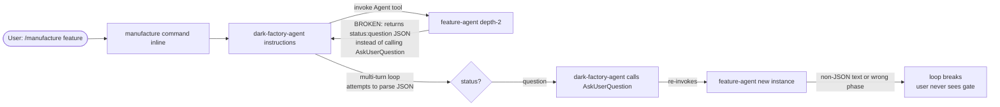
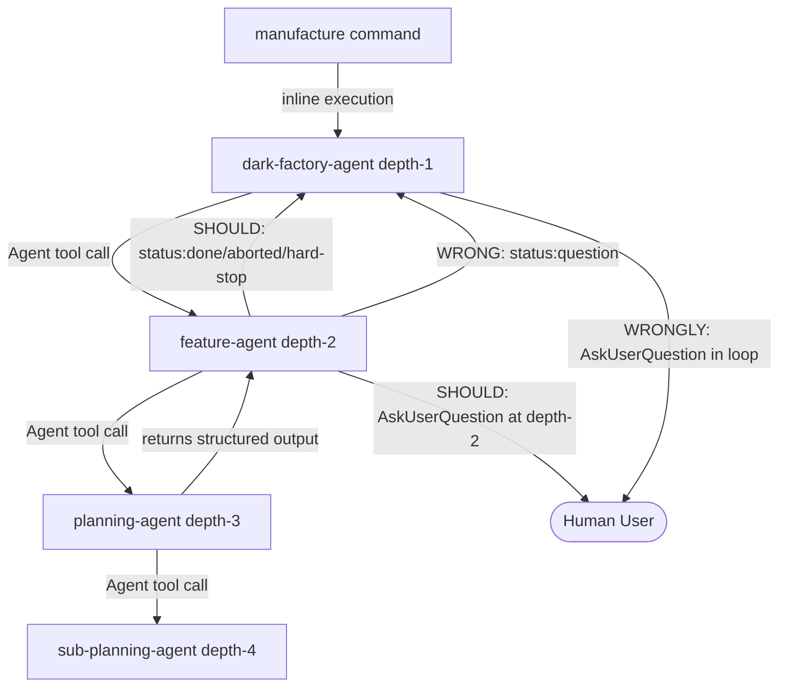

# Planning User Input Bypassed After Dark-Factory-Agent Restore

## Metadata

- Date: `2026-05-06`
- Status: `fixed`
- Severity: `critical`
- Related issue/ticket: `N/A`
- Owner: `lewibs`

## About

**Overview**:
- After the batch-api PR (#176) overwrote dark-factory-agent.md, commit `6a66c8c` restored dark-factory-agent to a pre-fix state (the multi-turn loop from before `3a943ee`). However, feature-agent was not rolled back to match — it still returns `status: "question"` from the old return-question protocol rather than calling AskUserQuestion directly.
- Additionally, `3a943ee`'s fixes to dark-factory-agent (removing the multi-turn loop, adding mandatory step rules) were lost in the restore, and the SubagentStop hooks that were removed from settings.json were re-introduced.
- The net result: dark-factory-agent has the multi-turn loop (expects `status: "question"`) AND feature-agent also returns `status: "question"`, so the loop APPEARS to work — but the tests confirm the intended design (feature-agent calls AskUserQuestion directly, no multi-turn loop) is not in place. At runtime, feature-agent returns confused intermediate text rather than strict `{ status: "question" }` JSON (per the prior bug 2026-05-04), causing the loop to break silently.

**Technical Questions**:
- Why does the multi-turn loop fail? Feature-agent (Haiku) running as a sub-agent tends to return intermediate text rather than strict JSON, breaking the loop in dark-factory-agent (also Haiku).
- Why was the fix lost? The batch-api PR introduced a rename (`name: dark-factory-agent-batch-enabled`) that overwrote the agent file. The restore commit `6a66c8c` restored a pre-`3a943ee` version, losing the AskUserQuestion migration that `3a943ee` implemented.
- What's the correct architecture? Feature-agent runs at depth 2 (manufacture command is inline → dark-factory-agent instructions → Agent tool call → feature-agent at depth 2). At depth 2, AskUserQuestion reaches the user directly. The multi-turn loop in dark-factory-agent is fragile and unnecessary.

**Related Bugs**:
- `docs/bugs/2026-05-04-manufacture-flow-8-violations.md` — original identification of these violations and RC analysis
- `docs/bugs/2026-04-27-planning-approval-gate-bypassed.md` — original planning gate bypass bug

**Resources**:
- `agents/dark-factory/agents/dark-factory-agent.md` — orchestrator with broken multi-turn loop
- `agents/featurework/agents/feature-agent.md` — should use AskUserQuestion directly
- `.claude/settings.json` — SubagentStop hooks that should not be global
- `tests/test_planning_approval_gate.py` — 2 failing tests
- `tests/test_manufacture_flow_violations.py` — 4 failing tests (multi-turn loop, SubagentStop, mandatory steps)
- Commit `3a943ee` — correct fix that was subsequently reverted
- Commit `6a66c8c` — restore commit that lost the fix

## Steps to cause failure

## System

Notes:
- feature-agent at depth 2 CAN call AskUserQuestion and reach the user
- planning-agent at depth 3 CANNOT call AskUserQuestion (auto-answered by parent)
- The multi-turn loop is fragile: if feature-agent returns anything other than strict JSON, the loop breaks

## Reproduction Details

1. Run `python3 -m pytest tests/test_planning_approval_gate.py tests/test_manufacture_flow_violations.py -v`
2. Observe failures:
   - `test_feature_agent_declares_ask_user_question_in_tools` — AskUserQuestion missing from tools frontmatter
   - `test_feature_agent_asks_user_for_flow_approval` — AskUserQuestion not called for flow approval
   - `test_feature_agent_does_not_require_dark_factory_multi_turn_loop` — dark-factory-agent still has the loop
   - `test_settings_json_has_no_subagent_stop_hooks` — SubagentStop hooks present in settings.json
   - `test_dark_factory_agent_has_rule_against_skipping_code_review` — no mandatory rule
   - `test_dark_factory_agent_has_rule_against_user_override_of_mandatory_steps` — no override protection

Reproduction tests: `tests/test_planning_approval_gate.py`, `tests/test_manufacture_flow_violations.py`

## Notes for PR

Root causes and fixes:

**RC1 — feature-agent uses return-question protocol instead of AskUserQuestion**: The restore commit put back the old feature-agent that returns `{ status: "question" }`. Fix: restore the `3a943ee` design — add AskUserQuestion to feature-agent's tools frontmatter and replace all `RETURN { status: "question", ... }` blocks with direct `AskUserQuestion(...)` calls + loop logic.

**RC2 — dark-factory-agent has fragile multi-turn loop**: The restore brought back the multi-turn loop for feature-agent. Fix: simplify dark-factory-agent's feature route to invoke feature-agent once and wait for `status: done | hard-stop | aborted`. Remove all `status == "question"` handling.

**RC3 — SubagentStop hooks in settings.json**: The global SubagentStop hooks fire without agent name context, causing commit-on-subagent-stop.sh to skip all commits. Fix: remove SubagentStop from `.claude/settings.json` (they belong only in agent YAML frontmatter).

**RC4 — Missing mandatory step rules**: dark-factory-agent.md lacks explicit rules preventing steps 7-9 from being skipped on user override. Fix: add "Never skip steps 7-9 (code review, documentation, skill update) — mandatory regardless of user input."

## Audit Log

| ID | Action | Note | Context |
| --- | --- | --- | --- |
| 1 | Create audit log | Initialize bug investigation | user-reported planning gate bypass |
| 2 | Read agent files | Read dark-factory-agent.md, feature-agent.md, planning-agent.md, settings.json | Confirmed current state |
| 3 | Check git history | Identified commit 3a943ee (correct fix) → b9f7f53 (batch-api overwrote) → 6a66c8c (restore lost the fix) | Root cause confirmed |
| 4 | Run failing tests | 6 tests failing: 2 in test_planning_approval_gate.py, 4 in test_manufacture_flow_violations.py | Confirmed reproduction |
| 5 | Root cause analysis | 4 root causes identified | See Notes for PR |

## Verification

- [x] Reproduced failure before fix (6 failing tests confirmed)
- [x] Reproduction test fails before fix
- [x] Root cause identified with evidence (git bisect: commit 6a66c8c restored pre-3a943ee dark-factory-agent without re-applying 3a943ee's fixes)
- [x] Fix applied at source (no workaround-only patch): feature-agent.md uses AskUserQuestion directly, dark-factory-agent.md removes multi-turn loop, settings.json removes SubagentStop hooks, mandatory step rules added
- [x] Reproduction test passes after fix (all 6 previously-failing tests now pass)
- [x] Reproduction path now passes (15/15 in test_planning_approval_gate.py + test_manufacture_flow_violations.py)
- [x] Regression test added/updated (N/A — existing tests were the regressions; they now pass)
- [x] Verified no duplicate solved-bug log exists for same root cause (related: 2026-05-04-manufacture-flow-8-violations.md documents original diagnosis)
