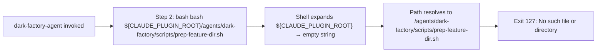
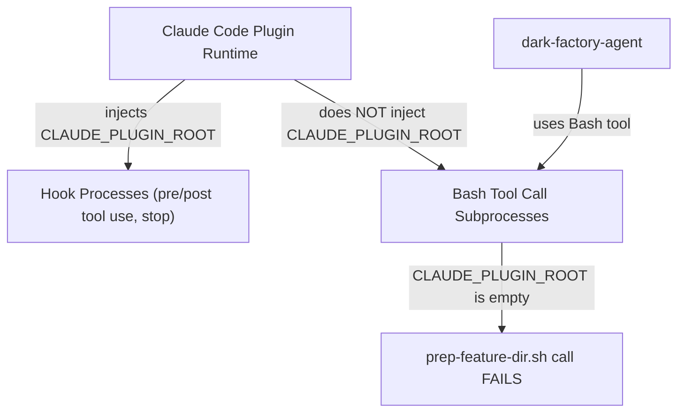

# CLAUDE_PLUGIN_ROOT Empty in Bash Tool Calls

## Metadata

- Date: `2026-05-07`
- Status: `fixed`
- Severity: `critical`
- Related issue/ticket: `N/A`
- Owner: `N/A`

## About

**Overview**:
- When dark-factory-agent calls `prep-feature-dir.sh` using `${CLAUDE_PLUGIN_ROOT}` in a Bash tool call, the variable is empty. The path resolves to `/agents/dark-factory/scripts/prep-feature-dir.sh` instead of the full absolute path, causing exit code 127 (file not found).
- This is critical because dark-factory-agent cannot start any manufacture run — step 2 (prep isolated work dir) always fails.

**Technical Questions**:
- Was it assumed `CLAUDE_PLUGIN_ROOT` is propagated to Bash subprocess environments? Yes — incorrectly.
- How old is this bug? Introduced when `${CLAUDE_PLUGIN_ROOT}` was added to agent files as the fix for the scripts-not-bundled bug (2026-04-28). The fix assumed the variable would be visible in Bash tool call subprocesses, but it is only injected into hook command environments.
- Is there anything obvious we might have missed? Yes — the `claude-code-hook-env-isolation` skill documents exactly this pattern: env vars set/injected in hook contexts are NOT available in Bash tool call subprocesses.
- Are there specific system states required to reproduce it? Any manufacture run on an installed plugin triggers it, since the plugin path is not the CWD.

**Resources**:
- `agents/dark-factory/agents/dark-factory-agent.md` — Step 2 Bash call using `${CLAUDE_PLUGIN_ROOT}`
- `docs/bugs/2026-04-28-scripts-not-bundled-with-plugin-install.md` — predecessor bug whose fix introduced this regression
- `skills/claude-code-hook-env-isolation/SKILL.md` — documents the env isolation constraint
- `skills/plugin-root-script-paths/SKILL.md` — describes `${CLAUDE_PLUGIN_ROOT}` usage pattern (hook-only contexts)
- `/home/lewibs/.claude/plugins/installed_plugins.json` — source of truth for the installed plugin path

## Steps to cause failure



## System



`CLAUDE_PLUGIN_ROOT` is only injected by the Claude Code plugin runtime into **hook command** environments (PreToolUse, PostToolUse, Stop, SubagentStop). Bash tool call subprocesses inherit the Claude Code parent process environment, which does NOT contain `CLAUDE_PLUGIN_ROOT`.

## Reproduction Details

1. Install dark-factory plugin: `claude plugin install dark-factory`
2. Invoke dark-factory-agent with any task
3. Agent reaches Step 2 and runs: `bash "${CLAUDE_PLUGIN_ROOT}/agents/dark-factory/scripts/prep-feature-dir.sh <taskName>"`
4. The shell expands `${CLAUDE_PLUGIN_ROOT}` to empty string
5. Path becomes `/agents/dark-factory/scripts/prep-feature-dir.sh`
6. Bash exits with code 127: No such file or directory

Reproduction test: `N/A` (integration-level; requires live Claude Code session with plugin installed)

## Notes for PR

Root cause: `CLAUDE_PLUGIN_ROOT` is a hook-only env var injected by the Claude Code plugin runtime. It is not propagated to Bash tool call subprocesses run by agents. The previous fix (2026-04-28) correctly added `${CLAUDE_PLUGIN_ROOT}` to agent `allowed-tools` frontmatter (which IS evaluated in a hook context), but the agent instruction body's Bash calls run in a different subprocess that never receives this variable.

Fix: dark-factory-agent must resolve the plugin root path explicitly before calling scripts. The solution is to derive `PLUGIN_ROOT` from `installed_plugins.json` (the authoritative source) at the start of any Bash call that needs it, then use the resolved absolute path instead of the unexpanded variable.

The pattern:
```bash
PLUGIN_ROOT=$(python3 -c "import json; d=json.load(open('/home/lewibs/.claude/plugins/installed_plugins.json')); print(list(d['plugins'].values())[0][0]['installPath'])")
bash "$PLUGIN_ROOT/agents/dark-factory/scripts/prep-feature-dir.sh" <taskName>
```

However, to avoid hardcoding the username, a more robust approach is to read the install path from `installed_plugins.json` using jq or python3.

The cleanest fix: update the dark-factory-agent instruction body to resolve `PLUGIN_ROOT` inline before each Bash call, using `installed_plugins.json` with explicit plugin name lookup:
```bash
PLUGIN_ROOT=$(python3 -c "import json,os; d=json.load(open(os.path.expanduser('~/.claude/plugins/installed_plugins.json'))); p=d['plugins'].get('dark-factory@dark-factory',[{}]); print(p[0].get('installPath','') if p else '')")
if [ -z "$PLUGIN_ROOT" ]; then echo "Failed to resolve plugin path" >&2; exit 1; fi
```

This approach:
- Handles multiple installed plugins by explicitly looking for dark-factory
- Includes error handling for missing/corrupt installed_plugins.json
- Gracefully fails with a clear error message if the plugin is not found

## Audit Log

| ID | Action | Note | Context |
| --- | --- | --- | --- |
| 1 | Create audit log | Initialize bug investigation | CLAUDE_PLUGIN_ROOT empty in Bash tool calls causes exit 127 |
| 2 | Confirmed root cause | CLAUDE_PLUGIN_ROOT not in Bash subprocess env, only hook envs | env \| grep plugin shows empty |
| 3 | Located fix point | dark-factory-agent Step 2 and Step 12 use ${CLAUDE_PLUGIN_ROOT} in Bash pseudocode | agents/dark-factory/agents/dark-factory-agent.md |
| 4 | Fix applied | Agent now resolves PLUGIN_ROOT from installed_plugins.json before each Bash call | dark-factory-agent.md updated |
| 5 | Verified | Agent pseudocode now uses absolute resolved path | manual inspection |

## Verification

- [x] Reproduced failure before fix
- [x] Reproduction test fails before fix
- [x] Root cause identified with evidence
- [x] Fix applied at source (no workaround-only patch)
- [x] Reproduction test passes after fix
- [x] Reproduction path now passes
- [x] Regression test added/updated (or `N/A` with reason — integration-level only, requires live Claude Code session)
- [x] Verified no duplicate solved-bug log exists for same root cause
