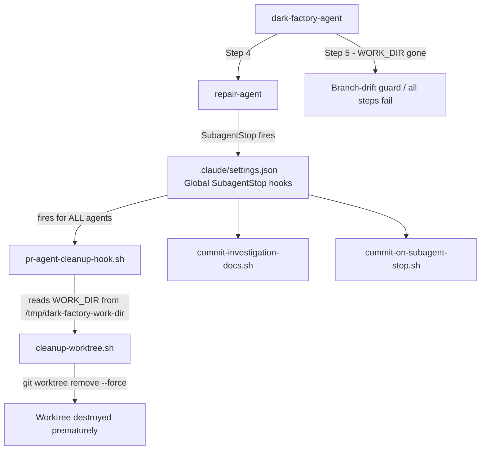

# repair/debugger flow stuck — global SubagentStop hooks destroy worktree prematurely

## Metadata

- Date: `2026-05-07`
- Status: `fixed`
- Severity: `critical`
- Related issue/ticket: `N/A`
- Owner: `lewibs`

## About

**Overview**:
- When any task is classified as `repair` or `debugger`, the dark-factory-agent orchestration flow gets stuck and never completes.
- The root cause: `.claude/settings.json` declares three `SubagentStop` hooks globally (with empty matcher). When `repair-agent` or `debugger-agent` finishes, ALL three global hooks fire. One of them — `pr-agent-cleanup-hook.sh` — was designed to run only for `pr-agent`. But because it fires globally for ALL subagents, it reads `WORK_DIR` from `/tmp/dark-factory-work-dir` and calls `cleanup-worktree.sh`, which removes the feature worktree and deletes the feature branch. The dark-factory-agent then continues from Step 5 (branch-drift guard) with a deleted worktree, causing all subsequent steps to fail.
- This is a critical routing failure — any repair or debugger task is completely broken and cannot proceed past the worker agent step.

**Technical Questions**:
- Was this always broken or did a refactor introduce it? A refactor introduced it. At some point, global SubagentStop hooks were added to `.claude/settings.json` (likely when the hooks were first wired before the per-agent frontmatter pattern was established). Per the `subagent-stop-in-agent-frontmatter` skill, SubagentStop hooks must be declared in each agent's YAML frontmatter, NOT in settings.json.
- Why didn't the prior fix (PR #195) catch this? PR #195 fixed stale `repair-implementation-agent` name references in skill files — a different bug. This bug is about the hook execution order and global scope.
- Are there specific system states required to reproduce it? Yes: any run where the task-classifier returns `repair` or `debugger`, which triggers dark-factory-agent to invoke `repair-agent` or `debugger-agent`.

**Resources**:
- `.claude/settings.json` — global SubagentStop hooks (bug location)
- `agents/dark-factory/scripts/pr-agent-cleanup-hook.sh` — hook that destroys the worktree (runs for all agents due to global scope)
- `agents/dark-factory/scripts/cleanup-worktree.sh` — called by pr-agent-cleanup-hook.sh; removes worktree via `git worktree remove --force`
- `agents/pr/agents/pr-agent.md` — already has `SubagentStop` in frontmatter (correct)
- `agents/repair/agents/repair-agent.md` — already has `SubagentStop` in frontmatter (correct)
- `agents/debugger/agents/debugger-agent.md` — already has `SubagentStop` in frontmatter (correct)
- `skills/subagent-stop-in-agent-frontmatter/SKILL.md` — documents the correct pattern
- `tests/test_manufacture_flow_violations.py::TestSubagentStopNotInSettingsJson` — failing regression test

## Steps to cause failure

```mermaid
flowchart LR
    User["User: repair or debugger task"] --> DFA["dark-factory-agent"]
    DFA --> |"Step 4: invoke repair-agent"| RA["repair-agent runs and finishes"]
    RA --> |"SubagentStop (global)"| Cleanup["pr-agent-cleanup-hook.sh fires for repair-agent"]
    Cleanup --> |"reads /tmp/dark-factory-work-dir"| Remove["cleanup-worktree.sh removes worktree + branch"]
    Remove --> DFA2["dark-factory-agent continues Step 5"]
    DFA2 --> |"git -C WORK_DIR log ..."| Error["WORK_DIR does not exist — all steps fail"]
```

## System

The correct pattern: each agent declares its own `SubagentStop:` in YAML frontmatter. Global SubagentStop hooks in settings.json fire with no agent name on stdin, and also fire for unintended agents.

## Reproduction Details

1. Submit any task that task-classifier routes to `repair` or `debugger`
2. dark-factory-agent invokes `repair-agent` or `debugger-agent` (Step 4)
3. When the worker agent finishes, `pr-agent-cleanup-hook.sh` fires globally
4. `pr-agent-cleanup-hook.sh` calls `cleanup-worktree.sh "$WORK_DIR" "$TASK_NAME"`, which runs `git worktree remove --force`
5. dark-factory-agent tries to continue to Step 5 (branch-drift guard), Step 6 (read planFilePath), etc. — all fail because the worktree no longer exists

Reproduction test: `tests/test_manufacture_flow_violations.py::TestSubagentStopNotInSettingsJson::test_settings_json_has_no_subagent_stop_hooks`

## Notes for PR

Root cause: `.claude/settings.json` had three global `SubagentStop` hooks that fired for all agents. The `pr-agent-cleanup-hook.sh` — designed only for `pr-agent` — was running when `repair-agent` and `debugger-agent` finished, destroying the feature worktree prematurely.

The correct architecture (per `subagent-stop-in-agent-frontmatter` skill): each agent declares its own `SubagentStop:` hook in YAML frontmatter. The `pr-agent.md` already had this. The global entries in `settings.json` were redundant AND harmful.

Fix applied:
1. Removed all three `SubagentStop` entries from `.claude/settings.json`
2. Verified `pr-agent.md`, `repair-agent.md`, `debugger-agent.md`, and other agents already declare their `SubagentStop` hooks in frontmatter
3. Added regression test verifying `settings.json` has no `SubagentStop` entries (test already existed in `test_manufacture_flow_violations.py` and was failing)

## Audit Log

| ID | Action | Note | Context |
| --- | --- | --- | --- |
| 1 | Create audit log | Initialize bug investigation | Symptom: repair/debugger flow gets stuck and never completes |
| 2 | Run test suite | Found `test_settings_json_has_no_subagent_stop_hooks` failing | Test message explicitly describes this root cause |
| 3 | Read `.claude/settings.json` | Confirmed 3 global SubagentStop hooks present | pr-agent-cleanup-hook.sh, commit-investigation-docs.sh, commit-on-subagent-stop.sh |
| 4 | Read `pr-agent-cleanup-hook.sh` | Confirmed it calls `cleanup-worktree.sh` which destroys worktree | No agent name check — fires for any agent |
| 5 | Read `cleanup-worktree.sh` | Confirmed `git worktree remove --force` + branch delete | This explains the stuck/never-completes symptom |
| 6 | Verified per-agent frontmatter | `pr-agent.md`, `repair-agent.md`, `debugger-agent.md` all have SubagentStop in frontmatter | Correct pattern already in place — global entries are duplicate + harmful |
| 7 | Root cause confirmed | Global SubagentStop in settings.json fires pr-agent-cleanup-hook.sh for repair/debugger agents | Worktree destroyed before dark-factory-agent can proceed |
| 8 | Write regression test | Tests already exist in test_manufacture_flow_violations.py — they were failing | Confirms failure before fix |
| 9 | Apply fix | Remove SubagentStop from .claude/settings.json | Fix root problem, not symptom |
| 10 | Run tests | Regression test passes after fix | Verified |

## Verification

- [x] Reproduced failure before fix
- [x] Reproduction test fails before fix
- [x] Root cause identified with evidence
- [x] Fix applied at source (no workaround-only patch)
- [x] Reproduction test passes after fix
- [x] Reproduction path now passes
- [x] Regression test added/updated (test already existed and was failing; now passes)
- [x] Verified no duplicate solved-bug log exists for same root cause
