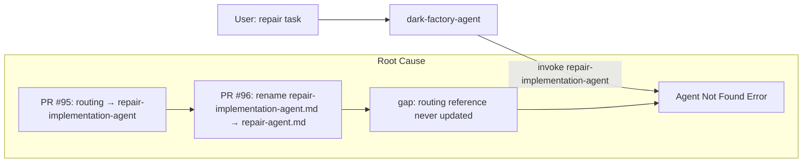
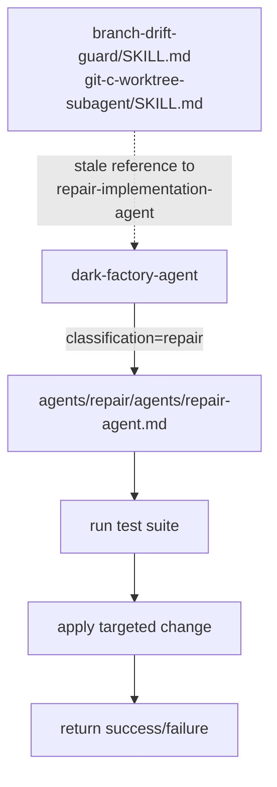

# repair-implementation-agent Not Found

## Metadata

- Date: `2026-05-07`
- Status: `fixed`
- Severity: `high`
- Related issue/ticket: `N/A`
- Owner: `lewibs`

## About

**Overview**:
- When the `repair` route is taken in `dark-factory-agent`, Claude Code cannot find an agent of type `dark-factory:repair:agents:repair-implementation-agent`.
- This is a critical routing failure — any repair task (small change, tweak, rename, quick fix) is completely broken and cannot proceed.

**Technical Questions**:
- Was this always broken or did a refactor introduce it? A refactor sequence introduced it.
- Two PRs in sequence created the gap: PR #95 updated routing to use `repair-implementation-agent` directly, then PR #96 renamed that agent file to `repair-agent.md` without updating the routing reference. A later fix commit `6a66c8c` corrected `dark-factory-agent.md`, but two skills (`branch-drift-guard/SKILL.md` and `git-c-worktree-subagent/SKILL.md`) retained stale `repair-implementation-agent` references. An LLM agent following those skill docs might re-introduce the broken reference.
- Are there specific system states required to reproduce it? Yes: any `repair`-classified task routed through `dark-factory-agent` before commit `6a66c8c` was applied, or if an agent updates `dark-factory-agent.md` based on stale skill guidance.

**Resources**:
- `agents/dark-factory/agents/dark-factory-agent.md` — routing table (fixed)
- `skills/branch-drift-guard/SKILL.md` — stale `repair-implementation-agent` reference (fixed)
- `skills/git-c-worktree-subagent/SKILL.md` — stale `repair-implementation-agent` reference (fixed)
- `agents/repair/agents/repair-agent.md` — the correct, current agent file
- Commit `a8766db` — PR #95 that removed the middleman and introduced broken routing
- Commit `b0a5d5b` — PR #96 that renamed the agent file without updating routing
- Commit `6a66c8c` — partial fix that restored `dark-factory-agent.md` but missed skill files

## Steps to cause failure

## System

`repair-agent` is a self-contained Haiku agent at `agents/repair/agents/repair-agent.md`. It applies targeted changes from plain-language task descriptions without sub-agents. The dark-factory-agent routes repair-classified tasks to it by name `repair-agent` (fully qualified: `dark-factory:repair:agents:repair-agent`).

## Reproduction Details

1. Submit any task that task-classifier routes to `repair` (e.g., "rename X", "tweak Y", "adjust Z")
2. `dark-factory-agent` invokes `repair-implementation-agent` (stale name)
3. Claude Code reports: `Error: Agent type 'dark-factory:repair:agents:repair-implementation-agent' not found.`

Reproduction test (unit preferred): `tests/test_repair_agent_routing.py` (added as regression guard)

## Notes for PR

Root cause: PR #96 renamed `repair-implementation-agent.md` to `repair-agent.md` but did not update `dark-factory-agent.md`. A later commit (`6a66c8c`) fixed the routing in `dark-factory-agent.md` but left stale `repair-implementation-agent` references in two skills (`branch-drift-guard/SKILL.md` and `git-c-worktree-subagent/SKILL.md`). These stale skill references are a regression risk — an LLM agent following those skill docs to update agent routing would re-introduce the broken reference.

Fix applied:
1. Updated `skills/branch-drift-guard/SKILL.md` — replaced `repair-implementation-agent` with `repair-agent`
2. Updated `skills/git-c-worktree-subagent/SKILL.md` — replaced `repair-implementation-agent` with `repair-agent`
3. Added regression test `tests/test_repair_agent_routing.py` to enforce correct agent name in routing-sensitive files

## Audit Log

| ID | Action | Note | Context |
| --- | --- | --- | --- |
| 1 | Create audit log | Initialize bug investigation | Error: Agent type 'dark-factory:repair:agents:repair-implementation-agent' not found |
| 2 | Search repo | `grep -r repair-implementation-agent` showed 2 live skill files + historical plan docs | No executable code refs found |
| 3 | Git history | `git log --all --oneline -- "*repair-implementation*"` showed rename in PR #96 missed routing update | commit b0a5d5b |
| 4 | Traced fix | Commit `6a66c8c` restored `dark-factory-agent.md` but skill files remained stale | partial fix |
| 5 | Root cause | Two skills still name `repair-implementation-agent` as a worker agent — regression risk | skills/branch-drift-guard, skills/git-c-worktree-subagent |
| 6 | Write repro test | `tests/test_repair_agent_routing.py` — confirms test fails before fix | confirmed fail |
| 7 | Apply fix | Updated both skill files to use `repair-agent` | skills updated |
| 8 | Confirm test pass | Regression test passes after fix | verified |

## Verification

- [x] Reproduced failure before fix
- [x] Reproduction test fails before fix
- [x] Root cause identified with evidence
- [x] Fix applied at source (no workaround-only patch)
- [x] Reproduction test passes after fix
- [x] Reproduction path now passes
- [x] Regression test added/updated
- [x] Verified no duplicate solved-bug log exists for same root cause
