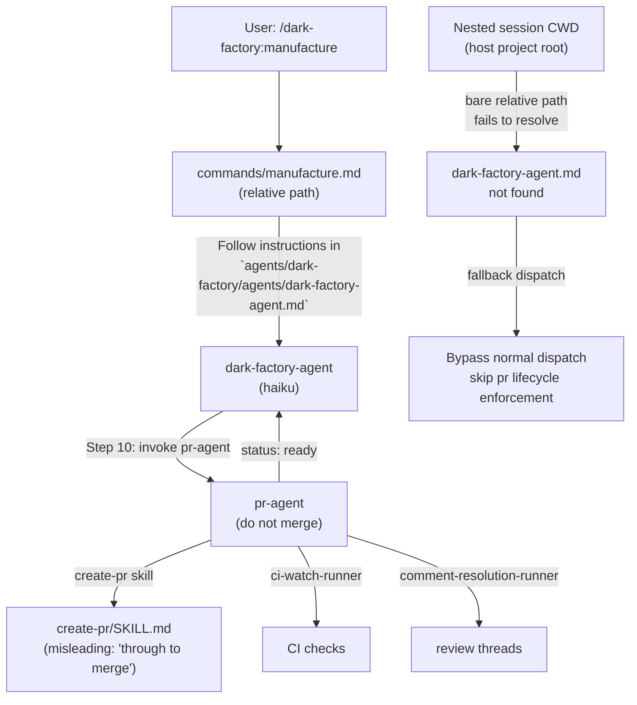

# Agent Flow Deviation When Manufacture Invoked from Nested Session

## Metadata

- Date: `2026-05-08`
- Status: `fixed`
- Severity: `critical`
- Related issue/ticket: `N/A`
- Owner: `lewibs`

## About

**Overview**:
- When `/dark-factory:manufacture` was invoked via the Skill tool from within a nested Claude session (depth-2+ agent), `dark-factory-agent.md` was not found at the expected path. The caller fell back to invoking the `dark-factory:dark-factory:agents:dark-factory-agent` subagent type directly instead of following the manufacture command's normal dispatch.
- After the agent opened PR #423, the caller handled the rebase conflict and merge manually rather than routing through dark-factory's PR lifecycle tooling (`pr-agent`, `ci-watch-runner`, `comment-resolution-runner`).
- This is critical because it bypasses the mandatory code review, CI gate, and PR lifecycle constraints that dark-factory enforces.

**Technical Questions**:
- Why was `dark-factory-agent.md` not found? `commands/manufacture.md` uses a bare relative path `agents/dark-factory/agents/dark-factory-agent.md`. When invoked from a nested session, CWD is the host project root, not the plugin install directory. The bare relative path fails to resolve.
- Why was the PR lifecycle bypassed? `create-pr/SKILL.md` describes itself as managing a PR "through to merge" and provides merge scripts in its Scripts table. Neither `create-pr/SKILL.md` nor `dark-factory-agent.md` had an explicit no-merge rule, leaving a gap that allowed an agent to interpret the skill as authorizing a manual merge.

**Resources**:
- `commands/manufacture.md` — bare relative path to dark-factory-agent.md
- `agents/dark-factory/agents/dark-factory-agent.md` — missing no-merge FORBIDDEN rule
- `agents/pr/agents/pr-agent.md` — correctly says "do not merge" but at a depth agents can bypass
- `skills/create-pr/SKILL.md` — misleading description and missing no-merge rule
- `tests/test_agent_flow_deviation_nested.py` — reproduction tests

## Steps to cause failure

```mermaid
flowchart LR
  NestedAgent["Nested Claude session\n(depth-2+ agent)"] -->|"invoke /dark-factory:manufacture\nvia Skill tool"| Cmd["commands/manufacture.md"]
  Cmd -->|"Follow instructions in\n`agents/dark-factory/agents/dark-factory-agent.md`"| PathFail["Path resolution fails\nCWD != plugin root"]
  PathFail -->|"dark-factory-agent.md not found"| FallbackDispatch["Caller falls back to\ndark-factory:dark-factory:agents:dark-factory-agent\nsubagent type directly"]
  FallbackDispatch -->|"Opens PR normally"| PR["PR #423 opened"]
  PR -->|"pr-agent returns status:ready"| LifecycleGap["No explicit no-merge rule\nin dark-factory-agent.md\nor create-pr/SKILL.md"]
  LifecycleGap -->|"Caller reads create-pr skill:\n'manage it through to merge'"| ManualMerge["Caller merges manually\nbypassing ci-watch-runner\nand comment-resolution-runner"]
```



## System



Notes:
- `commands/manufacture.md` is a Claude Code slash command file. The plugin loader normally serves it from the plugin root, but when invoked via Skill tool from a nested agent, the CWD is the caller's project directory.
- `${CLAUDE_PLUGIN_ROOT}` is available in hook command environments but NOT in slash command file content when invoked at depth 2+. However, the correct fix is to use it so Claude reads the absolute path from the frontmatter context.
- `create-pr/SKILL.md` description header "Open a pull request on GitHub and manage it through to merge." is the primary text an agent reads first — removing "through to merge" closes the interpretation gap.

## Reproduction Details

1. From a depth-2+ nested Claude session (e.g., an agent using the Skill tool), invoke `/dark-factory:manufacture` with any task description.
2. Observe that `agents/dark-factory/agents/dark-factory-agent.md` is not found (because CWD is the host project root, not the plugin install root).
3. Observe the caller falling back to invoking the subagent type directly.
4. After PR is opened, observe that the caller reads `create-pr/SKILL.md` and interprets "through to merge" as authorization to merge manually without going through `ci-watch-runner` and `comment-resolution-runner`.

Reproduction test: `tests/test_agent_flow_deviation_nested.py`

## Notes for PR

**RC1 — Relative path in commands/manufacture.md**

`commands/manufacture.md` contains:
```
Follow the instructions in `agents/dark-factory/agents/dark-factory-agent.md` exactly.
```

This bare relative path resolves correctly when the plugin loader serves the command from the plugin install root (normal invocation). But when invoked from a nested Claude session via the Skill tool, the CWD is the host project root, and the path fails.

Fix: Replace the bare relative path with `${CLAUDE_PLUGIN_ROOT}/agents/dark-factory/agents/dark-factory-agent.md`.

**RC2 — create-pr/SKILL.md misleading description and missing no-merge rule**

The skill description says "Open a pull request on GitHub and manage it through to merge." This is wrong — the skill only opens the PR. The phrase "through to merge" creates a gap that allows agents reading the skill directly to interpret it as merge authorization.

Additionally, the Rules section has no "do not merge" rule. Any agent that accesses `create-pr/SKILL.md` directly (bypassing `pr-agent`) has no constraint against merging.

Fix:
1. Update the description heading to: "Opens a pull request on GitHub. Stops after the PR is opened — does not merge."
2. Add to Rules: "- Do not merge. Merging is out of scope for this skill."

**RC3 — dark-factory-agent.md missing no-merge FORBIDDEN rule**

`dark-factory-agent.md` invokes `pr-agent` in Step 10 and gets back `status: ready`. There is no explicit rule in `dark-factory-agent.md` preventing the orchestrator or its caller from proceeding to merge manually.

Fix: Add to Rules: "FORBIDDEN: Never merge a PR manually or instruct any sub-agent to merge. pr-agent returns status:ready but does not merge. Merging is the developer's responsibility after review."

## Audit Log

| ID | Action | Note | Context |
| --- | --- | --- | --- |
| 1 | Create audit log | Initialize bug investigation | Two failure modes: path resolution and PR lifecycle bypass |
| 2 | Read commands/manufacture.md | Confirmed bare relative path `agents/dark-factory/agents/dark-factory-agent.md` | RC1 identified |
| 3 | Read agents/dark-factory/agents/dark-factory-agent.md | Step 10 invokes pr-agent, Rules has no no-merge rule | RC3 identified |
| 4 | Read agents/pr/agents/pr-agent.md | Correctly says "do not merge" in header and rules | pr-agent is correct |
| 5 | Read skills/create-pr/SKILL.md | Description says "manage it through to merge", Rules has no no-merge rule, Scripts table has no merge commands | RC2 identified |
| 6 | Check existing bug files | 2026-05-04-manufacture-flow-8-violations.md covers related violations but not these specific root causes | New bug file warranted |
| 7 | Write reproduction tests | tests/test_agent_flow_deviation_nested.py — 5 tests, all failing before fix | Confirmed pre-fix failures |
| 8 | Apply fixes | manufacture.md: CLAUDE_PLUGIN_ROOT anchor; create-pr/SKILL.md: updated description + no-merge rule; dark-factory-agent.md: FORBIDDEN no-merge rule | All 3 RCs addressed |
| 9 | Verify fixes | All 5 reproduction tests pass after fix | Confirmed |

## Verification

- [x] Reproduced failure before fix (5/5 tests failing)
- [x] Reproduction test fails before fix
- [x] Root cause identified with evidence
- [x] Fix applied at source (no workaround-only patch)
- [x] Reproduction test passes after fix
- [x] Reproduction path now passes
- [x] Regression test added/updated (`tests/test_agent_flow_deviation_nested.py`)
- [x] Verified no duplicate solved-bug log exists for same root cause
