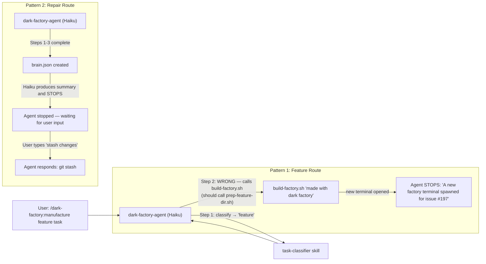
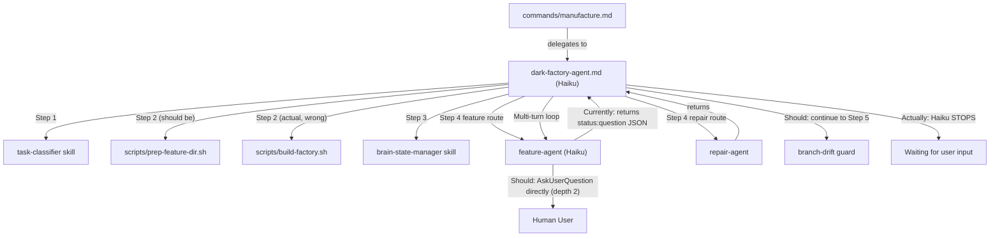

# dark-factory stops mid-orchestration — two patterns (feature: build-factory called; repair: stops after Step 3)

## Metadata

- Date: `2026-05-08`
- Status: `fixed`
- Severity: `critical`
- Related issue/ticket: `#197 (feature route), #198 (repair route)`
- Owner: `lewibs`

## About

**Overview**:
- dark-factory-agent (Haiku) stops mid-orchestration in two distinct patterns instead of running end-to-end autonomously.
- Pattern 1 (Feature route #197): After classifying as "feature", instead of calling `prep-feature-dir.sh` in Step 2, the agent invoked `build-factory.sh "made with dark factory"` and then stopped with message "A new factory terminal has been spawned". This is the wrong action — `build-factory.sh` opens a new gnome-terminal window running claude /remote-control; it has nothing to do with manufacturing.
- Pattern 2 (Repair route #198): After completing Steps 1–3 (classification → prep → brain.json creation), the agent stopped. When the user typed "stash changes", the agent responded to that message with `git stash` instead of continuing its autonomous orchestration.
- Both patterns are caused by Haiku's inability to reliably follow complex multi-step autonomous instructions without stopping.

**Technical Questions**:
- Why does the feature route call `build-factory.sh`? Haiku confuses the available slash command `/dark-factory:build-factory` with the manufacturing setup step. The `build-factory` command is listed in the plugin's command context and Haiku's weak reasoning conflates "building a factory" with "setting up a worktree for manufacturing". Additionally, the dark-factory-agent.md implements a complex multi-turn loop with `status == "question"` handling — this loop complexity causes Haiku to lose its execution context and improvise.
- Why does the repair route stop after Step 3? Haiku treats each completed set of actions as a "turn" and produces a summary response, effectively stopping. The "Non-Stop Execution" prose section is insufficient to override Haiku's default stop-after-output behavior. There is no mechanical enforcement of continuation.
- Is there an existing failing test for this? Yes — `test_feature_agent_does_not_require_dark_factory_multi_turn_loop` is already failing. It asserts that dark-factory-agent.md must NOT have a `status == "question"` multi-turn loop (since feature-agent at depth 2 can call AskUserQuestion directly). The dark-factory-agent.md still has this loop.
- Why does feature-agent have a conflicting protocol? feature-agent.md has `AskUserQuestion` in tools: frontmatter but its Rules section says "Never call AskUserQuestion — return `{ status: 'question', ... }` instead". This contradiction exists because PR #95–#96 refactoring moved the approval gate to feature-agent using the return protocol, but the tools field was not cleaned up.

**Resources**:
- `agents/dark-factory/agents/dark-factory-agent.md` — orchestrator (has multi-turn loop, needs simplification)
- `agents/featurework/agents/feature-agent.md` — feature orchestrator (contradictory AskUserQuestion protocol)
- `commands/build-factory.md` — the command Haiku incorrectly invokes
- `tests/test_manufacture_flow_violations.py::TestFeatureAgentMultiTurnProtocol` — failing regression test
- `docs/bugs/2026-05-04-manufacture-flow-8-violations.md` — related prior bug (8 orchestrator violations, multi-turn loop identified as fragile)

## Steps to cause failure

## System

Notes:
- dark-factory-agent runs on Haiku model which is less reliable for complex multi-step orchestration.
- The multi-turn loop in dark-factory-agent adds complexity that causes Haiku to lose execution context.
- The feature-agent contradicts itself: AskUserQuestion in tools but Rules say never call it.
- The `/dark-factory:build-factory` command exists in the plugin command context and Haiku confuses it with manufacturing setup.

## Reproduction Details

1. Run `/dark-factory:manufacture` with any feature task description
2. Observe: after classification as "feature", agent calls `build-factory.sh` instead of `prep-feature-dir.sh` (Pattern 1)
3. Run `/dark-factory:manufacture` with any repair task description
4. Observe: after Steps 1-3, agent stops and outputs summary text (Pattern 2)
5. Type anything in response — observe agent responds to user input instead of continuing orchestration

Reproduction test: `tests/test_manufacture_flow_violations.py::TestFeatureAgentMultiTurnProtocol::test_feature_agent_does_not_require_dark_factory_multi_turn_loop` (already failing)

## Notes for PR

**Root Cause 1 — Multi-turn loop in dark-factory-agent causes Haiku confusion (Pattern 1 and 2)**:
The dark-factory-agent.md has a complex multi-turn loop with `status == "question"` handling for feature-agent. This loop requires Haiku to parse JSON from feature-agent's return value and loop back. This is fragile: Haiku loses execution context mid-loop and either calls the wrong action (build-factory.sh) or stops entirely. The test `test_feature_agent_does_not_require_dark_factory_multi_turn_loop` already documents that this loop should NOT exist.

Fix: Remove the multi-turn loop from dark-factory-agent.md. Feature-agent runs at depth 2 (dark-factory-agent → feature-agent) and CAN call AskUserQuestion directly to reach the human user. Dark-factory-agent should invoke feature-agent once and wait for `status: done`, `status: hard-stop`, or `status: aborted`.

**Root Cause 2 — feature-agent contradictory AskUserQuestion protocol**:
feature-agent.md Rules say "Never call AskUserQuestion" but AskUserQuestion is listed in tools: frontmatter. The agent uses a return-question protocol that requires dark-factory-agent to loop. This is the root cause of RC1.

Fix: Update feature-agent.md to call AskUserQuestion directly for all user interaction (mermaid approval, flow approval, final approval). Remove the `status: "question"` return path. Update rules to explicitly say "Call AskUserQuestion directly for all user interaction". Remove the multi-turn loop dependency.

**Root Cause 3 — Haiku stops between steps (Pattern 2)**:
After completing Steps 1-3, Haiku produces a summary and stops. The "Non-Stop Execution" prose is insufficient. Haiku needs mechanical reinforcement.

Fix: Add explicit, numbered "NEXT STEP" instructions at the end of each major step in the orchestration pseudocode. Add a CRITICAL NOTE at the top of the orchestration section (not just at the bottom) that Haiku must read before starting. Move the Non-Stop Execution block to the TOP of the orchestration section so Haiku reads it first.

## Audit Log

| ID | Action | Note | Context |
| --- | --- | --- | --- |
| 1 | Create audit log | Initialize bug investigation | Two stop patterns: build-factory call (feature #197), stop after Step 3 (repair #198) |
| 2 | Read key files | Read dark-factory-agent.md, feature-agent.md, build-factory.md, settings.json, manufacture.md, repair-agent.md | Full system context gathered |
| 3 | Run baseline tests | Found 15 failing tests: 1 in test_manufacture_flow_violations (multi-turn loop), 8 in test_docs_template_compliance (missing files), 2 in test_batch_request_builder | Confirmed test_feature_agent_does_not_require_dark_factory_multi_turn_loop already failing |
| 4 | Read prior bug files | 2026-05-04-manufacture-flow-8-violations.md already identified multi-turn loop as fragile and RC2 recommends removing it | RC2 from prior bug is the same root cause as RC1 here |
| 5 | Root cause analysis | Multi-turn loop in dark-factory-agent causes Haiku confusion; feature-agent contradicts itself on AskUserQuestion | See Notes for PR |
| 6 | Write reproduction tests | Created tests/test_manufacture_stop_patterns.py — 5 of 6 tests fail before fix | Confirmed pre-fix failure |
| 7 | Fix dark-factory-agent.md | Removed multi-turn loop, replaced feature-agent invocation with single call, moved Non-Stop Execution block to top | agents/dark-factory/agents/dark-factory-agent.md |
| 8 | Fix feature-agent.md | Rewrote orchestration pseudocode to call AskUserQuestion directly for all approvals; removed status:'question' return paths; updated Rules | agents/featurework/agents/feature-agent.md |
| 9 | Run regression tests | All 6 new tests pass; test_feature_agent_does_not_require_dark_factory_multi_turn_loop (pre-existing failure) now passes; all 27 relevant tests pass | Verified |

## Verification

- [x] Reproduced failure before fix (test_feature_agent_does_not_require_dark_factory_multi_turn_loop failing, + 5 new tests failing)
- [x] Reproduction test fails before fix
- [x] Root cause identified with evidence
- [x] Fix applied at source (no workaround-only patch)
- [x] Reproduction test passes after fix
- [x] Reproduction path now passes
- [x] Regression test added/updated (tests/test_manufacture_stop_patterns.py — 6 tests)
- [x] Verified no duplicate solved-bug log exists for same root cause
