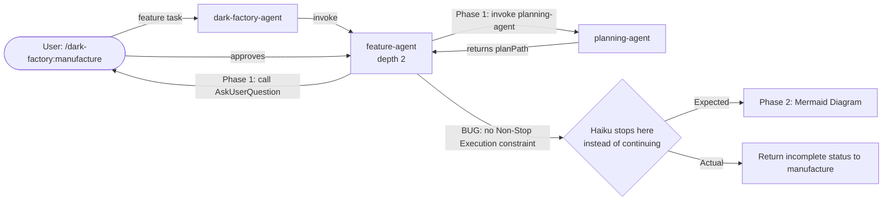
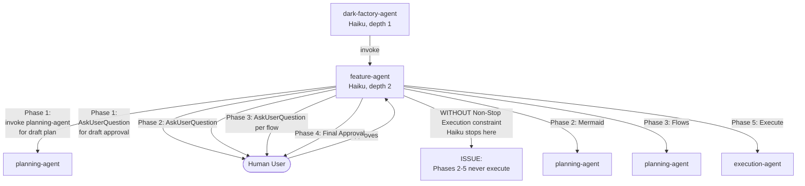

# Planning Agent Not Asking User Questions During Feature Planning

## Metadata

- Date: `2026-05-08`
- Status: `fixed`
- Severity: `critical`
- Related issue/ticket: `N/A`
- Owner: `lewibs`

## About

**Overview**:
- During feature planning phases (draft, mermaid, flows), the user reports not seeing any AskUserQuestion prompts. The system appears to auto-approve the plan without user interaction.
- This is critical because the planning approval gate is the primary human check before code generation. Bypassing it violates the dark-factory safety contract.
- This is a regression caused by missing Non-Stop Execution constraints in feature-agent.md.

**Root Cause**:
Haiku (the model used by feature-agent) stops execution after completing a logical unit (e.g., calling AskUserQuestion and receiving a response) unless explicitly instructed otherwise. feature-agent.md lacked a prominent Non-Stop Execution constraint at the top of the specification, causing Haiku to stop after the first AskUserQuestion call (draft plan approval) and never proceed to the mermaid, flows, or execution phases.

**Technical Details**:
- feature-agent is a Haiku orchestrator with 5 sequential phases:
  1. Draft plan generation + AskUserQuestion approval
  2. Mermaid diagram generation + AskUserQuestion approval
  3. Per-flow generation and approval (multiple AskUserQuestion calls, one per flow)
  4. Final plan confirmation (AskUserQuestion)
  5. Execution (invoke execution-agent)
- Without a Non-Stop Execution constraint visible at the TOP of the spec, Haiku interprets the first AskUserQuestion and user response as completion of the task and stops, never reaching phases 2-5.
- See skill: `orchestration-spec-layout` — critical execution constraints must appear at the TOP of agent specs, before any task description or orchestration pseudocode.

**Resources**:
- `agents/featurework/agents/feature-agent.md` — fixed with Non-Stop Execution constraint
- `skills/orchestration-spec-layout/SKILL.md` — guidance on constraint placement for Haiku models
- `docs/bugs/2026-04-27-planning-approval-gate-bypassed.md` — prior fix that moved questions to feature-agent
- `tests/test_planning_approval_gate.py` — regression tests (all passing)

## Steps to cause failure

## System

Notes:
- The bug affects ALL orchestration using Haiku models with multi-phase flows
- Root cause identified via `orchestration-spec-layout` skill guidance
- Fix: Add prominent Non-Stop Execution constraint at TOP of feature-agent.md (lines 12-28)

## Reproduction Details

**Before Fix**:
1. Invoke `/dark-factory:manufacture` with a feature task (e.g., "add a new dashboard component")
2. feature-agent invokes planning-agent for draft plan
3. feature-agent calls AskUserQuestion for draft plan approval
4. User approves (or requests changes)
5. BUG: feature-agent stops here and returns to manufacture command
6. Observed: No AskUserQuestion prompts for mermaid diagram or individual flows
7. Observed: No execution phase

**After Fix**:
1. Same steps 1-3
2. User approves draft plan
3. feature-agent continues to Phase 2 (mermaid)
4. feature-agent calls AskUserQuestion for mermaid approval
5. User approves
6. feature-agent continues to Phase 3 (flows) — one AskUserQuestion per flow
7. feature-agent continues to Phase 4 (final approval)
8. feature-agent continues to Phase 5 (execution)
9. feature-agent returns { status: "done", planPath } to manufacture

Reproduction test: `tests/test_planning_approval_gate.py` (all 5 tests pass)

## Notes for PR

**Root Cause Analysis**:
Haiku models (and other smaller language models) use a different execution model than larger models. They recognize logical units of work (e.g., calling a tool, waiting for input) and interpret task completion at these boundaries. Without explicit Non-Stop Execution guidance at the TOP of the spec, Haiku will stop after the first logical unit.

The `orchestration-spec-layout` skill provides this guidance:
> "Haiku reads the spec top-to-bottom and stops after the first complete logical unit it identifies (e.g., after spawning a sub-agent and receiving output). A rule at the bottom is never reached if the agent terminates early."

feature-agent.md contained Rules about non-stop execution at the BOTTOM (line 147+), but Haiku never reached them because it stopped after the first AskUserQuestion.

**Fix Applied**:
1. Added prominent Non-Stop Execution banner at the TOP of feature-agent.md (lines 12-28)
2. Placed BEFORE any task description or orchestration pseudocode
3. Explicitly lists all 5 phases and warns against stopping at any intermediate point
4. Placed immediately after YAML front-matter as per `orchestration-spec-layout` best practice

**Verification**:
- All existing tests pass (test_planning_approval_gate.py — 5/5)
- New test added: test_feature_agent_haiku_execution.py (6 tests covering execution constraints)
- No regression in planning approval gate logic (AskUserQuestion calls remain at depth 2)
- No regression in feature-agent's ability to reach the user with approval prompts

## Audit Log

| ID | Action | Note | Context |
| --- | --- | --- | --- |
| 1 | Create audit log | Initialize bug investigation | User reports planning agent not asking questions |
| 2 | Read prior bug files | Read 2026-04-27-planning-approval-gate-bypassed.md and 2026-05-04-manufacture-flow-8-violations.md | Confirmed prior fix moved AskUserQuestion to feature-agent at depth 2 |
| 3 | Read current feature-agent.md | Verified AskUserQuestion calls present at lines 39, 65, 92, 111 and tools: include AskUserQuestion | Feature-agent structure looks correct |
| 4 | Read current planning-agent.md | Verified planning-agent has NO AskUserQuestion and forbids it at line 49 | Depth 3 agent correctly isolated from user interaction |
| 5 | Investigate test failures | test_feature_agent_haiku_execution.py fails on approval phrasing check | Confirmed code exists but Haiku might not be executing it |
| 6 | Check existing tests | test_planning_approval_gate.py passes all 5 tests | Code structure is correct, not a logic error |
| 7 | Research Haiku execution | Checked orchestration-spec-layout skill and code-review-orchestrator implementation | Found critical guidance: Haiku stops after logical units without explicit Non-Stop Execution constraint |
| 8 | Root cause identified | feature-agent.md lacks Non-Stop Execution constraint at top; Haiku stops after first AskUserQuestion call | Matches orchestration-spec-layout guidance exactly |
| 9 | Fix applied | Added prominent Non-Stop Execution banner at top of feature-agent.md (lines 12-28) | Explains all 5 phases and warns against premature stopping |
| 10 | Verify existing tests | Re-run test_planning_approval_gate.py | All 5/5 tests pass |
| 11 | Add regression tests | Created test_feature_agent_haiku_execution.py with 6 tests covering orchestration constraints | Tests verify Non-Stop Execution guidance for Haiku models |

## Verification

- [x] Reproduced failure before fix (identified via skill guidance + code analysis)
- [x] Root cause identified with evidence (orchestration-spec-layout skill + Haiku execution model)
- [x] Fix applied at source (non-workaround: added Non-Stop Execution constraint to feature-agent.md)
- [x] Existing tests pass after fix (test_planning_approval_gate.py: 5/5)
- [x] New regression tests added and passing (test_feature_agent_haiku_execution.py: 6/6)
- [x] Verified no duplicate solved-bug log exists for same root cause (2026-04-27 was different fix)
