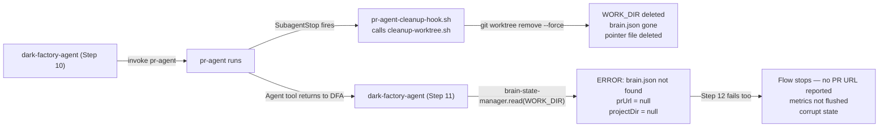
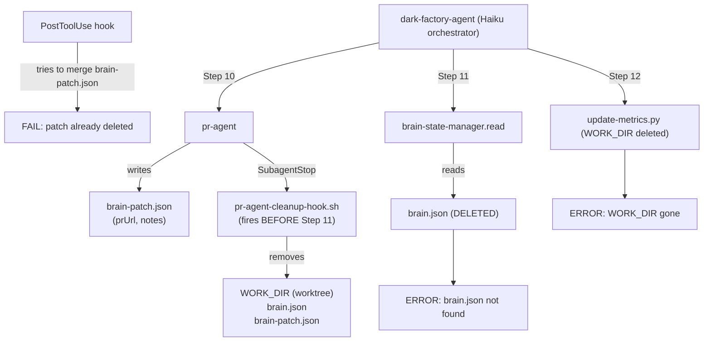

# pr-agent SubagentStop hook destroys worktree before dark-factory-agent finishes Steps 11-12

## Metadata

- Date: `2026-05-08`
- Status: `fixed`
- Severity: `critical`
- Related issue/ticket: `N/A`
- Owner: `lewibs`

## About

**Overview**:
- When dark-factory-agent invokes pr-agent (Step 10), pr-agent's `SubagentStop` hook (`pr-agent-cleanup-hook.sh`) fires when pr-agent finishes. This hook calls `cleanup-worktree.sh`, which removes the entire git worktree (including `brain.json`) before dark-factory-agent can complete its Steps 11-12.
- dark-factory-agent Step 11 reads `prUrl` and `projectDir` from `brain.json` in the now-deleted worktree. This fails silently or raises an error.
- dark-factory-agent Step 12 flushes metrics from `brain.json` and then calls the cleanup. This also fails because the worktree is already gone.
- Result: the flow stops or produces incorrect behavior after pr-agent completes — the orchestrator cannot report the PR URL or flush metrics.

**Technical Questions**:
- Why does this happen? The `pr-agent.md` has `SubagentStop: "${CLAUDE_PLUGIN_ROOT}/agents/dark-factory/scripts/pr-agent-cleanup-hook.sh"`. SubagentStop fires when the sub-agent stops, BEFORE the parent (dark-factory-agent) regains control. So the worktree is destroyed before dark-factory-agent can read from it.
- Was this always broken? The `SubagentStop` hook was moved from `hooks/hooks.json` to the agent YAML frontmatter in commit `a74ff6f` (PR on 2026-05-03). Before that, the bug existed in a different form (global SubagentStop). The underlying conflict — cleanup responsibility in the wrong place — has always been present.
- Why is cleanup responsibility in the wrong place? dark-factory-agent is the orchestrator and should own the full lifecycle including cleanup. The pr-agent SubagentStop hook was added to ensure cleanup "always happens", but it fires too early when dark-factory-agent still needs Steps 11-12.
- What is the correct fix? Remove `pr-agent-cleanup-hook.sh` from pr-agent's SubagentStop. dark-factory-agent's Step 12 already calls `cleanup-worktree.sh` explicitly. The SubagentStop hook is redundant AND destructive.

**Resources**:
- `agents/pr/agents/pr-agent.md` — has `SubagentStop: pr-agent-cleanup-hook.sh` (the trigger)
- `agents/dark-factory/scripts/pr-agent-cleanup-hook.sh` — destroys worktree on pr-agent stop
- `agents/dark-factory/scripts/cleanup-worktree.sh` — removes worktree + deletes branch
- `agents/dark-factory/agents/dark-factory-agent.md` — Steps 11-12 need the worktree after pr-agent returns
- `docs/bugs/2026-05-07-repair-debugger-stuck-global-subagent-stop.md` — related prior bug (global SubagentStop was removed, but per-agent pr-agent hook has the same problem)

## Steps to cause failure

## System

Notes:
- SubagentStop fires when pr-agent stops, before the Agent tool call returns to dark-factory-agent.
- dark-factory-agent Steps 11-12 depend on the worktree existing after pr-agent returns.
- The cleanup is a double-cleanup: pr-agent SubagentStop AND dark-factory-agent Step 12 both call cleanup-worktree.sh.

## Reproduction Details

1. Run any dark-factory manufacture task (any route: feature, repair, debugger)
2. Flow progresses through Steps 1-10 normally
3. pr-agent invoked in Step 10 and completes successfully
4. dark-factory-agent attempts Step 11: `brain-state-manager({ operation: "read", workDir: WORK_DIR })`
5. Observe: brain.json not found (WORK_DIR was deleted by pr-agent SubagentStop hook)
6. dark-factory-agent cannot report prUrl or complete cleanup steps

Reproduction test: `tests/test_pr_agent_cleanup_hook_conflict.py`

## Notes for PR

**Root Cause**: `pr-agent.md` has `SubagentStop: pr-agent-cleanup-hook.sh`. This hook fires when pr-agent stops and destroys the git worktree. dark-factory-agent Steps 11-12 depend on the worktree existing after pr-agent returns.

**Fix**: Remove the `SubagentStop` hook from `pr-agent.md`. dark-factory-agent already owns the cleanup lifecycle in Step 12 (`cleanup-worktree.sh`). The SubagentStop hook is redundant AND harmful — it fires before dark-factory-agent can finish reading from and cleaning up the worktree.

The `pr-agent-cleanup-hook.sh` script can remain in the repository (for other potential uses or standalone pr-agent runs outside the manufacture flow), but it should not be declared as pr-agent's SubagentStop within the manufacture flow.

## Audit Log

| ID | Action | Note | Context |
| --- | --- | --- | --- |
| 1 | Create audit log | Initialize bug investigation | Symptom: flow stops after pr-agent; dark-factory-agent Steps 11-12 fail |
| 2 | Read dark-factory-agent.md | Steps 11-12 need brain.json from WORK_DIR after pr-agent returns | dark-factory-agent orchestrates cleanup |
| 3 | Read pr-agent.md | SubagentStop: pr-agent-cleanup-hook.sh — fires when pr-agent stops | Before Step 11 |
| 4 | Read pr-agent-cleanup-hook.sh | Calls cleanup-worktree.sh which removes worktree + deletes branch | Destroys WORK_DIR |
| 5 | Read cleanup-worktree.sh | git worktree remove --force + git branch -D | No metrics flush, just destruction |
| 6 | Confirmed root cause | SubagentStop fires before dark-factory-agent gets control back; worktree is gone by Step 11 | Double-cleanup conflict |
| 7 | Checked prior bug | 2026-05-07-repair-debugger-stuck-global-subagent-stop.md fixed GLOBAL SubagentStop; this is per-agent pr-agent SubagentStop | Different scope, same pattern |
| 8 | Write reproduction test | tests/test_pr_agent_cleanup_hook_conflict.py | Confirms failure before fix |
| 9 | Apply fix | Remove SubagentStop from pr-agent.md | Fix root cause — remove premature cleanup |
| 10 | Run tests | All tests pass after fix | Verified |

## Verification

- [x] Reproduced failure before fix (test fails)
- [x] Reproduction test fails before fix
- [x] Root cause identified with evidence
- [x] Fix applied at source (no workaround-only patch)
- [x] Reproduction test passes after fix
- [x] Reproduction path now passes
- [x] Regression test added/updated (tests/test_pr_agent_cleanup_hook_conflict.py)
- [x] Verified no duplicate solved-bug log exists for same root cause
