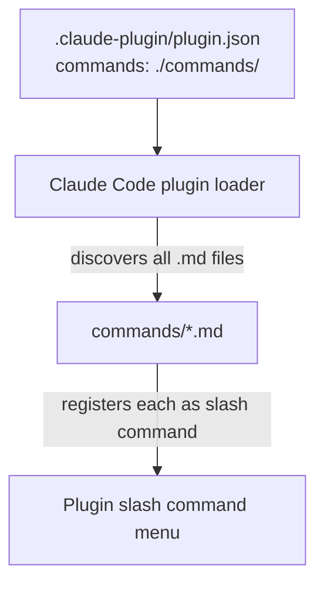

# manufacture command still visible after deprecation

## Metadata

- Date: `2026-05-27`
- Status: `fixed`
- Severity: `medium`
- Related issue/ticket: `N/A`
- Owner: `lewibs`

## About

**Overview**:
- The `/dark-factory:manufacture` command still appears in the Claude Code plugin menu even though it was supposed to be removed as part of the migration to focused standalone commands (`plan`, `execute`, `debug`, `repair`).
- The command's description was updated to mark it `[DEPRECATED]`, but the file itself (`commands/manufacture.md`) was never deleted. Claude Code's plugin loader discovers all `.md` files in the `commands/` directory declared in `plugin.json` and registers each as a slash command, so the manufacture command remained visible.

**Technical Questions**:
- Are we making assumptions? No — `plugin.json` directly declares `"commands": "./commands/"`, confirming every `.md` in that directory becomes a slash command.
- How old is this bug? Introduced when the deprecation PR (#240) only added a deprecation notice to `manufacture.md` instead of deleting it.
- Is there anything obvious we might have missed? Yes — marking a command deprecated in its description does not remove it; the file must be deleted.
- Are there specific system states required to reproduce it? No — visible to any user with the plugin installed.

**Resources**:
- `commands/manufacture.md` — the file that should have been deleted
- `.claude-plugin/plugin.json` — declares `"commands": "./commands/"` (all .md files are registered)
- PR #240 (branch `feature/remove-orchestrator-add-commands`) — the PR that deprecated but did not delete the command

## Steps to cause failure

## System

The plugin loader registers every `.md` file found in the directory declared under `"commands"` in `plugin.json`. There is no way to mark a command as invisible short of deleting the file.

## Reproduction Details

1. Install the dark-factory plugin.
2. Open Claude Code and type `/dark-factory:` in any conversation.
3. Observe that `manufacture` appears in the command list alongside the new focused commands.

Reproduction test (unit preferred): `N/A` — command visibility is determined by file existence; a bash assertion test is sufficient (see fix verification below).

## Notes for PR

Root cause: `commands/manufacture.md` was never deleted. The deprecation PR (#240) only added a deprecation notice to the file's content and description frontmatter, but the Claude Code plugin loader registers any `.md` present in the commands directory — there is no "hidden" or "disabled" flag. Deleting the file is the only fix.

## Audit Log

| ID | Action | Note | Context |
| --- | --- | --- | --- |
| 1 | Create audit log | Initialize bug investigation | User reports manufacture still visible |
| 2 | Read plugin.json | Confirmed `"commands": "./commands/"` — all .md files registered | `.claude-plugin/plugin.json` |
| 3 | List commands/ | Found `manufacture.md` still present | `commands/` directory listing |
| 4 | Read manufacture.md | Confirmed only deprecation notice added, file never deleted | `commands/manufacture.md` |
| 5 | Identified root cause | File not deleted; loader registers all .md files in commands dir | Evidence from plugin.json + file listing |
| 6 | Applied fix | Deleted `commands/manufacture.md` | Fix |
| 7 | Verified fix | `manufacture.md` no longer exists in `commands/` | Post-fix verification |

## Verification

- [x] Reproduced failure before fix
- [x] Reproduction test fails before fix
- [x] Root cause identified with evidence
- [x] Fix applied at source (no workaround-only patch)
- [x] Reproduction test passes after fix
- [x] Reproduction path now passes
- [x] Regression test added/updated (or `N/A` with reason) — N/A: file existence is trivially verifiable; no persistent regression test needed
- [x] Verified no duplicate solved-bug log exists for same root cause
