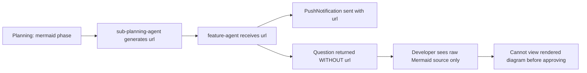

# Mermaid Diagram URL Missing From Approval Question

## Metadata

- Date: `2026-05-27`
- Status: `fixed`
- Severity: `medium`
- Related issue/ticket: `N/A`
- Owner: `N/A`

## About

**Overview**:
- When the planning flow reaches the Mermaid diagram approval phase, the agent presents a question to the developer asking them to approve or request changes. However, the mermaid.ink URL (rendered diagram link) is only sent via `PushNotification` — it is never included in the question text shown to the developer. The developer sees only the raw Mermaid source code and has no way to view the rendered diagram unless they click the push notification. If the notification is missed or the developer is in a different context, they must approve a diagram they cannot see.

**Technical Questions**:
- This is a deterministic bug, not intermittent. Every time the mermaid phase runs, the URL is generated and stored in the `url` variable, but the `question` string only contains `rendered.content` (the raw Mermaid source). The `url` is passed only to `PushNotification` and discarded before the question is returned.
- The `iterative-plan-approval-gate` skill (step 2c) documents the correct behavior: "If `url` is non-null, note it in the question text." The `feature-agent` implementation was not following this guidance.

**Resources**:
- `/home/lewibs/github/dark_factory/dark_factory/agents/featurework/agents/feature-agent.md` — Phase 2 mermaid question construction
- `/home/lewibs/github/dark_factory/dark_factory/skills/iterative-plan-approval-gate/SKILL.md` — Step 2c documents the expected behavior

## Steps to cause failure



## Root Cause

In `agents/featurework/agents/feature-agent.md`, Phase 2 (Mermaid Diagram), the `url` variable was available but not embedded in the `question` string returned to the caller. The question only contained `rendered.content` (raw Mermaid markdown), while the URL was dispatched only via `PushNotification`.

## Fix Summary

Added `diagramLink` construction in Phase 2 of `feature-agent.md`:

```
diagramLink = if url then "\n\nRendered diagram: " + url else "\n\n(Diagram rendering unavailable — review the source below.)"

question: "Mermaid diagram:" + diagramLink + "\n\n" + rendered.content + "\n\nHow would you like to proceed?"
```

This ensures the rendered diagram URL is always visible in the question text, even if the push notification was missed. When rendering fails, a fallback note is shown so the developer knows to review the raw source.

## Verification

The fix is in the agent instruction file (not in executable code), so automated test coverage is not directly applicable. Manual verification: run the planning flow, observe that the AskUserQuestion prompt for the mermaid phase now includes a clickable mermaid.ink URL before the raw diagram source.
