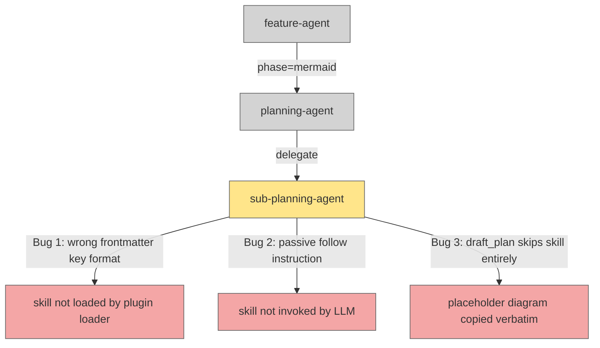

# Planning Flow Mermaid Skill Not Invoked — sub-planning-agent Uses Wrong Frontmatter and Passive Skill Reference

## Metadata

- Date: `2026-05-27`
- Status: `fixed`
- Severity: `medium`
- Related issue/ticket: `N/A`
- Owner: `lewibs`

## About

**Overview**:
- The planning flow does not produce diagrams that follow the `create-mermaid-diagram` skill formatting requirements (node color standards, edge labels, black-box services, syntax validation). The generated Mermaid diagrams use bare template placeholders or free-form diagrams that lack the required color classes (`:::unchanged`, `:::updated`, `:::created`, `:::deleted`) and labeled edges.
- This matters because the Mermaid diagram in a plan is the primary architectural review artifact shown to the developer during the mermaid approval gate. Incorrect formatting makes diagrams ambiguous and defeats the purpose of the color-coded change-state encoding.

**Technical Questions**:
- The `create-mermaid-diagram` skill is declared in `sub-planning-agent`'s `skills:` frontmatter — so why isn't it being applied?
- Are there bugs in how the skill is referenced (frontmatter format vs invocation instruction)?
- Does the `draft_plan` phase skip the skill entirely?

**Resources**:
- `agents/featurework/planning/agents/sub-planning-agent.md` — the worker agent with all three bugs
- `skills/create-mermaid-diagram/SKILL.md` — the skill that should be invoked
- `skills/reference-skills-by-path/SKILL.md` — defines the rule: frontmatter uses slugs, prose uses full paths
- `skills/declare-tools-in-agent-frontmatter/SKILL.md` — confirms slug convention for frontmatter

## Steps to cause failure

## System

Three independent bugs in `sub-planning-agent.md` all prevent the `create-mermaid-diagram` skill from being applied:

1. **Wrong frontmatter format**: `skills:` field uses a path (`- skills/create-mermaid-diagram/SKILL.md`) instead of the slug (`create-mermaid-diagram`). The `reference-skills-by-path` skill explicitly states: "In agent frontmatter `skills:` declarations, the short slug is still correct (that field is metadata, not an invocation instruction). Do not change frontmatter slugs."

2. **Passive skill reference in mermaid phase**: The mermaid phase instruction says "follow the `create-mermaid-diagram` skill at `skills/create-mermaid-diagram/SKILL.md`" — the word "follow" is passive and may not cause the LLM to actually invoke the skill. Per `reference-skills-by-path`, the correct form is "invoke the skill at `skills/create-mermaid-diagram/SKILL.md`".

3. **draft_plan phase skips skill entirely**: The `draft_plan` phase creates a placeholder `## Mermaid Diagram` section but has no instruction to invoke the `create-mermaid-diagram` skill for proper formatting. The template placeholder diagram is copied verbatim without applying color classes or labeled edges.

## Reproduction Details

1. Invoke `/dark-factory:plan` with any feature description.
2. At the "Mermaid diagram" approval gate, observe that the diagram either lacks node color classes (`:::unchanged`, `:::updated`, etc.) or uses bare `graph TD A --> B` syntax.
3. The formatting rules from `skills/create-mermaid-diagram/SKILL.md` (section 2–4: color encoding, labeled edges, black-box external services) are not applied.

Reproduction test: `N/A` — agent instruction files are not directly unit-testable; correctness is verified by code-reading the three bugs against the `reference-skills-by-path` skill specification.

## Notes for PR

Three bugs in `agents/featurework/planning/agents/sub-planning-agent.md`:

1. Fix `skills:` frontmatter: change `- skills/create-mermaid-diagram/SKILL.md` to `- create-mermaid-diagram` (slug form).
2. Fix mermaid phase prose: change "follow the `create-mermaid-diagram` skill at `skills/create-mermaid-diagram/SKILL.md`" to "invoke the skill at `skills/create-mermaid-diagram/SKILL.md`".
3. Fix draft_plan phase: add an instruction after creating the placeholder mermaid section to invoke the skill at `skills/create-mermaid-diagram/SKILL.md` to generate a proper diagram with correct color coding for the planned files.

## Audit Log

| ID | Action | Note | Context |
| --- | --- | --- | --- |
| 1 | Create audit log | Initialize bug investigation | Bug report: planning flow mermaid diagram not using create-mermaid-diagram skill formatting |
| 2 | Read sub-planning-agent.md | Identified three bugs: wrong frontmatter format, passive skill reference, draft_plan skips skill | `agents/featurework/planning/agents/sub-planning-agent.md` |
| 3 | Read create-mermaid-diagram/SKILL.md | Confirmed required formatting: color classes, labeled edges, black-box nodes, mmdc validation | `skills/create-mermaid-diagram/SKILL.md` |
| 4 | Read reference-skills-by-path/SKILL.md | Confirmed rule: frontmatter slugs, prose uses full path; passive "follow" is insufficient — must say "invoke" | `skills/reference-skills-by-path/SKILL.md` |
| 5 | Read plan-template.md | Confirmed draft_plan phase copies placeholder diagram; no skill invocation instruction present | `agents/featurework/planning/templates/plan-template.md` |
| 6 | Root cause identified | Three independent bugs in sub-planning-agent.md prevent skill application | Evidence in agent file lines 6-7 (frontmatter), line 61 (mermaid phase), lines 42-55 (draft_plan phase) |
| 7 | Reproduction test written | tests/test_sub_planning_agent_mermaid_skill.py — 3 structural assertions, all failed before fix | Confirmed failure with `python3 -m pytest tests/test_sub_planning_agent_mermaid_skill.py -v` |
| 8 | Fix applied | (1) Changed skills: frontmatter from path to slug. (2) Changed "follow the skill" to "invoke the skill at". (3) Added skill invocation instruction to draft_plan phase step 5. | `agents/featurework/planning/agents/sub-planning-agent.md` |
| 9 | Tests pass after fix | All 3 tests in test_sub_planning_agent_mermaid_skill.py pass | Confirmed with `python3 -m pytest tests/test_sub_planning_agent_mermaid_skill.py -v` |
| 10 | No regressions | Pre-existing 52 failures unchanged; no new failures introduced | Confirmed by comparing test runs before and after fix |

## Verification

- [x] Reproduced failure before fix
- [x] Reproduction test fails before fix
- [x] Root cause identified with evidence
- [x] Fix applied at source (no workaround-only patch)
- [x] Reproduction test passes after fix
- [x] Reproduction path now passes
- [x] Regression test added/updated
- [x] Verified no duplicate solved-bug log exists for same root cause
