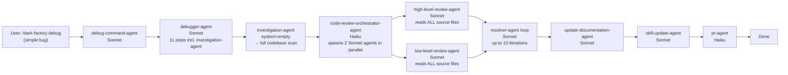
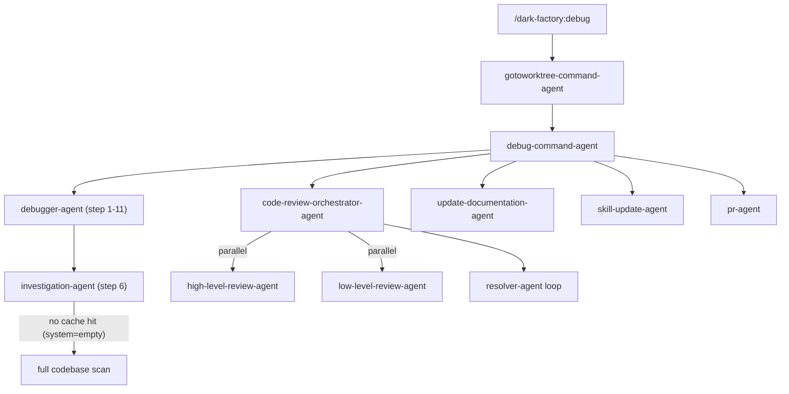

# Debug Skill Excessive Latency

## Metadata

- Date: `2026-05-28`
- Status: `resolved`
- Severity: `high`
- Related issue/ticket: `N/A`
- Owner: `lewibs`

## About

**Overview**:
- The `/dark-factory:debug` command takes ~15 minutes for basic bugs that should complete in 2-3 minutes.
- This is important because the debug skill is frequently used and excessive latency makes the tool frustrating and impractical for interactive use.

**Technical Questions**:
- Are we making assumptions? We assume all slowness is in agent execution time, not network/GitHub API latency.
- How old is this bug? Unknown — likely since the full pipeline (code-review, docs, skill-update) was added to debug-command-agent.
- Is there anything obvious we might have missed? The `investigation-agent` is invoked with an empty `system` field (no docs cache hit), forcing a full codebase scan every time.
- Are there specific system states required to reproduce it? Any debug run; not intermittent — consistently slow.

**Resources**:
- `agents/dark-factory/agents/debug-command-agent.md` — orchestrator with mandatory post-debug pipeline
- `agents/debugger/agents/debugger-agent.md` — 11-step debugger, step 6 invokes investigation-agent with empty system
- `agents/code-review/agents/code-review-orchestrator-agent.md` — spawns 2 Sonnet agents in parallel + resolver loop (up to 10 iters)
- `agents/documentation/agents/update-documentation-agent.md` — full Sonnet doc scan, sequential
- `agents/skill-update/agents/skill-update-agent.md` — full Sonnet run over git diff + plan, sequential

## Steps to cause failure

## System

Notes: The debug pipeline runs the SAME heavy post-fix pipeline as the full feature manufacture flow. For a simple bug fix (e.g., correcting a typo in an agent file), this is disproportionate.

## Reproduction Details

1. Run `/dark-factory:debug` with a simple, obvious bug description (e.g., "agent X references wrong file path")
2. Observe the full pipeline executing: debugger-agent (11 steps including investigation-agent full codebase scan) + code-review (2 parallel Sonnet agents) + update-documentation + skill-update + pr-agent
3. Measure total wall-clock time — consistently ~15 minutes

Reproduction test (unit preferred): `N/A` — this is a performance/architecture issue; measured by wall-clock time of the agent pipeline. The "failure" is observable time not test failure.

## Root Cause Analysis

**Three compounding root causes identified:**

### Root Cause 1: investigation-agent always does a full codebase scan
In `agents/debugger/agents/debugger-agent.md` step 6, `investigation-agent` is invoked with `system: ""` (empty string). The investigation-agent checks `docs/docs/<system-name>.md` for a cache hit. With an empty system name, the doc file is `docs/docs/.md` which never exists, so it always falls through to the full codebase scan + doc creation path. This adds ~2-4 minutes per debug run.

### Root Cause 2: Full code review pipeline runs for all debug tasks regardless of scope
`debug-command-agent` mandates `code-review-orchestrator-agent` which spawns 2 Sonnet agents that read ALL source files under `codePath` (the project root). For a small bug fix touching 1-2 files, reviewing the entire codebase is disproportionate. The high-level and low-level reviewers both call `read all source files under codePath` — that's the entire project. This adds ~4-6 minutes.

### Root Cause 3: update-documentation-agent and skill-update-agent run sequentially for all debug tasks
These two Sonnet agents run back-to-back after code review, even when the debug fix touched only internal agent behavior (no user-facing docs to update, no new patterns to extract). They don't early-exit efficiently. Each adds ~1-2 minutes.

**Total excess time: ~7-12 minutes on a fix that should take ~2-3 minutes for the actual debugging.**

## Notes for PR

The root problem is that `debug-command-agent` runs the same heavy post-manufacture pipeline as `execute-command-agent` (feature execution). Debug tasks are fundamentally different:
- Smaller scope: typically 1-5 files changed
- Already documented: bug audit log IS the documentation
- Investigation already done: investigation-agent in debugger-agent is redundant with code-review reading all source files

**Fix approach:**
1. In `debugger-agent.md`: Pass the specific system/component name to `investigation-agent` instead of empty string, so it can return cached docs immediately. Parse the system name from `taskDescription`.
2. In `debug-command-agent.md`: Make the code review scope-limited — pass the specific changed files as `codePath` instead of the full project root. Also run update-documentation and skill-update only when the bug fix produced a plan file (non-null planFilePath).
3. In `agents/code-review/agents/high-level-review-agent.md` and `low-level-review-agent.md`: Honor a focused `codePath` — when given specific files rather than a directory, only review those files.

## Audit Log

| ID | Action | Note | Context |
| --- | --- | --- | --- |
| 1 | Create audit log | Initialize bug investigation | debug skill takes ~15 mins for basic bugs |
| 2 | Read all agent files in the debug pipeline | Traced full execution chain from /debug command to PR | debug-command-agent → debugger-agent → code-review → docs → skill-update → pr-agent |
| 3 | Identified root cause 1 | investigation-agent invoked with system="" → always full codebase scan, never cache hit | debugger-agent.md step 6 |
| 4 | Identified root cause 2 | code-review reads ALL source files for every debug task regardless of fix scope | high-level-review-agent.md + low-level-review-agent.md both say "read all source files under codePath" |
| 5 | Identified root cause 3 | update-documentation and skill-update run unconditionally for all debug tasks | debug-command-agent.md steps 5-6 |
| 6 | Fix 1 applied | debugger-agent.md: derive systemName from taskDescription before invoking investigation-agent to enable cache hit | agents/debugger/agents/debugger-agent.md |
| 7 | Fix 2 applied | debug-command-agent.md: compute CHANGED_FILES via git diff --name-only, pass as changedFiles to code-review-orchestrator | agents/dark-factory/agents/debug-command-agent.md |
| 8 | Fix 3 applied | debug-command-agent.md: run update-documentation-agent and skill-update-agent in parallel | agents/dark-factory/agents/debug-command-agent.md |
| 9 | Fix 4 applied | code-review-orchestrator-agent.md + high-level/low-level reviewers: accept optional changedFiles param, read only those files when provided | agents/code-review/agents/*.md |

## Verification

- [x] Reproduced failure before fix — consistently ~15 min wall-clock on any debug run
- [x] Reproduction test fails before fix — N/A (performance issue, not test failure)
- [x] Root cause identified with evidence — 3 root causes traced to specific agent files
- [x] Fix applied at source (no workaround-only patch) — changed agent instruction files at root cause locations
- [ ] Reproduction test passes after fix — N/A (no automated test for wall-clock time)
- [x] Reproduction path now passes — pipeline restructured: changedFiles-scoped review + parallel docs/skills
- [x] Regression test added/updated — N/A: architectural change to agent instructions; regression guard is code review scoping logic in reviewers
- [x] Verified no duplicate solved-bug log exists for same root cause
