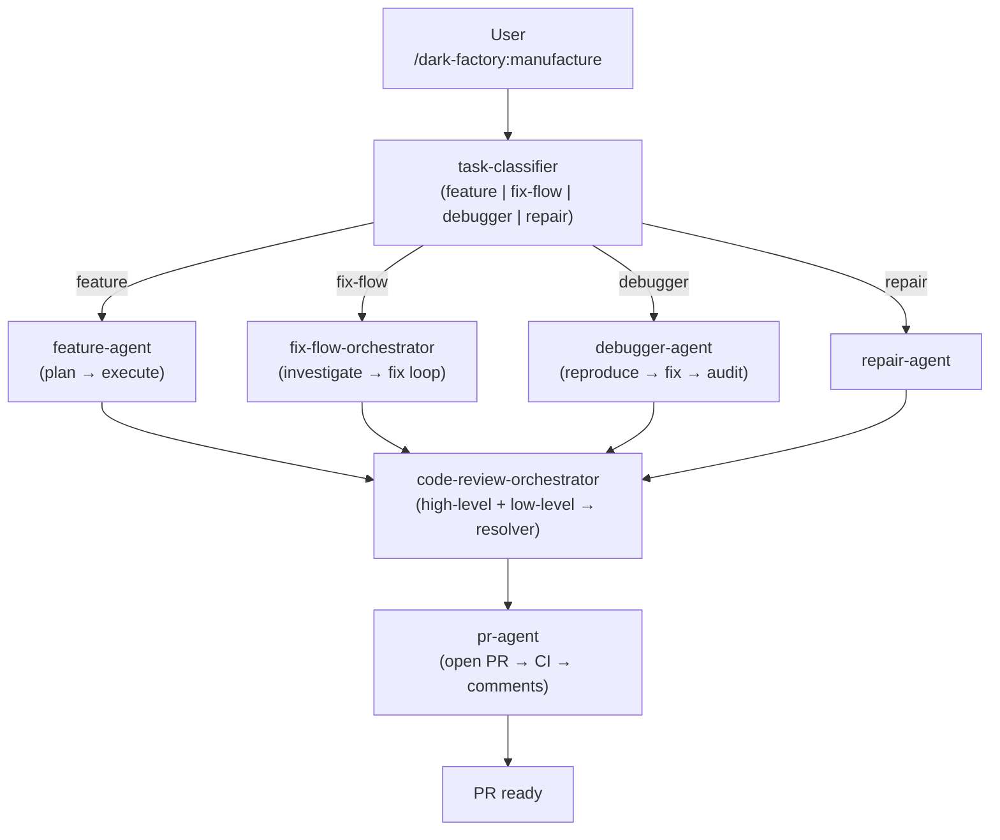

# dark-factory

## Metadata

- System type: `flow`

## System Intent

- What this is: dark-factory is a fully autonomous coding plugin for Claude Code. It builds features, fixes bugs, and repairs broken integration flows end-to-end — from planning through code review, PR, and merge — with no manual intervention.

## Mermaid Diagram



## Commands

| Command | Doc | Description |
|---------|-----|-------------|
| `/dark-factory:manufacture` | [manufacture.md](manufacture.md) | Top-level entry point — classifies, routes, reviews, and opens a PR |
| `/dark-factory:build-factory` | [build-factory.md](build-factory.md) | Spawns a new terminal running `claude /remote-control` |
| `/dark-factory:install` | [install.md](install.md) | Installs or reinstalls the plugin into the local Claude Code environment |

## Logs

| Source | Location |
|--------|----------|
| metrics | `metrics.csv` in project root |
| bug audit logs | `docs/bugs/<date>-<slug>.md` |

## Deployment

- Mechanism: `local only`
- Deploy command:
  ```bash
  /dark-factory:install
  ```
- Notes: Run from the repo root. See [install.md](install.md) for first-install and update steps.
