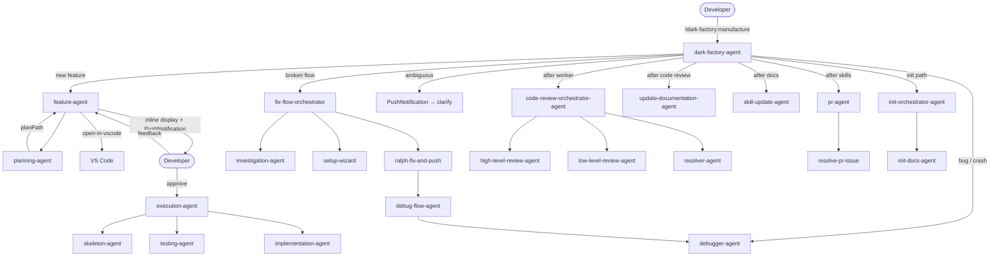

# Agents

## Metadata

- System type: `library`
- Owner: dark-factory plugin
- Source directory: `agents/`
- Agent count: 24 agent markdown files across 9 subsystems

## System Intent

- What this is: The `agents/` directory contains all orchestration logic for Dark Factory. Agents are markdown files with YAML front-matter that Claude Code loads as sub-agents. Each agent has a narrowly-scoped responsibility and delegates all writing/editing to other agents or skills. No agent writes code directly — they orchestrate.
- Primary consumer(s): Claude Code runtime (loads agents via front-matter), `/dark-factory:manufacture` command (entry point).
- Boundary: Only agent `.md` files. No Python, no shell scripts (except via `allowed-tools`).

## Mermaid Diagram



## Flows

### Flow: `manufacture`

- Core files: `agents/dark-factory/agents/dark-factory-agent.md`

#### Types

```txt
TaskInput {
  taskDescription: string (verbatim user request)
  taskName: string (optional short slug; derived from taskDescription if omitted)
}

WorkerResult {
  planFilePath: string | null (path written by worker; null if debugger-agent)
}

ManufactureOutput {
  prUrl: string
  merged: boolean
  skillsWritten: string[]
}

StandardError {
  message: string (human-readable description of what went wrong)
}
```

#### Paths

| path | input | output | path-type | notes |
| --- | --- | --- | --- | --- |
| `manufacture.feature` | `TaskInput` | `ManufactureOutput` | `happy path` | Routes to feature-agent; runs code-review, docs, skills, PR, cleanup |
| `manufacture.fixFlow` | `TaskInput` | `ManufactureOutput` | `happy path` | Routes to fix-flow-orchestrator |
| `manufacture.debug` | `TaskInput` | `ManufactureOutput` | `happy path` | Routes to debugger-agent; planFilePath is null |
| `manufacture.ambiguous` | `TaskInput` | PushNotification + clarifying question | `branch` | Sends PushNotification before asking developer |
| `manufacture.workerError` | `TaskInput` | `StandardError` | `error` | Worker returns error or hard-stop; cleanup runs before halt |
| `manufacture.prepFailure` | `TaskInput` | `StandardError` | `error` | prep-feature-dir.sh fails; no cleanup needed |

---

### Flow: `featurework`

- Core files: `agents/featurework/agents/feature-agent.md`, `agents/featurework/planning/agents/planning-agent.md`, `agents/featurework/execution/agents/execution-agent.md`, `agents/featurework/execution/agents/skeleton-agent.md`, `agents/featurework/execution/agents/testing-agent.md`, `agents/featurework/execution/agents/implementation-agent.md`

#### Types

```txt
FeatureInput {
  taskDescription: string
}

PlanFile {
  path: string (docs/plans/<date>-<slug>.md)
  approved: boolean
}

FeatureOutput {
  planFilePath: string
  testsGreen: boolean
}

ReviewDecision {
  decision: "approve" | "abort" | "feedback"
  feedbackText: string | null (present when decision == "feedback")
}
```

#### Paths

| path | input | output | path-type | notes |
| --- | --- | --- | --- | --- |
| `featurework.approved` | `FeatureInput` | `FeatureOutput` | `happy path` | planning-agent writes plan; feature-agent opens it in VS Code, reads and displays it inline, sends PushNotification, developer replies "yes" or "approve"; execution-agent implements |
| `featurework.feedbackLoop` | `FeatureInput` | revised plan + PushNotification | `loop` | Developer replies with feedback text; feature-agent re-invokes planning-agent with feedback, re-opens in VS Code, re-displays, re-prompts; loop repeats until explicit approval |
| `featurework.abort` | `FeatureInput` | `StandardError` | `error` | Developer replies "abort" during plan review; feature-agent stops all work |
| `featurework.hardStop` | `FeatureInput` | `StandardError` | `error` | implementation-agent triggers deviation-protocol and cannot self-resolve |

---

### Flow: `fixFlow`

- Core files: `agents/fix-flow/agents/fix-flow-orchestrator.md`, `agents/fix-flow/agents/setup-wizard.md`, `agents/fix-flow/agents/ralph-fix-and-push.md`, `agents/fix-flow/agents/debug-flow-agent.md`

#### Types

```txt
FixFlowInput {
  flowName: string (name of the failing integration flow)
}

DebugFlowInput {
  triggerScriptPath: string
  waitScriptPath: string
  fetchLogsScriptPath: string
}

DebugFlowOutput {
  bugFilePath: string (docs/bugs/bug-explanation-<N>.md)
  exitCode: number (0 = flow passed, 1 = flow failed)
}

FixFlowOutput {
  prUrls: string[]
}
```

#### Paths

| path | input | output | path-type | notes |
| --- | --- | --- | --- | --- |
| `fixFlow.success` | `FixFlowInput` | `FixFlowOutput` | `happy path` | investigation → setup → ralph-fix-and-push loop until flow green; debug-flow-agent triggers + fetches logs per iteration |
| `fixFlow.flowPassed` | `DebugFlowInput` | `DebugFlowOutput{exitCode=0}` | `happy path` | debug-flow-agent runs trigger.sh + wait-for-completion.sh; flow succeeds; no logging or debug needed |
| `fixFlow.flowFailed` | `DebugFlowInput` | `DebugFlowOutput{exitCode=1}` | `branch` | flow fails; debug-flow-agent fetches logs and delegates to debugger-agent for fix |
| `fixFlow.missingFlowName` | `FixFlowInput{flowName=null}` | PushNotification + halt | `error` | fix-flow-orchestrator sends PushNotification before asking developer for flow name |

---

### Flow: `codeReview`

- Core files: `agents/code-review/agents/code-review-orchestrator-agent.md`, `agents/code-review/agents/high-level-review-agent.md`, `agents/code-review/agents/low-level-review-agent.md`, `agents/code-review/agents/resolver-agent.md`

#### Types

```txt
ReviewInput {
  planFilePath: string | "Task: <description>"
  codePath: string
}

ReviewOutput {
  status: "complete"
  anyRemaining: boolean (false when all issues are resolved; true if max iterations hit)
}
```

#### Paths

| path | input | output | path-type | notes |
| --- | --- | --- | --- | --- |
| `codeReview.clean` | `ReviewInput` | `ReviewOutput{anyRemaining=false}` | `happy path` | No issues found; resolver loop exits immediately |
| `codeReview.issuesFound` | `ReviewInput` | `ReviewOutput{anyRemaining=false}` | `happy path` | Resolver loop runs up to 10 iterations until all issues checked off |
| `codeReview.maxIterations` | `ReviewInput` | `StandardError` | `error` | Resolver loop exceeds 10 iterations without clearing all items; orchestrator halts with stuck-items description |

---

### Flow: `documentation`

- Core files: `agents/documentation/agents/investigation-agent.md`, `agents/documentation/agents/update-documentation-agent.md`, `agents/documentation/agents/detect-drift-agent.md`

#### Types

```txt
DocUpdateInput {
  planFilePath: string | null
}

DocUpdateOutput {
  filesUpdated: string[]
}
```

#### Paths

| path | input | output | path-type | notes |
| --- | --- | --- | --- | --- |
| `documentation.update` | `DocUpdateInput` | `DocUpdateOutput` | `happy path` | update-documentation-agent identifies affected flows and updates docs/docs/ files |
| `documentation.missingPlan` | `DocUpdateInput{planFilePath=null}` | PushNotification + error | `error` | update-documentation-agent sends PushNotification before halting |
| `documentation.driftDetected` | DetectDriftInput | drift report | `branch` | detect-drift-agent flags stale docs; fixes straightforward drift in place |

---

### Flow: `init`

- Core files: `agents/initialization/agents/init-orchestrator-agent.md`, `agents/initialization/agents/init-docs-agent.md`

#### Types

```txt
InitInput {
  project_path: string (absolute path to the project directory to document)
}

SystemInfo {
  name: string          // e.g. "backend", "frontend"
  rootDir: string       // absolute path to that system's root directory
}

FlowInfo {
  name: string          // kebab-case slug, e.g. "upload-image", "create-account"
  displayName: string   // human-readable label, e.g. "Upload Image"
  owningSystem: string  // SystemInfo.name
  outputPath: string    // absolute path: <project_path>/docs/docs/<name>.md
}

InitDocsOutput {
  docsWritten: string[] (paths to all docs/docs/*.md files written)
  readmePath: string    (path to docs/docs/README.md)
  claudeMdPath: string  (path to CLAUDE.md)
}

StandardError {
  message: string (human-readable description of what went wrong)
}
```

#### Paths

| path | input | output | path-type | notes |
| --- | --- | --- | --- | --- |
| `init.success` | `InitInput` | `InitDocsOutput` | `happy path` | Guard → discoverSystems → discoverFlowsPerSystem → invoke investigation-agent per flow → write README index → write CLAUDE.md |
| `init.noFlows` | `SystemInfo` with no entry-point files | `FlowInfo[name=<system>]` | `fallback` | System has no routes/CLI/handlers; one FlowInfo using system name is emitted |
| `init.flatProject` | `InitInput` with no sub-systems | `FlowInfo[name=basename(project_path)]` | `fallback` | No distinct sub-directories; entire project treated as one system and one flow |
| `init.agentFailure` | `FlowInfo` | warning logged, flow skipped | `error` | investigation-agent fails for one flow; log warning and continue remaining flows |
| `init.allFailed` | all FlowInfo fail | README: "No documentation generated yet"; generic CLAUDE.md | `error` | All investigation-agent calls fail; placeholder docs written |
| `init.invalidPath` | `InitInput{project_path=invalid}` | `StandardError` | `error` | project_path does not exist; init-docs-agent halts immediately |

#### Steps

init-docs-agent runs these steps in order:

1. **Guard** — `ls <project_path>` verifies the path exists; halts on failure.
2. **Discover Systems** — `ls -la <project_path>` identifies top-level directories; each becomes a `SystemInfo`.
3. **Discover Flows Per System** — for each `SystemInfo`, globs entry-point files (`routes.*`, `urls.*`, `router.*`, `cli.*`, `commands/*`, `handlers/*`, `listeners/*`, `controllers/*`, `views/*`, `endpoints/*`) and reads them to extract named actions/endpoints/commands. Each distinct action becomes a `FlowInfo`. If no flows are found for a system, one fallback `FlowInfo` using the system name is emitted. Duplicates are deduplicated by name slug.
4. **Ensure docs/docs/ exists** — `mkdir -p <project_path>/docs/docs`.
5. **Invoke investigation-agent per flow** — one Task-tool call per `FlowInfo`; each writes `docs/docs/<flow-name>.md` using the documentation template.
6. **Write docs/docs/README.md** — index table with one row per successfully written flow doc.
7. **Write CLAUDE.md** — minimal pointer doc at project root.

---

### Flow: `pr`

- Core files: `agents/pr/agents/pr-agent.md`, `agents/pr/agents/resolve-pr-issue.md`

#### Types

```txt
PRInput {
  planFilePath: string | taskDescription
}

PROutput {
  pr_url: string
  merged: boolean
}
```

#### Paths

| path | input | output | path-type | notes |
| --- | --- | --- | --- | --- |
| `pr.merged` | `PRInput` | `PROutput{merged=true}` | `happy path` | PR opens, CI passes, squash-merge succeeds |
| `pr.ciFailure` | `PRInput` | spawn `resolve-pr-issue` | `branch` | CI red; resolve-pr-issue fixes and pushes |
| `pr.reviewComment` | `PRInput` | spawn `resolve-pr-issue` | `branch` | Unresolved review thread; resolve-pr-issue addresses and resolves |

## Logs

| Source | Location |
|--------|----------|
| N/A | Agents are markdown instruction files; they produce no structured runtime log output. All observable output is Claude Code session text. |

## Deployment

- Mechanism: `local only`
- Deploy command:
  ```bash
  # Agents are loaded by the Claude Code runtime from the plugin directory.
  # No deployment step — install the plugin with:
  claude plugin install dark-factory
  ```
- Notes: Agents run inside Claude Code sessions on the developer's local machine. There is no remote runtime or server.

## Front-matter Conventions

Every agent file has a YAML front-matter block:

| Field | Purpose |
|---|---|
| `name` | Agent identifier |
| `user-invocable` | Whether the agent can be invoked directly by the developer |
| `description` | One-line summary shown in Claude Code |
| `tools` | Comma-separated list of Claude tools the agent may use |
| `model` | Model to use (typically `sonnet`) |
| `skills` | Skill files the agent references |
| `allowed-tools` | Fine-grained bash command allowlist |
| `scripts` | Shell scripts the agent is permitted to run |

Agents that call `PushNotification` in their body must declare it in `tools:` — the Claude Code runtime silently skips notifications for agents missing this declaration (see `docs/bugs/2026-04-25-push-notification-missing-from-tools.md`).
