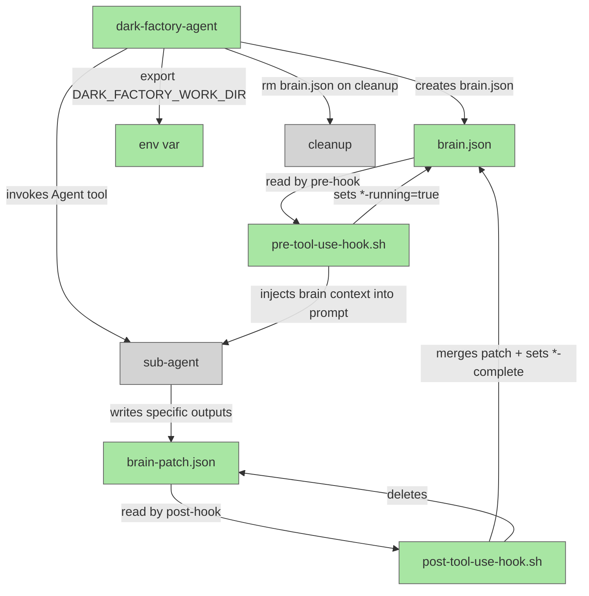

# Brain Hook-Driven State

## Metadata

- System type: `flow`

## System Intent

- What this is: Hook-driven brain.json state management for dark-factory. Claude Code PreToolUse and PostToolUse hooks on the Agent tool automatically inject brain state into every sub-agent prompt and merge each sub-agent's output patch back into brain.json. Phase transition flags (`*-running`, `*-complete`) are managed exclusively by the hooks — not by agent instruction text.
- Primary consumer(s): dark-factory-agent (creates, exports, and deletes brain.json); all sub-agents (write brain-patch.json with their specific outputs); pre-tool-use-hook.sh and post-tool-use-hook.sh (inject brain state and merge patches).
- Boundary: `agents/dark-factory/scripts/pre-tool-use-hook.sh`, `agents/dark-factory/scripts/post-tool-use-hook.sh`, `.claude/settings.json` hooks configuration, and sub-agent .md files that produce output fields. Claude Code's internal hook execution engine is out of scope.

## Mermaid Diagram



## Flows

### Flow: `pre-tool-use-hook`

- Core files: `agents/dark-factory/scripts/pre-tool-use-hook.sh`
- Test files: `tests/test_hooks.py`

#### Types

```txt
HookInput {
  // Provided by Claude Code hook environment
  DARK_FACTORY_WORK_DIR: string | unset  (absolute path to worktree; set by dark-factory-agent export)
  stdin: JSON  (Agent tool call input — contains "prompt" field)
}

HookOutput {
  // Exit codes
  0: success (brain context injected into prompt via stdout JSON, or pass-through if no-brain)
  // stdout: modified tool input JSON (Claude Code reads this to override the Agent tool input)
  // stderr: diagnostic log lines only
}
```

#### Paths

| path | input | output | path-type | notes |
| --- | --- | --- | --- | --- |
| `pre-hook.inject` | Agent tool call + brain.json | modified prompt with brain context prepended | happy path | brain.json exists; reads it, injects as read-only context header, sets current phase *-running=true |
| `pre-hook.no-brain` | Agent tool call (DARK_FACTORY_WORK_DIR unset or brain.json absent) | stdin passed through unchanged | happy path | not a dark-factory session — hook is a no-op |
| `pre-hook.set-phase-running` | brain.json | brain.json with current phase `*-running=true` | happy path | first phase where both -running and -complete are false is selected and set to running |

#### Pseudocode

```
pre-tool-use-hook.sh:
  BRAIN_PATH="${DARK_FACTORY_WORK_DIR:-}/brain.json"
  if DARK_FACTORY_WORK_DIR unset or brain.json absent:
    cat  # pass stdin through unchanged
    exit 0

  TOOL_INPUT=$(cat)  # Agent tool call JSON from stdin

  # Find first phase that is not yet started (neither -running nor -complete)
  PHASE = jq: first .phases entry where key !endswith("-running") and !endswith("-complete") and value == false

  if PHASE found:
    jq ".phases[\"${PHASE}-running\"] = true" brain.json > /tmp/brain-pre-tmp.json && mv → brain.json

  # Inject brain context into agent prompt
  BRAIN_CONTEXT = jq -c '.' brain.json
  ORIGINAL_PROMPT = TOOL_INPUT | jq -r '.prompt'
  NEW_PROMPT = "BRAIN STATE (read-only context — do not modify brain.json directly):\n${BRAIN_CONTEXT}\n\n${ORIGINAL_PROMPT}"

  # Output modified tool call — Claude Code reads stdout to override tool input
  TOOL_INPUT | jq --arg p "$NEW_PROMPT" '.prompt = $p'
```

---

### Flow: `post-tool-use-hook`

- Core files: `agents/dark-factory/scripts/post-tool-use-hook.sh`
- Test files: `tests/test_hooks.py`

#### Types

```txt
HookInput {
  DARK_FACTORY_WORK_DIR: string | unset
  // stdin: Agent tool result JSON (not read by this hook)
}
```

#### Paths

| path | input | output | path-type | notes |
| --- | --- | --- | --- | --- |
| `post-hook.merge-patch` | brain-patch.json + brain.json | brain.json updated with merged fields; brain-patch.json deleted | happy path | sub-agent wrote a patch; fields merged using `jq -s '.[0] * .[1]'` |
| `post-hook.no-patch` | (no brain-patch.json) | brain.json phase flag updated only | happy path | sub-agent wrote no patch; only *-running and *-complete flags are updated |
| `post-hook.set-phase-complete` | brain.json with a *-running=true phase | brain.json with that phase's *-running=false and *-complete=true | happy path | always runs after any patch merge |
| `post-hook.no-brain` | DARK_FACTORY_WORK_DIR unset or brain.json absent | exit 0 | happy path | not a dark-factory session |

#### Pseudocode

```
post-tool-use-hook.sh:
  BRAIN_PATH="${DARK_FACTORY_WORK_DIR:-}/brain.json"
  PATCH_PATH="${DARK_FACTORY_WORK_DIR:-}/brain-patch.json"

  if DARK_FACTORY_WORK_DIR unset or brain.json absent:
    exit 0

  if brain-patch.json exists:
    jq -s '.[0] * .[1]' brain.json brain-patch.json > /tmp/brain-post-tmp.json && mv → brain.json
    rm -f brain-patch.json

  RUNNING_PHASE = jq: first .phases entry where key endswith("-running") and value == true
  if RUNNING_PHASE found:
    COMPLETE_PHASE = "${RUNNING_PHASE%-running}-complete"
    jq ".phases[\"${RUNNING_PHASE}\"] = false | .phases[\"${COMPLETE_PHASE}\"] = true" brain.json > tmp && mv → brain.json
```

---

### Flow: `settings-json-hooks`

- Core files: `.claude/settings.json`
- Test files: N/A

#### Types

```txt
HookConfig {
  hooks: {
    PreToolUse: [{ matcher: "Agent", hooks: [{ type: "command", command: string }] }]
    PostToolUse: [{ matcher: "Agent", hooks: [{ type: "command", command: string }] }]
    Stop: [{ matcher: "", hooks: [{ type: "command", command: string }] }]  // pre-existing
  }
}
```

#### Paths

| path | input | output | path-type | notes |
| --- | --- | --- | --- | --- |
| `hooks.pre-agent` | Agent tool call | modified prompt with brain context | happy path | PreToolUse hook matched to "Agent" tool |
| `hooks.post-agent` | Agent tool result | brain.json updated | happy path | PostToolUse hook matched to "Agent" tool |

---

### Flow: `dark-factory-agent-brain-lifecycle`

- Core files: `agents/dark-factory/agents/dark-factory-agent.md`
- Test files: N/A

#### Types

```txt
BrainState {
  taskDescription:  string
  taskName:         string
  workDir:          string    (absolute path to worktree)
  classification:   string    (one of: feature | fix-flow | debugger)
  planFilePath:     string | null
  bugFiles:         string[] | null
  prUrl:            string | null
  docsWritten:      string[] | null
  skillsWritten:    string[] | null
  phases: {
    prep-running: boolean,     prep-complete: boolean,
    worker-running: boolean,   worker-complete: boolean,
    review-running: boolean,   review-complete: boolean,
    docs-running: boolean,     docs-complete: boolean,
    skills-running: boolean,   skills-complete: boolean,
    pr-running: boolean,       pr-complete: boolean,
    cleanup-running: boolean,  cleanup-complete: boolean
  }
}
```

#### Paths

| path | input | output | path-type | notes |
| --- | --- | --- | --- | --- |
| `brain.create` | taskDescription, taskName, workDir, classification | brain.json written to WORK_DIR | happy path | immediately after prep-feature-dir.sh succeeds; prep-complete set to true |
| `brain.export` | WORK_DIR | `DARK_FACTORY_WORK_DIR` env var exported | happy path | export allows hooks to find brain.json in subsequent Agent calls |
| `brain.read-results` | brain.json | planFilePath, prUrl | happy path | dark-factory-agent reads brain.json after each sub-agent returns to get output values merged by post-hook |
| `brain.delete` | WORK_DIR/brain.json | file removed | happy path | at cleanup — after pr-agent completes, before cleanup-worktree.sh runs |

#### Pseudocode

```
dark-factory-agent — brain lifecycle steps:

After prep-feature-dir.sh succeeds and WORK_DIR is captured:
  Write $WORK_DIR/brain.json:
    { taskDescription, taskName, workDir, classification,
      planFilePath: null, bugFiles: null, prUrl: null,
      docsWritten: null, skillsWritten: null,
      phases: { prep-running: false, prep-complete: true, all others: false } }

  export DARK_FACTORY_WORK_DIR=<WORK_DIR>
  # From this point, pre/post hooks handle all brain state automatically.
  # dark-factory-agent MUST NOT pass brain fields to sub-agents manually.

After each sub-agent returns:
  Read $WORK_DIR/brain.json
  Extract output values (planFilePath, prUrl, etc.) — hooks have already merged them.

At cleanup (Step 7):
  rm -f $WORK_DIR/brain.json
  bash agents/dark-factory/scripts/cleanup-worktree.sh "$WORK_DIR" "$TASK_NAME"
```

---

### Flow: `sub-agent-brain-patch`

- Core files: `agents/featurework/agents/feature-agent.md`, `agents/debugger/agents/debugger-agent.md`, `agents/documentation/agents/update-documentation-agent.md`, `agents/skill-update/agents/skill-update-agent.md`, `agents/pr/agents/pr-agent.md`
- Test files: N/A

#### Types

```txt
BrainPatch {
  // Written by sub-agents to $DARK_FACTORY_WORK_DIR/brain-patch.json.
  // Contains only the fields that agent produced — never phase flags.
  planFilePath?:  string
  bugFiles?:      string[]
  prUrl?:         string
  docsWritten?:   string[]
  skillsWritten?: string[]
}
```

#### Paths

| path | input | output | path-type | notes |
| --- | --- | --- | --- | --- |
| `patch.planner` | planFilePath produced | brain-patch.json `{ planFilePath }` | happy path | feature-agent writes after planning-agent completes |
| `patch.debugger` | bugFiles produced | brain-patch.json `{ bugFiles }` | happy path | debugger-agent writes after bug files produced |
| `patch.docs` | docsWritten produced | brain-patch.json `{ docsWritten }` | happy path | update-documentation-agent writes after docs completed |
| `patch.skills` | skillsWritten produced | brain-patch.json `{ skillsWritten }` | happy path | skill-update-agent writes after skills completed |
| `patch.pr` | prUrl produced | brain-patch.json `{ prUrl }` | happy path | pr-agent writes after PR opened |

#### Sub-agent rules

- Sub-agents MUST NOT read brain.json directly — context is already injected by pre-hook.
- Sub-agents MUST NOT write brain.json directly.
- Sub-agents ONLY write brain-patch.json with their specific output fields.
- Sub-agents MUST NOT set phase flags — hooks own those.
- brain-patch.json is deleted by post-tool-use-hook.sh after merge.
- If a sub-agent has no output fields to write, it does not write brain-patch.json.

## Testing

The hook scripts are covered by behavioral unit tests in `tests/test_hooks.py`. Each test executes the actual shell script via `subprocess.run()` and asserts real outcomes: stdout content, brain.json file state, and exit codes.

| Test class | Flow covered | Script under test |
|---|---|---|
| `TestPreHookInjectsBrainState` | `pre_hook.inject.success`, `pre_hook.inject.no_brain` | `pre-tool-use-hook.sh` |
| `TestPreHookSetsRunningPhase` | `pre_hook.set_running.success`, `pre_hook.set_running.no_incomplete` | `pre-tool-use-hook.sh` |
| `TestPreHookEmitsValidJson` | `pre_hook.valid_json.success` | `pre-tool-use-hook.sh` |
| `TestPostHookMergesPatch` | `post_hook.merge.success`, `post_hook.merge.no_patch` | `post-tool-use-hook.sh` |
| `TestPostHookSetsCompleteAndClearsRunning` | `post_hook.phase.success`, `post_hook.phase.no_running` | `post-tool-use-hook.sh` |
| `TestPostHookNoBrain` | `post_hook.no_brain.success` | `post-tool-use-hook.sh` |

Run the tests with:

```bash
pytest tests/test_hooks.py -v
```

Each test creates an isolated `tempfile.TemporaryDirectory`, writes a minimal `brain.json` using the `make_brain()` helper, invokes the hook via `run_hook()`, and asserts the resulting file state and/or stdout/stderr content. `DARK_FACTORY_WORK_DIR` is set or cleared via `env_override` to control whether hooks see a brain file.

## Logs

| Source | Location |
|--------|----------|
| pre-tool-use-hook.sh | stderr only (errors and phase-running events); stdout reserved for modified tool input JSON |
| post-tool-use-hook.sh | stderr only (merge-patch events, phase-complete events, warnings) |
| brain.json | `$DARK_FACTORY_WORK_DIR/brain.json` — readable at any point during a run; deleted at cleanup |

## Deployment

- Mechanism: `local only`
- Deploy command:
  ```bash
  # No deploy needed — changes are to agent .md files, shell scripts, and settings.json.
  # Hook scripts must be executable:
  chmod +x agents/dark-factory/scripts/pre-tool-use-hook.sh
  chmod +x agents/dark-factory/scripts/post-tool-use-hook.sh
  # All changes take effect immediately after files are written.
  ```
- Notes: Hook scripts must be executable (`chmod +x`). The `.claude/settings.json` hooks section must be valid JSON. `DARK_FACTORY_WORK_DIR` must be exported by dark-factory-agent before any Agent tool calls — if it is unset, both hooks are no-ops.
