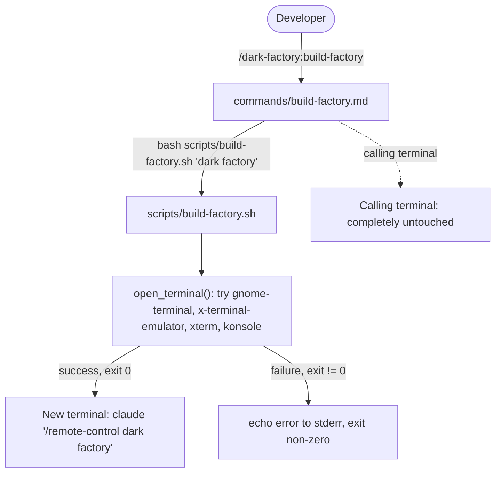

# build-factory

## Metadata

- System type: `flow`
- Owner: dark-factory plugin
- Source files: `commands/build-factory.md`, `scripts/build-factory.sh`
- Test files: `tests/test_build_factory_no_destroy.py`

## System Intent

- What this is: A slash command and companion shell script that opens a new terminal window running Claude in remote-control mode (`claude "/remote-control <name>"`). Unlike `reopen-remote-control.sh`, this script is strictly open-only — the calling terminal is never closed, killed, or modified in any way. Useful for spawning additional parallel factory processing sessions without disrupting the current session.
- Primary consumer(s): Developers invoking `/dark-factory:build-factory` from the Claude Code interface.
- Boundary: `commands/build-factory.md` is the slash command entrypoint (thin stub). All logic runs in `scripts/build-factory.sh`. The script is responsible only for launching the new terminal — it has no process-tree-walk logic, no `kill $PPID`, and no systemctl scope manipulation.

## Mermaid Diagram



## Flows

### Flow: `build-factory`

- Test files: `tests/test_build_factory_no_destroy.py`
- Core files: `commands/build-factory.md`, `scripts/build-factory.sh`

#### Types

```txt
BuildFactoryInput {
  name: string (optional, default: "dark factory" — remote-control session name passed as $1)
}

BuildFactoryOutput {
  void (side effect: new terminal opened; calling terminal is left untouched)
}

StandardError {
  message: string (written to stderr; e.g. "No terminal emulator found" or "Failed to open terminal")
}
```

#### Paths

| path | input | output | path-type | notes |
| --- | --- | --- | --- | --- |
| `build-factory.success` | `BuildFactoryInput` | `BuildFactoryOutput` | `happy path` | Terminal opens successfully; calling terminal is never closed or modified |
| `build-factory.no-emulator` | `BuildFactoryInput` | `StandardError` | `error` | No supported terminal emulator found (gnome-terminal, x-terminal-emulator, xterm, konsole all absent); exits non-zero |
| `build-factory.open-failed` | `BuildFactoryInput` | `StandardError` | `error` | Terminal emulator found but returned non-zero exit code; exits non-zero; calling terminal unaffected |

#### Pseudocode

```
NAME = argv[1] ?? "dark factory"
cmd  = "claude \"/remote-control $NAME\""
cwd  = pwd

open_terminal():
  try gnome-terminal --working-directory=$cwd -- bash -c "$cmd"  → return
  try x-terminal-emulator -e bash -c "$cmd"                      → return
  try xterm -e bash -c "$cmd"                                     → return
  try konsole --workdir $cwd -e bash -c "$cmd"                    → return
  echo error; return 1

TERMINAL_EXIT = open_terminal()

if TERMINAL_EXIT != 0:
    echo error; exit TERMINAL_EXIT
# Calling terminal is NOT touched — no kill $PPID, no systemctl stop, no process-tree walk
```

#### Key implementation details

- `build-factory.sh` is intentionally open-only. It must NOT contain:
  - `kill $PPID` (kills the calling terminal)
  - `systemctl --user stop` on any vte-spawn scope (closes the calling terminal tab)
  - `pid=$$` with a process-tree walk to find and kill a `claude` ancestor (destroys the calling factory session)
- Contrast with `reopen-remote-control.sh` (used by `install`): that script closes the calling terminal after opening the new one. `build-factory` must never delegate to `reopen-remote-control.sh`.
- Terminal fallback order: `gnome-terminal` → `x-terminal-emulator` → `xterm` → `konsole`.
- The regression test (`tests/test_build_factory_no_destroy.py`) asserts all of the above constraints statically by inspecting the script source.

## Logs

| Source | Location |
|--------|----------|
| script stderr | terminal session running the build-factory command |

## Deployment

- Mechanism: `local only`
- Deploy command:
  ```bash
  # Called automatically by the /dark-factory:build-factory slash command.
  # Can also be invoked directly:
  bash scripts/build-factory.sh "dark factory"
  ```
- Notes: Linux only. Requires at least one of: gnome-terminal, x-terminal-emulator, xterm, or konsole. Must be run from the repo root or any directory where `pwd` resolves to the desired working directory for the new Claude session.
