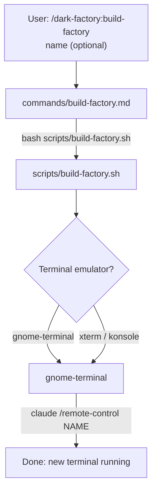

# /dark-factory:build-factory

Opens a new terminal window running `claude /remote-control` for parallel factory sessions.

## Flow

## See also

- scripts/build-factory.sh — terminal spawn implementation
- [/dark-factory:destroy-factory](destroy-factory.md) — clean up all other terminals
