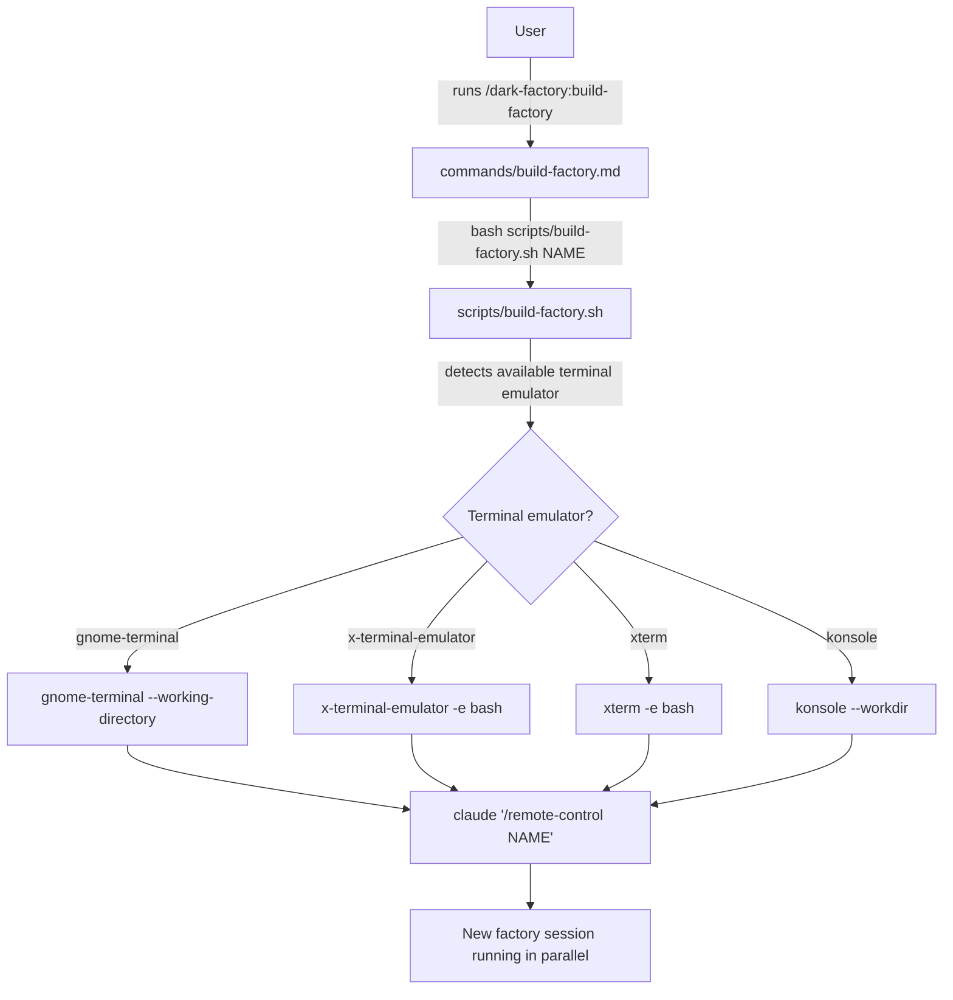

# build-factory

## Metadata

- System type: `command`

## System Intent

- What this is: A Claude Code slash command that spawns a new terminal window running `claude /remote-control`, leaving the calling session completely untouched.

## Mermaid Diagram



## Flows

### Flow: `build-factory`

- Core files: `commands/build-factory.md`, `scripts/build-factory.sh`
- Test files: `tests/test_build_factory_no_destroy.py`

#### Types

```txt
Input {
  name: string (optional, default: "dark factory") — label passed to /remote-control
}

Output {
  side-effect: new terminal window opened, running claude /remote-control <name>
}
```

#### Paths

| path | input | output | path-type | notes |
| --- | --- | --- | --- | --- |
| `build-factory.success` | `name` | new terminal window running remote-control | `happy path` | calling session is left untouched |
| `build-factory.no-terminal` | `name` | error to stderr, exit 1 | `error` | no supported terminal emulator found |

#### Pseudocode

```
NAME = args[1] or "dark factory"
cmd  = "claude '/remote-control NAME'"
cwd  = pwd

try gnome-terminal --working-directory=cwd -- bash -c cmd
else try x-terminal-emulator -e bash -c cmd  (cd cwd first)
else try xterm -e bash -c cmd                 (cd cwd first)
else try konsole --workdir cwd -e bash -c cmd
else error "No terminal emulator found"
```

## Logs

| Source | Location |
|--------|----------|
| terminal open failure | stderr of the calling claude session |

## Deployment

- Mechanism: `local only`
- Deploy command:
  ```bash
  # No deployment needed; the command and script ship with the plugin.
  # Install via:
  /dark-factory:install
  ```
- Notes: `scripts/build-factory.sh` is an open-only script. It has no self-close behavior. The "reopen" pattern (open new + close self) lives in `scripts/reopen-remote-control.sh` and must not be reused here — see `docs/bugs/2026-04-28-build-factory-destroys-existing-terminals.md`.
