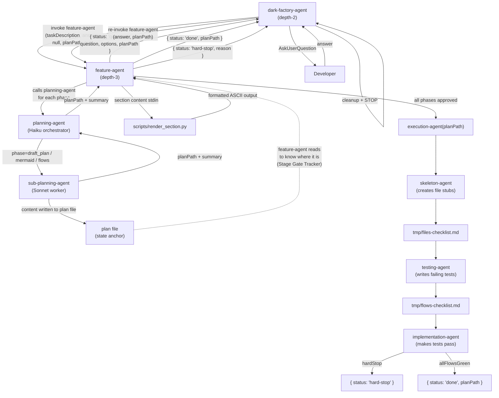

# build-feature

## Metadata

- System type: `flow`

## System Intent

- What this is: The end-to-end feature-building flow. Orchestrates planning (with Mermaid diagram, typed I/O contracts, and per-flow pseudocode), a human approval gate with feedback-and-retry, and then full execution (skeleton → tests → implementation). Does not open a PR itself — that is the caller's responsibility after documentation agents complete.
- Approval gate protocol: feature-agent does not call AskUserQuestion directly. Instead it returns structured `{ status: "question", ... }` objects to dark-factory-agent (depth-2), which calls AskUserQuestion and re-invokes feature-agent with the answer. This is the return-question protocol.

## Mermaid Diagram



## Flows

### Flow: `question-return-protocol`

- Test files: `N/A`
- Core files: `agents/featurework/agents/feature-agent.md`, `agents/dark-factory/agents/dark-factory-agent.md`

#### Types

```txt
FeatureAgentInput {
  taskDescription: string       (first invocation — the user's feature request)
  answer: string | null         (re-invocation — user's answer to the returned question)
  planPath: string | null       (re-invocation — path to the existing plan file)
}

FeatureAgentResult =
  | { status: "question", question: string, options: string[], planPath: string, phase: string }
  | { status: "done", planPath: string }
  | { status: "hard-stop", reason: string }

StandardError {
  message: string
}
```

#### Paths

| path | input | output | path-type | notes |
| --- | --- | --- | --- | --- |
| `question.firstInvoke` | `{ taskDescription, answer: null, planPath: null }` | `FeatureAgentResult{status:"question"}` | happy path | feature-agent runs draft_plan phase via planning-agent, returns question with System Intent section |
| `question.reInvoke` | `{ answer, planPath }` | `FeatureAgentResult{status:"question"}` | happy path | feature-agent reads planPath Stage Gate Tracker to determine current phase, applies answer, continues to next gate, returns next question |
| `question.done` | `{ answer, planPath }` (last phase approved) | `FeatureAgentResult{status:"done", planPath}` | happy path | all phases approved and execution-agent complete; dark-factory-agent continues to code review + PR |
| `question.hardStop` | execution-agent hard-stop | `FeatureAgentResult{status:"hard-stop", reason}` | error | dark-factory-agent reports reason, runs cleanup, and stops |

#### Pseudocode

```
# feature-agent — return-question protocol

Input: taskDescription, answer (may be null), planPath (may be null)

# Determine resume point by reading plan file
if planPath exists:
  read planPath
  determine current phase from Stage Gate Tracker checkboxes:
    - if "Stage 1 Mermaid approved" unchecked → phase = "mermaid" (apply answer, continue)
    - if "Stage 2 Flows approved" unchecked → phase = "flows" (apply answer, continue)
    - if all gates checked → phase = "execution"
else:
  phase = "draft_plan"

# Phase 1: Draft Plan
if phase == "draft_plan":
  invoke planning-agent(phase="draft_plan", feedback=taskDescription)
  receive { planPath, summary }
  PushNotification("Draft Plan Ready", ...)
  section_content = extract "## System Intent" from planPath
  rendered = bash("python3 scripts/render_section.py", stdin=section_content)
  formatted_content = rendered.stdout if rendered.exit_code == 0 else section_content
  RETURN { status: "question", question: "<formatted_content>",
           options: ["Looks good — continue to Mermaid diagram", "Request Changes"],
           planPath, phase: "draft_plan" }

# Phase 2: Mermaid Diagram
if phase == "mermaid":
  invoke planning-agent(phase="mermaid", planPath, feedback=answer ?? "none")
  receive { planPath, url, summary }
  if url: PushNotification("Mermaid Diagram Ready", url)
  section_content = extract "## Mermaid Diagram" from planPath
  rendered = bash("python3 scripts/render_section.py", stdin=section_content)
  formatted_content = rendered.stdout if rendered.exit_code == 0 else section_content
  RETURN { status: "question", question: "<formatted_content>",
           options: ["Approve — continue to flows", "Request Changes"],
           planPath, phase: "mermaid" }

# Phase 3: Flows (one at a time, tracked via flows-state.json)
if phase == "flows":
  load/init $DARK_FACTORY_WORK_DIR/flows-state.json
  if answer == "Approve — continue to next flow": mark current flow approved
  elif answer is feedback: re-invoke planning-agent(phase="flows", flowName=state.current, feedback=answer)
  nextFlow = first flow in allFlows not yet approved
  if nextFlow is null: GOTO phase == "execution"
  state.current = nextFlow; write stateFile
  section_content = extract "### Flow: <nextFlow>" from planPath
  rendered = bash("python3 scripts/render_section.py", stdin=section_content)
  formatted_content = rendered.stdout if rendered.exit_code == 0 else section_content
  RETURN { status: "question", question: "<formatted_content>",
           options: ["Approve — continue to next flow", "Request Changes"],
           planPath, phase: "flows" }

# Phase 4: Execution
if phase == "execution":
  invoke execution-agent(planPath)
  if hardStop: RETURN { status: "hard-stop", reason }
  write brain-patch.json { "planFilePath": planPath }
  RETURN { status: "done", planPath }
```

### Flow: `dark-factory-reinvoke-loop`

- Test files: `N/A`
- Core files: `agents/dark-factory/agents/dark-factory-agent.md`

#### Types

```txt
FeatureAgentResult =
  | { status: "question", question: string, options: string[], planPath: string, phase: string }
  | { status: "done", planPath: string }
  | { status: "hard-stop", reason: string }
```

#### Paths

| path | input | output | path-type | notes |
| --- | --- | --- | --- | --- |
| `loop.question` | `FeatureAgentResult{status:"question"}` | AskUserQuestion → re-invoke feature-agent | happy path | dark-factory-agent asks question at depth-2 (where AskUserQuestion works), re-invokes feature-agent with answer + planPath |
| `loop.done` | `FeatureAgentResult{status:"done"}` | continue to Step 4 (code review) | happy path | planning + execution complete; planFilePath captured from result |
| `loop.hardStop` | `FeatureAgentResult{status:"hard-stop"}` | cleanup + report + STOP | error | surface reason to developer; dark-factory-agent runs cleanup before stopping |

#### Pseudocode

```
# dark-factory-agent — feature route (Step 3)

result = invoke feature-agent({ taskDescription, answer: null, planPath: null })

LOOP:
  if result.status == "done":
    planFilePath = result.planPath
    BREAK  # proceed to Step 4 (code review)

  if result.status == "hard-stop":
    rm -f /tmp/dark-factory-work-dir
    run cleanup(WORK_DIR)
    report "Hard stop: " + result.reason
    STOP

  if result.status == "question":
    AskUserQuestion(result.question, result.options)
    answer = developer response
    result = invoke feature-agent({ answer, planPath: result.planPath, taskDescription: null })
    CONTINUE LOOP
```

### Flow: `planFeature`

- Test files: `N/A`
- Core files: `agents/featurework/agents/feature-agent.md`, `agents/featurework/planning/agents/planning-agent.md`, `agents/featurework/planning/agents/sub-planning-agent.md`, `agents/featurework/planning/templates/plan-template.md`

#### Types

```txt
SubPlanningAgentInput {
  phase: "draft_plan" | "mermaid" | "flows"
  planPath: string | null  (null for draft_plan phase)
  feedback: string         (user feedback or initial feature description)
  flowName: string | null  (only for flows phase)
}

SubPlanningAgentOutput {
  planPath: string (absolute path to the written/updated plan file)
  url: string | null (mermaid.ink URL; only for mermaid phase)
  summary: string (short description of what was done)
}

StandardError {
  message: string (human-readable description of what went wrong)
}
```

#### Paths

| path | input | output | path-type | notes |
| --- | --- | --- | --- | --- |
| `planFeature.draftQuestion` | `FeatureAgentInput{taskDescription}` | `FeatureAgentResult{status:"question", phase:"draft_plan"}` | happy path | feature-agent invokes planning-agent with phase=draft_plan; reads System Intent section from plan; pipes through scripts/render_section.py; returns formatted question to dark-factory-agent |
| `planFeature.mermaidQuestion` | answer="Looks good", planPath | `FeatureAgentResult{status:"question", phase:"mermaid"}` | happy path | feature-agent invokes planning-agent with phase=mermaid; pushes diagram URL via PushNotification if url is non-null; pipes Mermaid section through scripts/render_section.py; returns formatted question to dark-factory-agent |
| `planFeature.flowQuestion` | answer, planPath, flows-state.json | `FeatureAgentResult{status:"question", phase:"flows"}` | happy path | feature-agent iterates each Flow section one at a time; pipes each flow section through scripts/render_section.py so tables render as ASCII; tracks approved flows in flows-state.json |
| `planFeature.phaseRetry` | answer=feedback text, planPath | revised question for same phase | loop | developer provides feedback during any phase; feature-agent re-invokes planning-agent for that phase with the feedback, then returns another question |
| `planFeature.error` | `FeatureAgentInput` | `StandardError` | error | sub-planning-agent fails to complete a phase |

### Flow: `executeFeature`

- Test files: `tests/`
- Core files: `agents/featurework/execution/agents/execution-agent.md`, `agents/featurework/execution/agents/skeleton-agent.md`, `agents/featurework/execution/agents/testing-agent.md`, `agents/featurework/execution/agents/implementation-agent.md`

#### Types

```txt
ExecuteFeatureInput {
  planPath: string (required — path to approved plan file)
}

ExecuteFeatureOutput {
  allFlowsGreen: true
}

HardStop {
  hardStop: true
  reason: string
}
```

#### Paths

| path | input | output | path-type | notes |
| --- | --- | --- | --- | --- |
| `executeFeature.success` | `ExecuteFeatureInput` | `FeatureAgentResult{status:"done", planPath}` | happy path | skeleton → tests → implementation all pass; tmp checklists deleted; feature-agent writes brain-patch.json then returns done |
| `executeFeature.hard-stop` | `ExecuteFeatureInput` | `FeatureAgentResult{status:"hard-stop", reason}` | paused | implementation-agent encounters unresolvable deviation; feature-agent returns hard-stop to dark-factory-agent which runs cleanup |
| `executeFeature.plan-not-found` | `ExecuteFeatureInput` | `StandardError` | error | plan file does not exist |

#### Pseudocode

```
execution-agent(planPath):
  read planPath (error if missing)

  # Stage 1: skeleton
  skeleton-agent(planPath)
  assert tmp/files-checklist.md fully checked
  assert all listed files exist on disk

  # Stage 2: tests
  testing-agent(planPath)
  assert tmp/flows-checklist.md exists
  assert all new tests are FAILING (red-green discipline)

  # Stage 3: implementation
  implementation-agent(planPath, tmp/flows-checklist.md)
  if hardStop: PushNotification, pause, wait for developer (deviation-protocol updates diagram via skills/create-mermaid-diagram/SKILL.md if architecture changed), re-run implementation-agent
  if allFlowsGreen:
    rm tmp/files-checklist.md
    rm tmp/flows-checklist.md
    report success
```

## Logs

| Source | Location |
|--------|----------|
| planning-agent output | docs/plans/<date>-<slug>.md |
| flows approval state | $DARK_FACTORY_WORK_DIR/flows-state.json (deleted after all flows approved) |
| test results | Claude Code session transcript |
| checklists | tmp/files-checklist.md, tmp/flows-checklist.md (deleted on success) |
| render_section.py | stderr (table parsing errors, column width issues) |

## Deployment

- Mechanism: `local only` — invoked as a sub-agent by dark-factory-agent
- Notes: feature-agent is not user-invocable directly; it is spawned by dark-factory-agent when the task classification is "new feature". feature-agent does not call AskUserQuestion — it returns structured question objects to dark-factory-agent, which handles all user interaction at depth-2 via AskUserQuestion. The PR is opened by the caller (dark-factory-agent) after update-documentation-agent completes.
