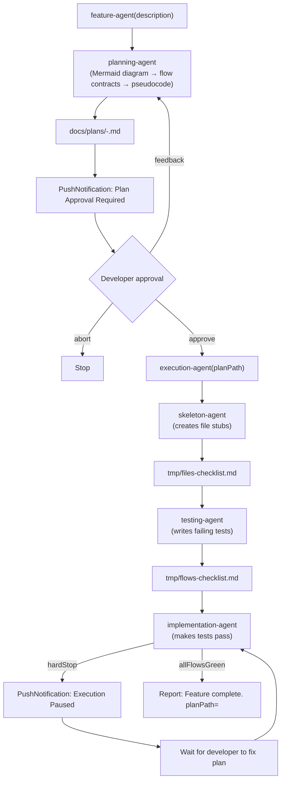

# build-feature

## Metadata

- System type: `flow`

## System Intent

- What this is: The end-to-end feature-building flow. Orchestrates planning (with Mermaid diagram, typed I/O contracts, and per-flow pseudocode), a human approval gate with feedback-and-retry, and then full execution (skeleton → tests → implementation). Does not open a PR itself — that is the caller's responsibility after documentation agents complete.

## Mermaid Diagram



## Flows

### Flow: `planFeature`

- Test files: `tests/`
- Core files: `agents/featurework/agents/feature-agent.md`, `agents/featurework/planning/agents/planning-agent.md`, `agents/featurework/planning/templates/plan-template.md`

#### Types

```txt
PlanFeatureInput {
  description: string (required — feature description or feedback-prefixed revision request)
}

PlanFeatureOutput {
  planPath: string (absolute path to the written plan file, e.g. docs/plans/2026-04-26-add-oauth.md)
}

StandardError {
  message: string (human-readable description of what went wrong)
}
```

#### Paths

| path | input | output | path-type | notes |
| --- | --- | --- | --- | --- |
| `planFeature.success` | `PlanFeatureInput` | `PlanFeatureOutput` | happy path | planning-agent writes plan, opens it in VSCode, returns planPath |
| `planFeature.error` | `PlanFeatureInput` | `StandardError` | error | planning-agent fails or returns no planPath |

### Flow: `approveFeature`

- Core files: `agents/featurework/agents/feature-agent.md`

#### Types

```txt
ApproveFeatureInput {
  planPath: string (path to the plan file displayed to the developer)
}

ApproveFeatureOutput {
  approved: true
}
```

#### Paths

| path | input | output | path-type | notes |
| --- | --- | --- | --- | --- |
| `approveFeature.approved` | `ApproveFeatureInput` | `ApproveFeatureOutput` | happy path | developer replies "yes" or "approve" |
| `approveFeature.feedback` | `ApproveFeatureInput` | feedback string | retry | developer provides revision text; feature-agent loops back to planning-agent |
| `approveFeature.abort` | `ApproveFeatureInput` | stopped | user abort | developer replies "abort" |

### Flow: `executeFeature`

- Test files: `tests/`
- Core files: `agents/featurework/execution/agents/execution-agent.md`, `agents/featurework/execution/agents/skeleton-agent.md`, `agents/featurework/execution/agents/testing-agent.md`, `agents/featurework/execution/agents/implementation-agent.md`

#### Types

```txt
ExecuteFeatureInput {
  planPath: string (required — path to approved plan file)
}

ExecuteFeatureOutput {
  allFlowsGreen: true
}

HardStop {
  hardStop: true
  reason: string
}
```

#### Paths

| path | input | output | path-type | notes |
| --- | --- | --- | --- | --- |
| `executeFeature.success` | `ExecuteFeatureInput` | `ExecuteFeatureOutput` | happy path | skeleton → tests → implementation all pass; tmp checklists deleted |
| `executeFeature.hard-stop` | `ExecuteFeatureInput` | `HardStop` | paused | implementation-agent encounters unresolvable deviation; developer must edit plan and resume |
| `executeFeature.plan-not-found` | `ExecuteFeatureInput` | `StandardError` | error | plan file does not exist |

#### Pseudocode

```
execution-agent(planPath):
  read planPath (error if missing)

  # Stage 1: skeleton
  skeleton-agent(planPath)
  assert tmp/files-checklist.md fully checked
  assert all listed files exist on disk

  # Stage 2: tests
  testing-agent(planPath)
  assert tmp/flows-checklist.md exists
  assert all new tests are FAILING (red-green discipline)

  # Stage 3: implementation
  implementation-agent(planPath, tmp/flows-checklist.md)
  if hardStop: PushNotification, pause, wait for developer, re-run implementation-agent
  if allFlowsGreen:
    rm tmp/files-checklist.md
    rm tmp/flows-checklist.md
    report success
```

## Logs

| Source | Location |
|--------|----------|
| planning-agent output | docs/plans/<date>-<slug>.md |
| test results | Claude Code session transcript |
| checklists | tmp/files-checklist.md, tmp/flows-checklist.md (deleted on success) |

## Deployment

- Mechanism: `local only` — invoked as a sub-agent by dark-factory-agent
- Notes: feature-agent is not user-invocable directly; it is spawned by dark-factory-agent when the task classification is "new feature". The PR is opened by the caller (dark-factory-agent) after update-documentation-agent completes.
