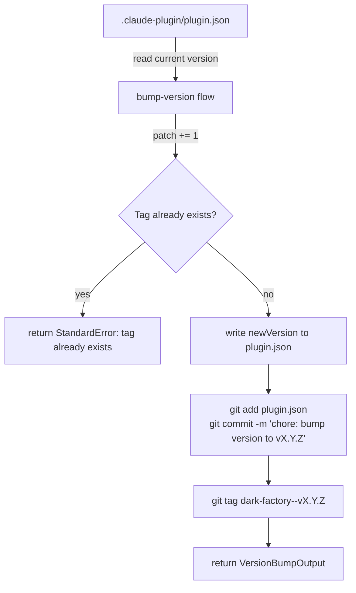

# bump-version

## Metadata

- System type: `flow`

## System Intent

- What this is: A patch-version increment flow. Reads the current version from `.claude-plugin/plugin.json`, increments the patch segment, writes the new version back, and creates a git commit and annotated tag for the new version.

## Mermaid Diagram



## Flows

### Flow: `bump-version`

- Test files: N/A
- Core files: `.claude-plugin/plugin.json`

#### Types

```txt
VersionBumpInput {
  currentVersion: string  (semver string read from plugin.json, e.g. "1.1.4")
  bumpType: "patch"       (always patch)
}

VersionBumpOutput {
  newVersion: string      (incremented semver, e.g. "1.1.5")
  commitSha: string       (sha of the resulting git commit)
  tag: string             (git tag created, e.g. "dark-factory--v1.1.5")
}

StandardError {
  message: string (human-readable description of what went wrong)
}
```

#### Paths

| path | input | output | path-type | notes |
| --- | --- | --- | --- | --- |
| `bump-version.success` | `VersionBumpInput` | `VersionBumpOutput` | happy path | Increments patch segment of version in `.claude-plugin/plugin.json`, commits, and creates git tag `dark-factory--v<newVersion>` |
| `bump-version.already-bumped` | `VersionBumpInput` | `StandardError` | error | Tag already exists for this version — abort to avoid duplicate tags |

#### Pseudocode

```
read version from .claude-plugin/plugin.json
split on "." → [major, minor, patch]
patch += 1
newVersion = major.minor.patch
# guard: if git tag "dark-factory--v<newVersion>" already exists → return StandardError { message: "tag already exists: dark-factory--v<newVersion>" }
write newVersion back to plugin.json
git add .claude-plugin/plugin.json
git commit -m "chore: bump version to <newVersion>"
git tag "dark-factory--v<newVersion>"
return { newVersion, commitSha, tag }
```

## Logs

| Source | Location |
|--------|----------|
| git output | stdout/stderr of terminal session |

## Deployment

- Mechanism: `local only`
- Deploy command:
  ```bash
  # Edit .claude-plugin/plugin.json to increment patch version, then:
  git add .claude-plugin/plugin.json
  git commit -m "chore: bump version to 1.1.5"
  git tag dark-factory--v1.1.5
  # Push tag to remote separately after local verification:
  git push origin dark-factory--v1.1.5
  ```
- Notes: Always verify the tag does not already exist before running. Push the tag to remote only after confirming the local plugin update works.
