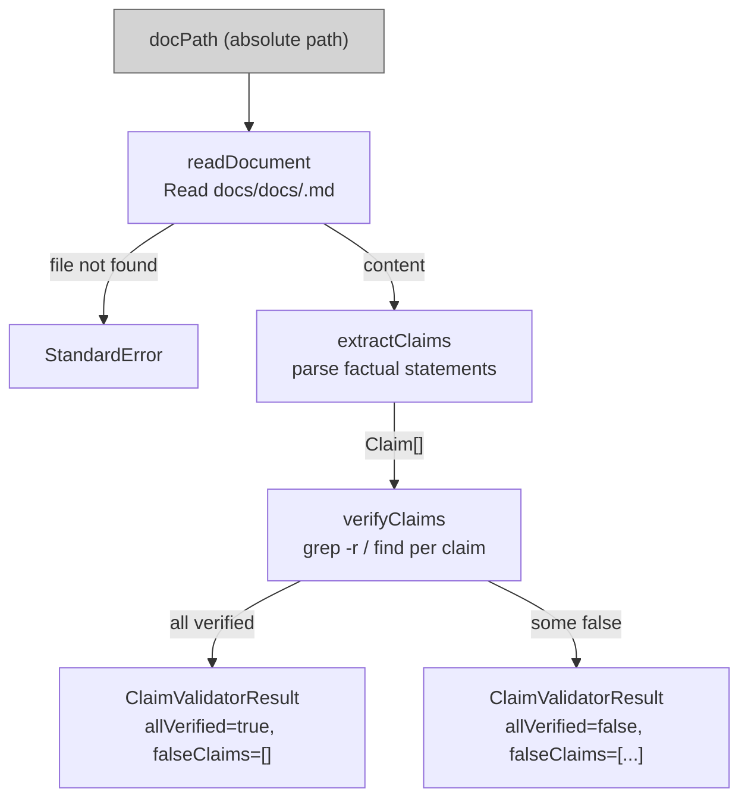

# claim-validator-agent

## Metadata

- System type: `microservice`

## System Intent

- What this is: A non-user-invocable agent that reads a documentation file, extracts every factual claim (file paths, agent names, behavioral assertions, configuration values, hook declarations), verifies each claim against actual source code using grep and find, and returns a structured result indicating which claims are verified and which are false. It is invoked by investigation-orchestrator as part of the investigation command's validation loop.

## Mermaid Diagram



## Flows

### Flow: `claimValidation`

- Test files: `tests/test_claim_validation.py`
- Core files:
  - `agents/documentation/agents/claim-validator-agent.md`

#### Types

```txt
ClaimValidatorInput {
  docPath: string (absolute path to a docs/docs/<system>.md file)
}

Claim {
  text: string (the exact statement from the doc)
  verified: boolean
  evidence: string | null (file:line format confirming or refuting)
}

ClaimValidatorResult {
  allVerified: boolean
  falseClaims: Claim[] (empty when allVerified is true)
}

StandardError {
  message: string (human-readable description of what went wrong)
}
```

#### Paths

| path | input | output | path-type | notes |
| --- | --- | --- | --- | --- |
| `claimValidation.all-true` | `ClaimValidatorInput` | `ClaimValidatorResult` with empty falseClaims | `happy path` | every extracted claim confirmed against source |
| `claimValidation.some-false` | `ClaimValidatorInput` | `ClaimValidatorResult` with falseClaims populated | `happy path` | caller feeds falseClaims back to investigation-agent for correction |
| `claimValidation.doc-not-found` | `ClaimValidatorInput` | `StandardError` | `error` | docPath does not exist |

#### Pseudocode

```
claimValidation(docPath):
  if not file_exists(docPath):
    RETURN StandardError("Doc not found: " + docPath)

  content = read(docPath)

  # Step 1: Extract factual claims
  claims = []
  for each sentence/bullet in content:
    if is_factual_claim(sentence):  # file paths, agent/tool names, behavioral assertions, config values
      claims.append(Claim(text=sentence, verified=false, evidence=null))

  # Step 2: Verify each claim against source code
  falseClaims = []
  for each claim in claims:
    evidence = search_codebase(claim.text)  # uses grep -r and find
    if evidence confirms claim:
      claim.verified = true
      claim.evidence = evidence  # file:line format
    else:
      claim.verified = false
      claim.evidence = evidence  # may be null or a contradicting snippet
      falseClaims.append(claim)

  RETURN ClaimValidatorResult(
    allVerified = len(falseClaims) == 0,
    falseClaims = falseClaims
  )
```

## Logs

| Source | Location |
|--------|----------|
| claim verdicts | returned inline in ClaimValidatorResult (no persistent log) |

## Deployment

- Mechanism: `local only`
- Deploy command:
  ```bash
  # No separate deploy step — agent file is loaded at invocation time.
  # The agent is picked up automatically from agents/documentation/agents/claim-validator-agent.md.
  ```
- Notes: Tools are restricted to `Read`, `Grep`, `Glob`, `Bash(find *)`, `Bash(grep -r *)`, and `Bash(ls *)`. The agent does not modify documentation files, create PRs, or fix code — it only reads and reports.
