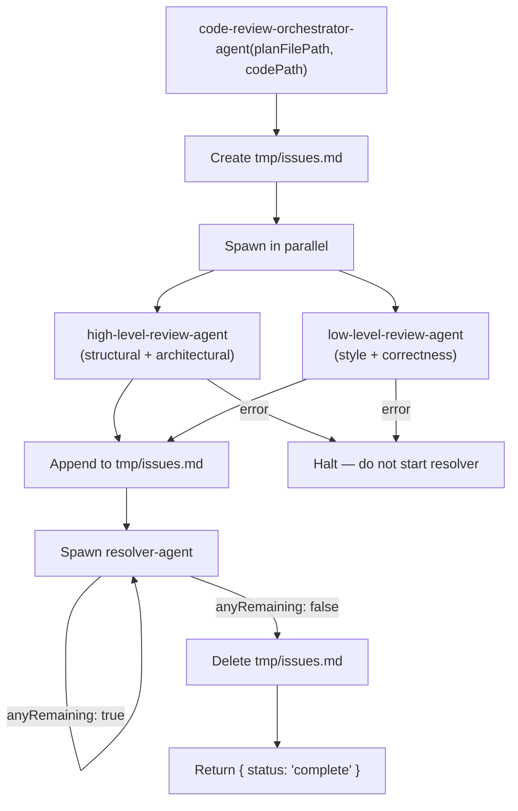

# code-review

## Metadata

- System type: `flow`

## System Intent

- What this is: The automated code review flow. Given an approved plan file and code path, spawns a high-level reviewer (structural/architectural conformance) and a low-level reviewer (style/correctness) in parallel, then runs a resolver loop until all issues are resolved and the issue list is clean.

## Mermaid Diagram



## Flows

### Flow: `orchestrateReview`

- Core files: `agents/code-review/agents/code-review-orchestrator-agent.md`, `agents/code-review/agents/high-level-review-agent.md`, `agents/code-review/agents/low-level-review-agent.md`, `agents/code-review/agents/resolver-agent.md`

#### Types

```txt
OrchestrateReviewInput {
  planFilePath: string (required — absolute path to the approved plan file)
  codePath: string (required — directory path or branch name containing the code to review)
  brainPath: string (optional — absolute path to brain.json; passed by dark-factory-agent)
}

OrchestrateReviewOutput {
  status: "complete"
}

StandardError {
  message: string (human-readable description of what went wrong)
}
```

#### Paths

| path | input | output | path-type | notes |
| --- | --- | --- | --- | --- |
| `orchestrateReview.success` | `OrchestrateReviewInput` | `OrchestrateReviewOutput` | happy path | both reviewers complete, resolver loop exits with zero unchecked items, issues.md deleted |
| `orchestrateReview.no-issues` | `OrchestrateReviewInput` | `OrchestrateReviewOutput` | happy path | both reviewers append nothing; resolver sees empty checklist and no-ops; issues.md deleted |
| `orchestrateReview.reviewer-error` | `OrchestrateReviewInput` | `StandardError` | error | one or both parallel reviewer agents fail; orchestrator surfaces error without starting resolver |
| `orchestrateReview.resolver-loop-error` | `OrchestrateReviewInput` | `StandardError` | error | resolver exits with an error on a given iteration |
| `orchestrateReview.resolver-stuck` | `OrchestrateReviewInput` | `StandardError` | error | resolver loop runs more than 10 iterations without clearing all items |

### Flow: `highLevelReview`

- Core files: `agents/code-review/agents/high-level-review-agent.md`

#### Types

```txt
HighLevelReviewInput {
  planFilePath: string (required)
  codePath: string (required)
}

HighLevelReviewOutput {
  issuesAppended: number (count of IssueItems written to issues.md; 0 if none)
}
```

#### Paths

| path | input | output | path-type | notes |
| --- | --- | --- | --- | --- |
| `highLevelReview.issues-found` | `HighLevelReviewInput` | `HighLevelReviewOutput` | happy path | structural/architectural divergences found and appended |
| `highLevelReview.no-issues` | `HighLevelReviewInput` | `HighLevelReviewOutput { issuesAppended: 0 }` | happy path | plan and code fully aligned |
| `highLevelReview.plan-not-found` | `HighLevelReviewInput` | `StandardError` | error | planFilePath does not exist or is unreadable |
| `highLevelReview.code-not-found` | `HighLevelReviewInput` | `StandardError` | error | codePath does not exist or yields no readable files |

#### Pseudocode

```
high-level-review-agent(planFilePath, codePath):
  read planFilePath (error if missing)
  read all source files under codePath (error if none)

  for each structural concern:
    - module structure: does file/agent layout match plan's Core files + Mermaid diagram?
    - I/O contracts: are input/output types from flow definitions honoured at call sites?
    - cross-cutting: is error handling consistent? are shared types used uniformly?
    - missing flows: are any plan-listed flows completely absent from code?

  for each concern found:
    append "- [ ] [high-level] <description> (<filePath>)" to tmp/issues.md

  return { issuesAppended: count }
```

## Logs

| Source | Location |
|--------|----------|
| issues checklist | `tmp/issues.md` (deleted on successful completion) |

## Deployment

- Mechanism: `local only` — invoked as a sub-agent by dark-factory-agent after the worker agent completes
- Notes: Never start the resolver if either reviewer returned an error. The resolver loop has a hard cap of 10 iterations to prevent infinite loops on intractable issues. dark-factory-agent passes `brainPath`; on entry code-review-orchestrator-agent sets `brain.phase = "review-running"` and on exit sets `brain.phase = "review-complete"`. If `brainPath` is not provided or unreadable, brain.json reads/writes are skipped (non-fatal).
