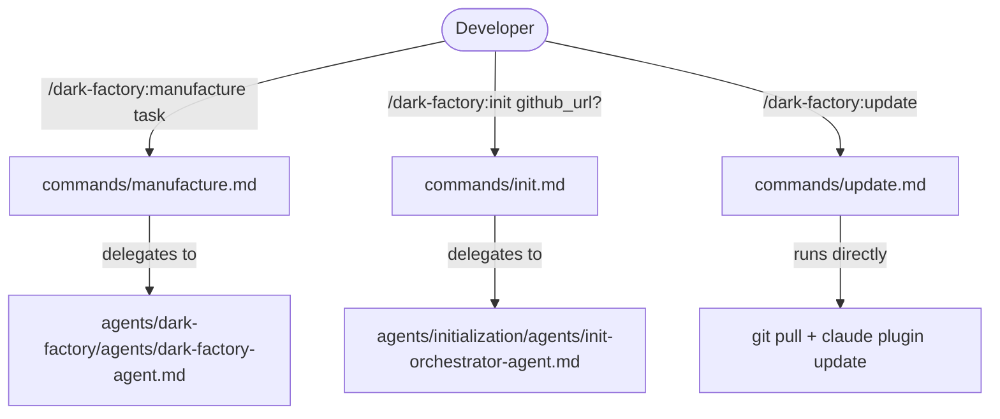

# Commands

## Metadata

- System type: `library`
- Owner: dark-factory plugin
- Source directory: `commands/`
- Command count: 3 slash commands

## System Intent

- What this is: The `commands/` directory contains the three Claude Code slash commands that Dark Factory exposes to the developer. Each command file is a minimal markdown stub that delegates all logic to the corresponding orchestrator agent. Commands carry a `description` field for the Claude Code command picker and a single delegation line in the body.
- Primary consumer(s): Developers invoking slash commands from the Claude Code interface.
- Boundary: Commands only contain front-matter and a delegation line. All orchestration logic lives in `agents/`.

## Mermaid Diagram



## Flows

### Flow: `manufacture`

- Core files: `commands/manufacture.md`, `agents/dark-factory/agents/dark-factory-agent.md`

#### Types

```txt
ManufactureInput {
  taskDescription: string (free-text, e.g. "add OAuth login", "fix login crash")
}

ManufactureOutput {
  prUrl: string
  merged: boolean
}

StandardError {
  message: string (human-readable description of what went wrong)
}
```

#### Paths

| path | input | output | path-type | notes |
| --- | --- | --- | --- | --- |
| `manufacture.success` | `ManufactureInput` | `ManufactureOutput` | `happy path` | Delegates to dark-factory-agent; routes feature/debug/fix-flow, reviews, opens PR |
| `manufacture.error` | `ManufactureInput` | `StandardError` | `error` | Worker agent returns error or hard-stop; cleanup runs |

---

### Flow: `init`

- Core files: `commands/init.md`, `agents/initialization/agents/init-orchestrator-agent.md`

#### Types

```txt
InitInput {
  githubUrl: string | void (optional GitHub repo URL to clone; omit to use CWD)
}

InitOutput {
  prUrl: string (the "init: dark factory" PR)
}
```

#### Paths

| path | input | output | path-type | notes |
| --- | --- | --- | --- | --- |
| `init.newRepo` | `InitInput{githubUrl}` | `InitOutput` | `happy path` | Clones repo, runs init.sh, generates docs, opens PR |
| `init.existingCWD` | `InitInput{void}` | `InitOutput` | `happy path` | Treats CWD as target; runs init.sh, generates docs, opens PR |

---

### Flow: `update`

- Core files: `commands/update.md`

#### Types

```txt
UpdateInput {
  void (no arguments)
}

UpdateOutput {
  void (outputs plugin version info to terminal)
}
```

#### Paths

| path | input | output | path-type | notes |
| --- | --- | --- | --- | --- |
| `update.success` | `UpdateInput` | `UpdateOutput` | `happy path` | Runs `git pull` then `claude plugin update "dark-factory@dark-factory"` |

## Logs

| Source | Location |
|--------|----------|
| N/A | Commands are thin stubs; they produce no structured log output. Terminal output from `git pull` and `claude plugin update` is the only observable output for the update command. |

## Deployment

- Mechanism: `local only`
- Deploy command:
  ```bash
  # Commands become available after installing the plugin:
  claude plugin install dark-factory
  # Commands are then accessible as /dark-factory:<name> in the Claude Code interface.
  ```
- Notes: Commands are loaded by the Claude Code runtime from the plugin's `commands/` directory. No deployment step beyond plugin installation.
