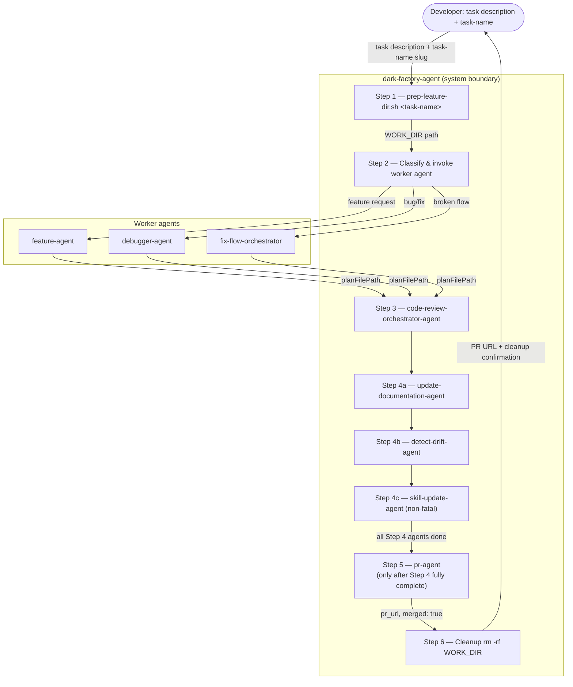

# dark-factory-agent

## Metadata

- System type: `flow`

## System Intent

- What this is: `dark-factory-agent` is the top-level orchestrator for all dark-factory work. It preps an isolated work directory (a fresh copy of the repo), routes to the appropriate worker agent, runs code review, runs documentation agents, and then opens a PR — in that strict order. It does not write code or modify files itself; it delegates entirely. The PR step (Step 5) is intentionally placed after all documentation agents (Step 4) have fully completed so that `pr-agent`'s `git add --all` picks up any docs written during Step 4.

## Mermaid Diagram



## Flows

### Flow: `darkFactoryAgent` (top-level)

- Test files: N/A
- Core files: `agents/dark-factory/agents/dark-factory-agent.md`

#### Types

```txt
DarkFactoryInput {
  taskDescription: string  (verbatim user request)
  taskName:        string  (short slug for the work dir, e.g. "add-oauth"; derived if not provided)
}

DarkFactoryOutput {
  prUrl:   string
  merged:  true
  workDir: string  (already deleted; reported for auditability)
}

StandardError {
  message: string (human-readable description of what went wrong)
}
```

#### Paths

| path | input | output | path-type | notes |
| --- | --- | --- | --- | --- |
| `darkFactoryAgent.success` | `DarkFactoryInput` | `DarkFactoryOutput` | happy path | all 6 steps complete, PR merged, work dir removed |
| `darkFactoryAgent.prepFailure` | `DarkFactoryInput` | `StandardError` | error | prep-feature-dir.sh fails; no work dir created, nothing to clean up |
| `darkFactoryAgent.workerFailure` | `DarkFactoryInput` | `StandardError` | error | worker agent hard-stops or errors; cleanup runs, then halt |
| `darkFactoryAgent.reviewFailure` | `DarkFactoryInput` | `StandardError` | error | code-review-orchestrator-agent halts; cleanup runs, then halt |
| `darkFactoryAgent.driftFailure` | `DarkFactoryInput` | `StandardError` | error | detect-drift-agent surfaces unresolvable items; cleanup runs before PR |
| `darkFactoryAgent.prFailure` | `DarkFactoryInput` | `StandardError` | error | pr-agent cannot merge; cleanup runs, then halt |

#### Pseudocode

```
dark-factory-agent(taskDescription, taskName):

  # Step 1 — prep isolated work dir
  run prep-feature-dir.sh <taskName>
  capture WORK_DIR from stdout
  if error: STOP (no cleanup needed)

  # Step 2 — route to worker
  cd WORK_DIR; classify taskDescription; invoke worker agent
  if error: cleanup(WORK_DIR); STOP
  planFilePath = worker result (null if no plan produced)

  # Step 3 — code review
  invoke code-review-orchestrator-agent with planFilePath, WORK_DIR
  if error: cleanup(WORK_DIR); STOP

  # Step 4 — documentation (MUST fully complete before Step 5)
  # Step 4a
  invoke update-documentation-agent with planFilePath (or null)
  # Step 4b
  invoke detect-drift-agent scoped to WORK_DIR/docs/docs/
  if detect-drift unresolvable: cleanup(WORK_DIR); STOP
  # Step 4c (non-fatal)
  try: invoke skill-update-agent
  catch: warn developer, continue

  # Step 5 — PR (only after all Step 4 agents done)
  # pr-agent uses `git add --all`; docs from Step 4 are included because Step 4 is complete.
  invoke pr-agent with planFilePath ?? taskDescription
  if error: cleanup(WORK_DIR); STOP
  prUrl = result

  # Step 6 — cleanup
  cleanup(WORK_DIR)

  report "Done. PR: <prUrl>. Work dir <WORK_DIR> removed."
  STOP
```

---

### Flow: `prepFeatureDir`

- Test files: N/A (shell script)
- Core files: `agents/dark-factory/scripts/prep-feature-dir.sh`

#### Types

```txt
PrepFeatureDirInput {
  taskName: string (required, short slug)
}

PrepFeatureDirOutput {
  workDir: string (printed as WORK_DIR=dark_factory-<taskName>)
}
```

#### Paths

| path | input | output | path-type | notes |
| --- | --- | --- | --- | --- |
| `prepFeatureDir.success` | `PrepFeatureDirInput` | `PrepFeatureDirOutput` | happy path | git pull succeeds, cp succeeds, WORK_DIR printed |
| `prepFeatureDir.git-pull-failure` | `PrepFeatureDirInput` | `StandardError` | error | git pull exits non-zero; script exits 1 |
| `prepFeatureDir.copy-failure` | `PrepFeatureDirInput` | `StandardError` | error | cp -r fails (disk space, permissions); script exits 1 |

---

### Flow: `updateDocsAndDrift` (Step 4)

- Test files: N/A (delegates to documentation agents)
- Core files: `agents/dark-factory/agents/dark-factory-agent.md`

#### Types

```txt
UpdateDocsInput {
  planFilePath: string | null
  workDir:      string
}

UpdateDocsOutput {
  docsUpdated:   string[]   (paths of docs written/updated)
  driftFindings: string     (summary from detect-drift-agent)
}
```

#### Paths

| path | input | output | path-type | notes |
| --- | --- | --- | --- | --- |
| `updateDocsAndDrift.success` | `UpdateDocsInput` | `UpdateDocsOutput` | happy path | docs updated, drift report clean or auto-fixed |
| `updateDocsAndDrift.noPlan` | `UpdateDocsInput` | `UpdateDocsOutput` | happy path | planFilePath null; update-documentation-agent may no-op or use git diff |
| `updateDocsAndDrift.driftUnresolved` | `UpdateDocsInput` | `StandardError` | error | detect-drift-agent finds unresolvable items; orchestrator surfaces and halts before Step 5 (PR) |

#### Pseudocode

```
updateDocsAndDrift(planFilePath, workDir):
  invoke update-documentation-agent with planFilePath (or null)
  invoke detect-drift-agent scoped to workDir/docs/docs/
  if unresolvable drift items: STOP with StandardError
  return { docsUpdated, driftFindings }
```

---

### Flow: `openPR` (Step 5)

- Test files: N/A (delegates to pr-agent)
- Core files: `agents/dark-factory/agents/dark-factory-agent.md`

#### Types

```txt
OpenPRInput {
  planFilePath:    string | null
  taskDescription: string
}

OpenPROutput {
  prUrl:  string
  merged: true
}
```

#### Paths

| path | input | output | path-type | notes |
| --- | --- | --- | --- | --- |
| `openPR.success` | `OpenPRInput` | `OpenPROutput` | happy path | PR opened, CI passes, merged; includes docs from Step 4 via `git add --all` |
| `openPR.noPlan` | `OpenPRInput` | `OpenPROutput` | happy path | planFilePath null; taskDescription string passed to pr-agent |
| `openPR.ciFailure` | `OpenPRInput` | `StandardError` | error | pr-agent cannot resolve CI failures |

---

### Flow: `cleanup`

- Test files: N/A
- Core files: `agents/dark-factory/agents/dark-factory-agent.md`

#### Types

```txt
CleanupInput {
  workDir: string
}

CleanupOutput {
  removed: true
}
```

#### Paths

| path | input | output | path-type | notes |
| --- | --- | --- | --- | --- |
| `cleanup.success` | `CleanupInput` | `CleanupOutput` | happy path | rm -rf succeeds |
| `cleanup.removeFailure` | `CleanupInput` | `StandardError` | error | rm -rf fails; report to developer but do not halt — non-fatal |

## Logs

| Source | Location |
|--------|----------|
| prep-feature-dir.sh stdout | terminal / caller stdout |
| Worker agent output | terminal / caller stdout |
| code-review-orchestrator-agent | terminal / caller stdout |
| update-documentation-agent | terminal / caller stdout |
| detect-drift-agent | terminal / caller stdout |
| skill-update-agent | terminal / caller stdout |
| pr-agent | terminal / caller stdout |

## Deployment

- Mechanism: `local only`
- Deploy command:
  ```bash
  # No deployment step — agent and script are markdown/shell files checked into the repo.
  # Invoke via Claude Code:
  # /dark-factory-agent <task-name> "<task description>"
  ```
- Notes: `prep-feature-dir.sh` must be run from the outer wrapper directory (`dark_factory/`). Step 5 (`pr-agent`) is intentionally ordered after Step 4 (documentation agents) so that `git add --all` in `pr-agent` includes any docs written during Step 4. `feature-agent` does not invoke `pr-agent`; only `dark-factory-agent` does, and only after documentation is complete.
