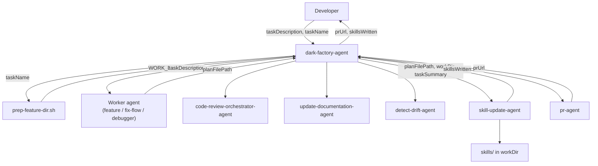

# dark-factory-agent

## Metadata

- System type: `agent`

## System Intent

- What this is: The top-level dark-factory orchestrator. It preps an isolated work directory, routes to the correct worker agent (feature/debug/fix-flow), runs code review and documentation housekeeping, invokes the skill-update-agent to capture recurring patterns, opens a PR, and removes the work directory. It does not write or modify code itself — it delegates entirely.

## Mermaid Diagram



## Flows

### Flow: `darkFactoryAgentOrchestration`

- Test files: N/A (agent instruction file, no automated tests)
- Core files:
  - `agents/dark-factory/agents/dark-factory-agent.md`
  - `agents/dark-factory/scripts/prep-feature-dir.sh`

#### Types

```txt
DarkFactoryInput {
  taskDescription: string  (verbatim user request)
  taskName:        string  (optional — short slug; derived from taskDescription if omitted)
}

DarkFactoryOutput {
  prUrl:         string
  merged:        true
  workDir:       string
  skillsWritten: SkillFile[]   (may be empty)
}

SkillFile {
  path:    string  (relative path within workDir)
  action:  "created" | "updated"
}

StandardError {
  message: string
}
```

#### Paths

| path | input | output | path-type | notes |
| --- | --- | --- | --- | --- |
| `darkFactoryAgent.success` | `DarkFactoryInput` | `DarkFactoryOutput` | happy path | Full manufacture loop completes; PR merged; work dir removed |
| `darkFactoryAgent.noSkills` | `DarkFactoryInput` | `DarkFactoryOutput { skillsWritten: [] }` | happy path | skill-update-agent ran, found nothing; manufacture continues normally |
| `darkFactoryAgent.skillsAdded` | `DarkFactoryInput` | `DarkFactoryOutput` | happy path | skill-update-agent wrote skills; they are included in the PR diff |
| `darkFactoryAgent.prepFailure` | `DarkFactoryInput` | `StandardError` | error | prep-feature-dir.sh fails; agent stops immediately (no cleanup needed) |
| `darkFactoryAgent.workerError` | `DarkFactoryInput` | `StandardError` | error | Worker agent errors; cleanup runs; agent stops |
| `darkFactoryAgent.codeReviewError` | `DarkFactoryInput` | `StandardError` | error | Code review errors; cleanup runs; agent stops |
| `darkFactoryAgent.driftUnresolved` | `DarkFactoryInput` | `StandardError` | error | detect-drift-agent surfaces items requiring developer input; cleanup runs; agent stops |
| `darkFactoryAgent.skillUpdateError` | `DarkFactoryInput` | `DarkFactoryOutput` | error (non-fatal) | skill-update-agent errors; dark-factory-agent logs warning and continues to pr-agent |
| `darkFactoryAgent.prError` | `DarkFactoryInput` | `StandardError` | error | pr-agent errors or cannot merge; cleanup runs; agent stops |

#### Pseudocode

```
dark-factory-agent(taskDescription, taskName):

  # Step 1 — prep isolated work dir
  bash agents/dark-factory/scripts/prep-feature-dir.sh <taskName>
  Capture WORK_DIR from stdout
  If script fails: report error and STOP

  # Step 2 — route to worker agent
  cd into WORK_DIR
  Classify taskDescription and invoke the appropriate worker
  If worker errors: cleanup(WORK_DIR), /clear, report error, STOP
  planFilePath = path the worker wrote its plan to (null if no plan produced)

  # Step 3 — code review
  invoke code-review-orchestrator-agent with planFilePath, WORK_DIR
  If error: cleanup(WORK_DIR), /clear, report error, STOP

  # Step 4 — update docs and detect drift
  invoke update-documentation-agent with planFilePath
  invoke detect-drift-agent scoped to WORK_DIR/docs/docs/
  If detect-drift-agent surfaces unresolvable items:
    report to developer, cleanup(WORK_DIR), /clear, STOP

  # Step 4c — skill update (non-fatal)
  try:
    skillResult = invoke skill-update-agent with planFilePath, workDir, taskSummary=taskDescription
    skillsWritten = skillResult.skillsWritten
    log "Skills written: " + skillsWritten
  catch error:
    warn developer: "skill-update-agent failed: <error>. Continuing to PR."

  # Step 5 — PR
  invoke pr-agent with planFilePath ?? taskDescription
  If pr-agent errors or cannot merge: cleanup(WORK_DIR), /clear, report error, STOP
  prUrl = result from pr-agent

  # Step 6 — cleanup
  cleanup(WORK_DIR)
  /clear
  Report: "Done. PR: <prUrl>. Work dir <WORK_DIR> removed. Skills written: <skillsWritten>."
```

## Logs

| Source | Location |
|--------|----------|
| dark-factory-agent stdout | terminal / caller stdout |
| skill-update-agent (Step 4c) | terminal / caller stdout |

## Deployment

- Mechanism: `local only`
- Deploy command:
  ```bash
  # No deployment step — agent is a markdown file checked into the repo.
  ```
- Notes: All steps except Step 4c (skill-update-agent) are fatal on error — they trigger cleanup and halt. Step 4c is non-fatal: errors are logged as warnings and the loop continues to the PR step.
