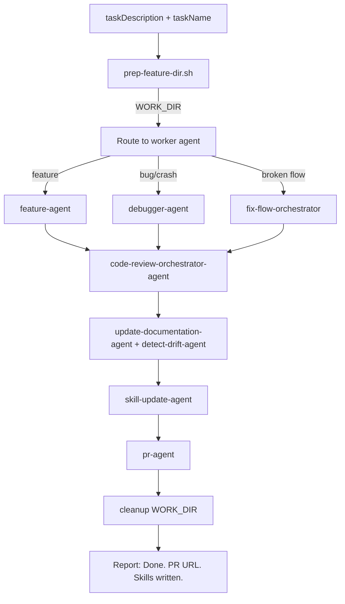

# dark-factory-agent

## Metadata

- System type: `flow`

## System Intent

- What this is: Top-level orchestrator for the dark-factory plugin. Accepts a task description, preps an isolated work directory, routes to the appropriate worker agent (feature, debugger, or fix-flow), runs code review and documentation housekeeping, opens a PR, and cleans up the work directory. The agent never writes or edits code itself — all work is delegated to sub-agents.

## Mermaid Diagram



## Flows

### Flow: `orchestration`
- Core files: `agents/dark-factory/agents/dark-factory-agent.md`, `agents/dark-factory/scripts/prep-feature-dir.sh`

#### Types

```txt
Input {
  taskDescription: string (required) — verbatim user request
  taskName: string (optional) — short slug for the work dir; derived from taskDescription if not provided
}

Output {
  prUrl: string — URL of the opened pull request
  skillsWritten: string[] — paths of any skill files updated
  workDir: string — path of the now-removed work directory
}
```

#### Paths

| path | input | output | path-type | notes |
| --- | --- | --- | --- | --- |
| `orchestration.success` | `Input` | `Output` | `happy path` | Work dir is removed after PR is merged |
| `orchestration.prep-failure` | `Input` | error report | `error` | prep-feature-dir.sh fails; no cleanup needed — work dir never created |
| `orchestration.worker-error` | `Input` | error report | `error` | Worker agent returns error; cleanup(WORK_DIR) runs then halts |
| `orchestration.code-review-error` | `Input` | error report | `error` | Code review fails; cleanup(WORK_DIR) runs then halts |
| `orchestration.drift-unresolvable` | `Input` | unresolved items report | `error` | detect-drift-agent surfaces items requiring developer input; cleanup(WORK_DIR) runs then halts |
| `orchestration.pr-error` | `Input` | error report | `error` | pr-agent errors or cannot merge; cleanup(WORK_DIR) runs then halts |

#### Pseudocode

```
dark-factory-agent(taskDescription, taskName):

  # Step 1 — prep isolated work dir
  bash agents/dark-factory/scripts/prep-feature-dir.sh <taskName>
  Capture WORK_DIR from stdout.
  If script fails: report error and STOP (no cleanup — work dir never created).

  # Step 2 — route to worker agent
  cd WORK_DIR
  Classify taskDescription → invoke feature-agent | fix-flow-orchestrator | debugger-agent
  If worker error: cleanup(WORK_DIR), report error, STOP
  planFilePath = path worker wrote its plan to (null if none)

  # Step 3 — code review
  invoke code-review-orchestrator-agent(planFilePath ?? "Task: <taskDescription>", WORK_DIR)
  If error: cleanup(WORK_DIR), report error, STOP

  # Step 4 — docs and drift
  invoke update-documentation-agent(planFilePath)   # pass null if none
  invoke detect-drift-agent(WORK_DIR/docs/docs/)
  If unresolvable drift items: report items, cleanup(WORK_DIR), STOP

  # Step 4c — skill update (non-fatal)
  try invoke skill-update-agent(planFilePath, WORK_DIR, taskDescription)
  catch: warn developer, continue

  # Step 5 — PR
  invoke pr-agent(planFilePath ?? taskDescription)
  If error: cleanup(WORK_DIR), report error, STOP
  prUrl = pr-agent result

  # Step 6 — cleanup
  cleanup(WORK_DIR)
  Report: "Done. PR: <prUrl>. Work dir <WORK_DIR> removed. Skills written: <skillsWritten>."

cleanup(WORK_DIR):
  cd dark_factory/
  rm -rf WORK_DIR
  If rm fails: warn developer (non-fatal).
```

#### Classification rules

| Signal in taskDescription | Route to |
|---|---|
| "add", "build", "create", "implement", "new feature" | `feature-agent` |
| "broken flow", "integration failing", "end-to-end", "pipeline" | `fix-flow-orchestrator` |
| "bug", "crash", "error", "fix", "broken", "not working", "debug" | `debugger-agent` |
| Ambiguous | Call PushNotification, then ask one clarifying question before routing |

#### /clear behavior

The orchestrator does **not** call `/clear` at any point. `/clear` is not issued at error paths, after cleanup, or at the end of a successful run. The developer calls `/clear` manually.

## Logs

| Source | Location |
|--------|----------|
| prep-feature-dir.sh stdout | stdout line `WORK_DIR=<value>` |

## Deployment

- Mechanism: `local only`
- Deploy command:
  ```bash
  /dark-factory:manufacture <task description>
  ```
- Notes: Invoked via the `/dark-factory:manufacture` Claude Code command. The orchestrator runs entirely within Claude Code — no external deployment infrastructure.
