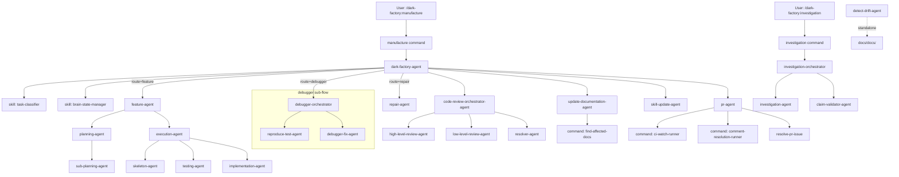

# dark-factory-agents

## Metadata

- System type: `flow`

## System Intent

- What this is: A catalog of every agent, sub-agent, command, and skill sub-flow in the dark-factory plugin. Dark-factory is a fully autonomous Claude Code plugin that builds features, fixes bugs, and drives integration flows end-to-end — from planning through PR and merge. All work is delegated through a tree of named agents invoked as sub-agents.

## Mermaid Diagram



## Flows

### Flow: `manufacture`

Top-level user-facing entry point. Routes a task description through the full dark-factory pipeline.

- Core files:
  - `commands/manufacture.md`
  - `agents/dark-factory/agents/dark-factory-agent.md`

#### Agents / Sub-flows

**dark-factory-agent** (`agents/dark-factory/agents/dark-factory-agent.md`)
- Model: haiku
- User-invocable: true (via `manufacture` command)
- Role: Top-level orchestrator. Classifies the task, preps an isolated worktree, routes to a worker agent, runs code review, updates documentation, updates skills, opens a PR, then cleans up.
- Invokes: `task-classifier` (skill), `brain-state-manager` (skill), `feature-agent`, `debugger-orchestrator`, `repair-agent`, `code-review-orchestrator-agent`, `update-documentation-agent`, `skill-update-agent`, `pr-agent`
- Scripts: `prep-feature-dir.sh`, `cleanup-worktree.sh`

**task-classifier** (`skills/task-classifier/SKILL.md`)
- Model: n/a (skill read by dark-factory-agent)
- User-invocable: false
- Role: Classifies a task description into one of three routes: `feature`, `debugger`, `repair`. Returns a classification string or prompts for clarification on ambiguity.

**brain-state-manager** (`skills/brain-state-manager/SKILL.md`)
- User-invocable: false
- Role: Manages `brain.json` state (create, read, patch, delete) in the isolated work dir. Dark-factory-agent must never write `brain.json` directly — always delegates to this skill.

---

### Flow: `feature`

Handles new feature development end-to-end with human plan approval at each phase.

**feature-agent** (`agents/featurework/agents/feature-agent.md`)
- Model: haiku
- User-invocable: false (spawned by dark-factory-agent for `route=feature`)
- Role: End-to-end feature orchestrator. Drives planning phases in sequence (draft plan → mermaid diagram → flows), gates on human AskUserQuestion approval between phases, then invokes execution-agent.
- Invokes: `planning-agent`, `execution-agent`
- Skills: `flow-state-manager`
- Commands: `render-plan-section`

**planning-agent** (`agents/featurework/planning/agents/planning-agent.md`)
- Model: haiku
- User-invocable: false
- Role: Lightweight phase-delegator. Receives a phase + context from feature-agent, delegates to sub-planning-agent, returns structured output. Does NOT interact with users.
- Invokes: `sub-planning-agent`

**sub-planning-agent** (`agents/featurework/planning/agents/sub-planning-agent.md`)
- Model: sonnet
- User-invocable: false
- Role: Heavy-lifting worker for the planning system. Researches codebase, writes plan files, runs scripts, generates mermaid diagrams. Handles all three phases: `draft_plan`, `mermaid`, `flows`.
- Skills: `create-mermaid-diagram`
- SubagentStop hook: `commit-on-subagent-stop.sh`

**execution-agent** (`agents/featurework/execution/agents/execution-agent.md`)
- Model: haiku
- User-invocable: false
- Role: Orchestrates end-to-end execution of an approved plan. Spawns skeleton-agent, testing-agent, and implementation-agent in strict sequence. Enters planning mode if a hard-stop deviation is triggered.
- Invokes: `skeleton-agent`, `testing-agent`, `implementation-agent`
- SubagentStop hook: `commit-on-subagent-stop.sh`

**skeleton-agent** (`agents/featurework/execution/agents/skeleton-agent.md`)
- Model: sonnet
- User-invocable: false
- Role: Phase 1 of execution. Reads plan, builds a files checklist (`tmp/files-checklist.md`), creates all skeleton files with correct structure but no implementation logic.
- SubagentStop hook: `commit-on-subagent-stop.sh`

**testing-agent** (`agents/featurework/execution/agents/testing-agent.md`)
- Model: sonnet
- User-invocable: false
- Role: Phase 2 of execution. Reads plan flows, writes one failing test per flow path, confirms all new tests fail before returning. Produces `tmp/flows-checklist.md`.
- SubagentStop hook: `commit-on-subagent-stop.sh`

**implementation-agent** (`agents/featurework/execution/agents/implementation-agent.md`)
- Model: sonnet
- User-invocable: false
- Role: Phase 3 of execution. Implements each flow from the flows checklist one at a time, runs tests after each, and invokes the deviation-protocol skill when a plan conflict cannot be resolved independently.
- Skills: `deviation-protocol`, `logging`
- SubagentStop hook: `commit-on-subagent-stop.sh`

**flow-state-manager** (`skills/flow-state-manager/SKILL.md`)
- User-invocable: false
- Role: Manages the flow approval state machine during feature planning. Tracks approved flows, current flow, and state persistence in `$DARK_FACTORY_WORK_DIR/flows-state.json`.

---

### Flow: `debugger`

Systematic debugging of non-obvious bugs using a three-phase structured orchestrator.

**debugger-orchestrator** (`agents/debugger/agents/debugger-orchestrator.md`)
- Model: haiku
- User-invocable: false (spawned by dark-factory-agent for `route=debugger`)
- Role: Top-level orchestrator for systematic debugging. Coordinates investigation, triage, test reproduction, and fix application across three specialized sub-agents with structural commit enforcement via SubagentStop hooks.
- Invokes: `reproduce-test-agent`, `debugger-fix-agent`
- Skills: `investigation-delegate`

**reproduce-test-agent** (`agents/debugger/agents/reproduce-test-agent.md`)
- Model: sonnet
- User-invocable: false
- Role: Phase 2 of debugger flow. Writes and executes a minimal failing reproduction test that isolates the bug behavior, verifies it fails, and stages files for SubagentStop commit.
- SubagentStop hook: `commit-on-subagent-stop.sh`

**debugger-fix-agent** (`agents/debugger/agents/debugger-fix-agent.md`)
- Model: sonnet
- User-invocable: false
- Role: Phase 3 of debugger flow. Identifies root cause from audit log evidence, applies minimal fix to address root cause only, verifies causality with reproduction test, and stages fixed files for SubagentStop commit.
- SubagentStop hook: `commit-on-subagent-stop.sh`

---

### Flow: `repair`

Lightweight targeted fix without a full plan file.

**repair-agent** (`agents/repair/agents/repair-agent.md`)
- Model: haiku
- User-invocable: false (spawned by dark-factory-agent for `route=repair`)
- Role: Applies a targeted change from a plain task description (no plan file), runs the test suite, and iteratively fixes failures up to 5 times. Invokes investigation-agent first for system context.
- Skills: `investigation-delegate`
- SubagentStop hook: `commit-on-subagent-stop.sh`

---

### Flow: `code-review`

Parallel high-level and low-level code review followed by iterative resolution.

**code-review-orchestrator-agent** (`agents/code-review/agents/code-review-orchestrator-agent.md`)
- Model: haiku
- User-invocable: false (spawned by dark-factory-agent after worker completes)
- Role: Spawns high-level-review-agent and low-level-review-agent in parallel, collects issues in `tmp/issues.md`, then loops resolver-agent until all issues are resolved.
- Invokes: `high-level-review-agent`, `low-level-review-agent`, `resolver-agent`

**high-level-review-agent** (`agents/code-review/agents/high-level-review-agent.md`)
- Model: sonnet
- User-invocable: false
- Role: Reviews code against the plan file for structural and architectural conformance. Appends high-level IssueItems to `tmp/issues.md`.

**low-level-review-agent** (`agents/code-review/agents/low-level-review-agent.md`)
- Model: sonnet
- User-invocable: false
- Role: Reviews code at the function level for bugs, untested paths, inter-agent conflicts, and refactor opportunities. Appends low-level IssueItems to `tmp/issues.md`.

**resolver-agent** (`agents/code-review/agents/resolver-agent.md`)
- Model: sonnet
- User-invocable: false
- Role: Reads `tmp/issues.md`, applies fixes for each unchecked item, checks them off, and returns whether any items remain unresolved. Called repeatedly by the orchestrator until the list is clean.

---

### Flow: `documentation`

Updates and validates system documentation after work is done.

**update-documentation-agent** (`agents/documentation/agents/update-documentation-agent.md`)
- Model: sonnet
- User-invocable: false (spawned by dark-factory-agent after code review)
- Role: Updates `docs/` based on an implemented plan. Identifies affected flows and docs via find-affected-docs, then deletes stale content, updates modified sections, and adds new information.
- Skills: `documentation`
- Commands: `find-affected-docs`
- SubagentStop hook: `commit-investigation-docs.sh`

**investigation-agent** (`agents/documentation/agents/investigation-agent.md`)
- Model: sonnet
- User-invocable: false (spawned by investigation-orchestrator, debugger-orchestrator, repair-agent)
- Role: General-purpose investigation agent. Given a system or topic, checks for existing docs, investigates the codebase if needed, creates or updates `docs/docs/<system>.md`, and returns the path.
- Skills: `investigate`, `documentation`
- SubagentStop hook: `commit-investigation-docs.sh`

**claim-validator-agent** (`agents/documentation/agents/claim-validator-agent.md`)
- Model: sonnet
- User-invocable: false (spawned by investigation-orchestrator)
- Role: Reads a documentation file, extracts factual claims (file paths, agent names, behavioral assertions), verifies each against source code, and returns verified/false claims so the orchestrator can iterate.
- SubagentStop hook: `commit-investigation-docs.sh`

**detect-drift-agent** (`agents/documentation/agents/detect-drift-agent.md`)
- Model: sonnet
- User-invocable: false (standalone or scoped to a specific doc)
- Role: Audits parity between `docs/docs/` and the actual codebase. Detects stale references, undocumented flows, and broken claims. Fixes straightforward drift in place and reports findings.
- Skills: `detect-drift`
- SubagentStop hook: `commit-investigation-docs.sh`

**skill-update-agent** (`agents/skill-update/agents/skill-update-agent.md`)
- Model: sonnet
- User-invocable: false (spawned by dark-factory-agent after documentation step)
- Role: Reviews completed work, identifies non-obvious recurring patterns, and writes or updates skill files in the target project's `skills/` directory so future manufacture runs benefit from that knowledge.
- SubagentStop hook: `commit-on-subagent-stop.sh`

---

### Flow: `pr`

PR lifecycle: open, watch CI, resolve review comments.

**pr-agent** (`agents/pr/agents/pr-agent.md`)
- Model: haiku
- User-invocable: false (spawned by dark-factory-agent as the final worker step)
- Role: Opens a PR, watches CI via ci-watch-runner, resolves review comments via comment-resolution-runner, and stops once CI is green and all threads resolved. Does NOT merge.
- Skills: `create-pr`
- Commands: `ci-watch-runner`, `comment-resolution-runner`
- PostToolUse hook: `append-footer-hook.sh`

**resolve-pr-issue** (`agents/pr/agents/resolve-pr-issue.md`)
- Model: sonnet
- User-invocable: false (spawned by pr-agent via ci-watch-runner / comment-resolution-runner)
- Role: Fixes one issue on a PR — either a CI failure (reads failed logs, applies fix, pushes) or an unresolved review thread (reads thread, applies fix, resolves thread).

---

### Flow: `investigation` (command)

User-facing investigation command that orchestrates documentation generation and claim validation.

**investigation command** (`commands/investigation.md`)
- User-invocable: true (via `/dark-factory:investigation`)
- Role: Thin dispatcher — delegates entirely to investigation-orchestrator.

**investigation-orchestrator** (`agents/commands/investigation-orchestrator.md`)
- Model: sonnet
- User-invocable: false
- Role: Orchestrates the investigation flow: invokes investigation-agent to generate docs, then loops calling claim-validator-agent up to 5 times until all claims are verified. Commits on SubagentStop.
- Invokes: `investigation-agent`, `claim-validator-agent`
- SubagentStop hook: `commit-investigation-docs.sh`

---

### Flow: Commands (utility, non-agent)

These are command files invoked by agents — they are not agents themselves but define behaviors invoked via `Command` tool.

| Command | File | Invoked by | Role |
|---|---|---|---|
| `ci-watch-runner` | `commands/ci-watch-runner.md` | `pr-agent` | Poll CI checks on a PR; spawn fix handlers for failures; retry up to maxIterations |
| `comment-resolution-runner` | `commands/comment-resolution-runner.md` | `pr-agent` | Iterate unresolved review threads; address each; re-check CI |
| `find-affected-docs` | `commands/find-affected-docs.md` | `update-documentation-agent` | Search docs/ for files affected by a feature plan |
| `manage-issues-file` | `commands/manage-issues-file.md` | code-review agents | Create, update, and manage `issues.md` during code review |
| `phase-gate-check` | `commands/phase-gate-check.md` | orchestration agents | Verify phase prerequisites in `brain.json` before a phase can run |
| `render-plan-section` | `commands/render-plan-section.md` | `feature-agent` | Extract and render a named section from a plan file |
| `metrics` | `commands/metrics.md` | User | Display ranked tables of slowest and most token-intensive agents/skills from `metrics.csv` |
| `gen-hooks` | `commands/gen-hooks.md` | User | Scan `.md` frontmatter for hook declarations and merge them into `.claude/settings.json` |
| `build-factory` | `commands/build-factory.md` | User | Open a new gnome-terminal running claude in remote-control mode |
| `destroy-factory` | `commands/destroy-factory.md` | User | Close the current terminal/factory session |
| `install` | `commands/install.md` | User | Install or reinstall the dark-factory plugin |
| `manufacture` | `commands/manufacture.md` | User | Top-level manufacture command — dispatches to dark-factory-agent |
| `investigation` | `commands/investigation.md` | User | Trigger investigation for a system — dispatches to investigation-orchestrator |

---

### Flow: Key Skills (referenced by agents)

Skills are instruction files read at runtime by agents. They are not agents themselves.

| Skill | Path | Used by |
|---|---|---|
| `task-classifier` | `skills/task-classifier/SKILL.md` | `dark-factory-agent` |
| `brain-state-manager` | `skills/brain-state-manager/SKILL.md` | `dark-factory-agent` |
| `flow-state-manager` | `skills/flow-state-manager/SKILL.md` | `feature-agent` |
| `investigation-delegate` | `skills/investigation-delegate/SKILL.md` | `debugger-orchestrator`, `repair-agent` |
| `deviation-protocol` | `skills/deviation-protocol/SKILL.md` | `implementation-agent` |
| `logging` | `skills/logging/SKILL.md` | `implementation-agent` |
| `create-mermaid-diagram` | `skills/create-mermaid-diagram/SKILL.md` | `sub-planning-agent` |
| `investigate` | `skills/investigate/SKILL.md` | `investigation-agent` |
| `documentation` | `skills/documentation/SKILL.md` | `investigation-agent`, `update-documentation-agent` |
| `detect-drift` | `skills/detect-drift/SKILL.md` | `detect-drift-agent` |
| `create-pr` | `skills/create-pr/SKILL.md` | `pr-agent` |
| `systematic-debugging` | `skills/debug/SKILL.md` | `debugger-agent` |

---

## Usage / Reference Notes

- All agents marked `user-invocable: false` are internal and only reachable through the orchestration tree.
- `debugger-orchestrator` is the top-level debugger router invoked by `dark-factory-agent` for `route=debugger`. It orchestrates `reproduce-test-agent` and `debugger-fix-agent` with structural commit enforcement.
- `detect-drift-agent` has no direct caller in the manufacture flow — it runs standalone or is triggered separately for documentation auditing.
- `manage-issues-file` command is declared but not referenced in agent frontmatter in the current codebase; usage may be inline within orchestration logic.
- The `metrics` command is user-facing only and not part of any automated flow.
- `build-factory`, `destroy-factory`, `install` are infrastructure/lifecycle commands not part of task execution.

## Logs

| Source | Location |
|--------|----------|
| Agent invocations | Claude Code session output |
| Brain state | `$DARK_FACTORY_WORK_DIR/brain.json` |
| Issues | `tmp/issues.md` (per-worktree, deleted after review) |
| Bug docs | `docs/bugs/bug-explanation-<N>.md` (persisted) |
| Investigation docs | `docs/docs/<system>.md` (persisted) |
| Metrics | `metrics.csv` (project root) |

## Deployment

- Mechanism: `local only` — Claude Code plugin installed via `claude plugin install`
- Deploy command:
  ```bash
  /dark-factory:install
  # or manually:
  claude plugin marketplace update dark-factory
  ```
- Notes: Plugin root is at `$CLAUDE_PLUGIN_ROOT`. Scripts under `agents/dark-factory/scripts/` are registered as hooks via `hooks/` directory or `.claude/settings.json` via `gen-hooks`.
