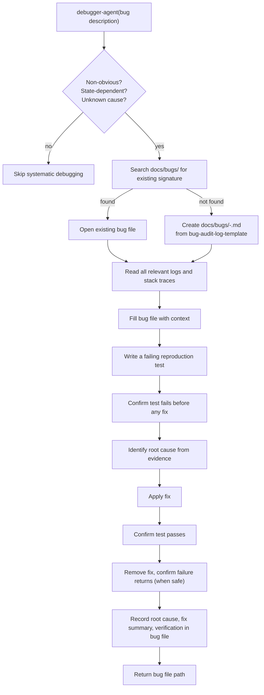

# debug-bug

## Metadata

- System type: `flow`

## System Intent

- What this is: The systematic bug-debugging flow. Given a non-obvious bug, follows a strict checklist: reproduce → confirm failure → identify root cause → fix → confirm fix → regression-confirm. Writes an audit log to `docs/bugs/` for every bug investigated. Does not open a PR — the caller (dark-factory-agent) handles that.

## Mermaid Diagram



## Flows

### Flow: `debugBug`

- Test files: `tests/`
- Core files: `agents/debugger/agents/debugger-agent.md`, `agents/debugger/skills/debug/SKILL.md`, `agents/debugger/skills/debug/templates/bug-audit-log-template.md`

#### Types

```txt
DebugBugInput {
  bugDescription: string (required — description of the failure to debug)
  scriptPaths: ScriptPaths (optional — provided by fix-flow-orchestrator when debugging integration flows)
  previousBugFiles: string[] (optional — list of prior bug-explanation file paths to avoid repeating known-bad fixes)
}

ScriptPaths {
  trigger: string (path to trigger.sh)
  waitForCompletion: string (path to wait-for-completion.sh)
  fetchLogs: string (path to fetch-logs.sh)
  deploy: string | null (path to deploy.sh, optional)
}

DebugBugOutput {
  bugFilePath: string (path to the written docs/bugs/<date>-<slug>.md file)
  resolved: boolean (true if bug is fixed; false if still open)
}

StandardError {
  message: string (human-readable description of what went wrong)
}
```

#### Paths

| path | input | output | path-type | notes |
| --- | --- | --- | --- | --- |
| `debugBug.success` | `DebugBugInput` | `DebugBugOutput { resolved: true }` | happy path | all checklist steps pass; bug file written with root cause and fix summary |
| `debugBug.unresolved` | `DebugBugInput` | `DebugBugOutput { resolved: false }` | partial | bug file written but fix not confirmed; caller decides whether to retry |
| `debugBug.obvious` | `DebugBugInput` | skipped | skip | bug is obvious/trivial; systematic debugging skipped |

#### Pseudocode

```
debugger-agent(bugDescription, scriptPaths?, previousBugFiles?):

  # Step 1: triage
  if bug is obvious or cause is already known: skip systematic protocol

  # Step 2: find or create bug file
  search docs/bugs/ for file with matching failure signature
  if found: open existing file
  if not found: create docs/bugs/<yyyy-mm-dd>-<slug>.md from bug-audit-log-template

  # Step 3: gather evidence
  read all relevant logs and stack traces (using scriptPaths.fetchLogs if provided)
  if previousBugFiles provided: read them to avoid repeating known-bad fixes

  # Step 4: fill bug file
  populate bug-audit-log-template fields with gathered context

  # Step 5: reproduce
  write a failing reproduction test
  run test suite; assert new test FAILS before any fix is applied

  # Step 6: fix
  identify root cause from evidence
  apply fix to source code

  # Step 7: verify
  run test suite; assert new test PASSES
  (if safe) remove fix temporarily; assert test FAILS again

  # Step 8: record
  write root cause, fix summary, and verification steps to bug file
  return { bugFilePath, resolved: true }
```

## Logs

| Source | Location |
|--------|----------|
| bug audit logs | `docs/bugs/<yyyy-mm-dd>-<slug>.md` |
| test output | Claude Code session transcript |
| integration flow logs | fetched via `fetch-logs.sh` (fix-flow context only) |

## Deployment

- Mechanism: `local only` — invoked as a sub-agent by dark-factory-agent or ralph-fix-and-push
- Notes: debugger-agent is not user-invocable directly. When called from fix-flow-orchestrator via ralph-fix-and-push, it receives script paths for triggering and fetching logs from the integration environment. When called from dark-factory-agent for a standalone bug report, no script paths are provided.
