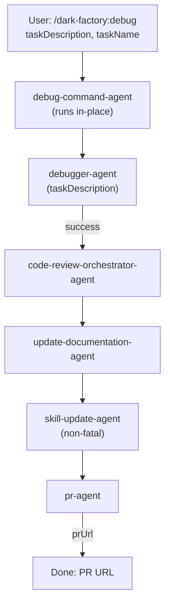

# /dark-factory:debug

Diagnoses and fixes a non-obvious bug — fills out a bug audit log, applies the fix, and opens a PR.

## Flow

## See also

- [debugger-agent](debugger-agent.md) — investigates and fixes bugs
- bug-audit-log-template.md — structured bug documentation
- [code-review-orchestrator-agent](code-review-orchestrator-agent.md) — reviews code changes
