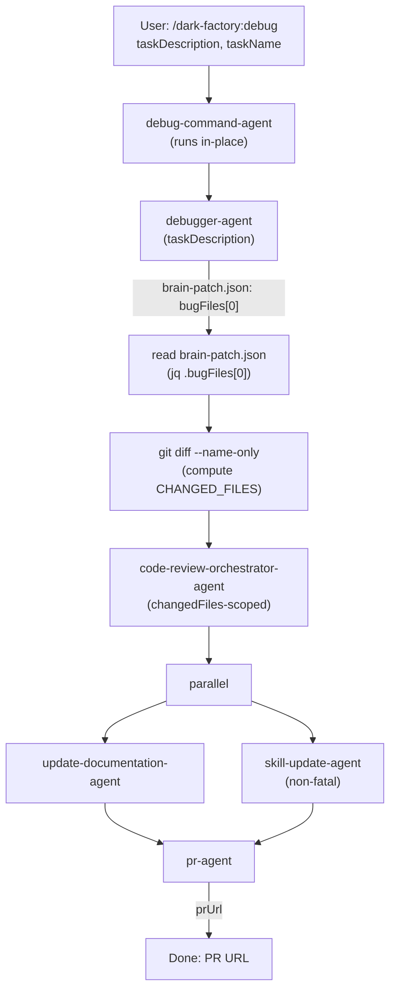

# /dark-factory:debug

Diagnoses and fixes a non-obvious bug — fills out a bug audit log, applies the fix, and opens a PR.

## Flow



## Orchestration

```
debug-command-agent(taskDescription, taskName):

  # Step 1 — derive taskName slug
  if taskName is empty:
    taskName = "debug-" + slugify(taskDescription)

  PROJECT_DIR = bash("git rev-parse --show-toplevel")

  # Step 2 — invoke debugger-agent
  result = invoke debugger-agent({ taskDescription })
  if result is error: report error and STOP

  # Step 3 — recover bug file path from brain-patch.json
  planFilePath = bash("jq -r '.bugFiles[0] // empty' \"$WORK_DIR/brain-patch.json\"")
  if planFilePath is empty: planFilePath = null

  # Step 4 — code review scoped to changed files only
  CHANGED_FILES = bash("git diff --name-only HEAD~1 || git diff --name-only --cached")
  invoke code-review-orchestrator-agent({
    planFilePath: planFilePath ?? "Task: " + taskDescription,
    codePath: PROJECT_DIR,
    changedFiles: CHANGED_FILES
  })

  # Step 5+6 — docs and skills in parallel (non-fatal)
  invoke in parallel:
    - update-documentation-agent({ planFilePath, workDir: PROJECT_DIR })
    - skill-update-agent({ planFilePath, workDir: PROJECT_DIR, taskSummary: taskDescription })

  # Step 7 — open PR
  prResult = invoke pr-agent({ planFilePath ?? taskDescription, workDir: PROJECT_DIR })
  Report: "Debug complete. PR: " + prResult.prUrl
```

## Key Design Rules

- **Scope code review to changed files** — pass `changedFiles` from `git diff --name-only` to code-review-orchestrator-agent so reviewers only read files touched by the fix, not the entire codebase.
- **Run docs and skills in parallel** — update-documentation-agent and skill-update-agent are independent; running them sequentially adds unnecessary latency.
- **Never skip code review, docs, or PR steps**.
- This agent runs in-place; worktree setup is handled by gotoworktree-command-agent.

## See also

- [debugger-agent](debugger-agent.md) — investigates and fixes bugs
- bug-audit-log-template.md — structured bug documentation
- [code-review-orchestrator-agent](code-review-orchestrator-agent.md) — reviews code changes (changedFiles-scoped)
