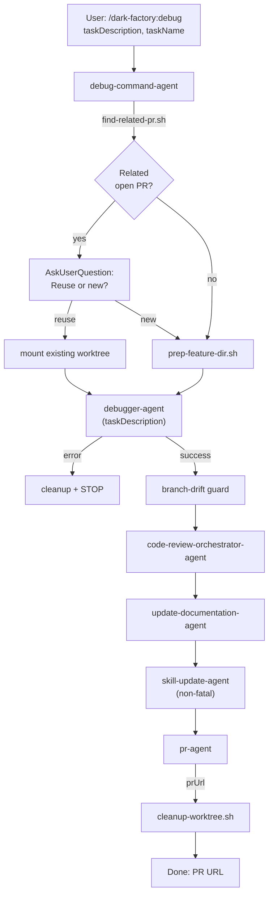

# debug-command-agent

## Metadata

- System type: `flow`

## System Intent

- What this is: The `debug-command-agent` backs the `/dark-factory:debug` slash command. It orchestrates systematic bug fixing: checks for related open PRs, creates or reuses a git worktree, delegates to `debugger-agent` to identify and fix the bug (including writing a bug audit log), then runs the full post-execution pipeline (code review → docs → skills → PR → cleanup). No plan file is generated; `taskDescription` is passed as fallback to downstream agents. State is passed directly between steps as local variables — no `brain.json` is created.

## Mermaid Diagram



## Flows

### Flow: `debugCommand`

- Test files: `N/A`
- Core files: `commands/debug.md`, `agents/dark-factory/agents/debug-command-agent.md`, `agents/debugger/agents/debugger-agent.md`

#### Types

```txt
DebugCommandInput {
  taskDescription: string (required — description of the bug)
  taskName:        string (optional — derived if absent)
}

DebugCommandOutput {
  prUrl:    string
  bugFiles: string[]  (paths to bug audit log files written)
}

StandardError {
  message: string (human-readable description of what went wrong)
}
```

#### Paths

| path | input | output | path-type | notes |
| --- | --- | --- | --- | --- |
| `debugCommand.success` | `DebugCommandInput` | `DebugCommandOutput` | happy path | bug fixed, docs updated, PR opened |
| `debugCommand.prep-failure` | `DebugCommandInput` | `StandardError` | error | worktree prep failed |
| `debugCommand.drift-guard-failure` | `DebugCommandInput` | `StandardError` | error | debugger-agent made no commits |
| `debugCommand.worker-error` | `DebugCommandInput` | `StandardError` | error | debugger-agent returned error |

#### Pseudocode

```
debug-command-agent(taskDescription, taskName):

  # Step 1 — derive taskName slug
  if taskName is empty:
    taskName = "debug-" + slugify(taskDescription)

  # Step 2 — PR reuse check + worktree prep
  PROJECT_DIR = bash("git rev-parse --show-toplevel")
  relatedPrOutput = bash("find-related-pr.sh taskDescription") || ""
  EXISTING_BRANCH = extract BRANCH= from relatedPrOutput
  ... (PR reuse + worktree prep, same pattern as plan-command-agent) ...
  branchRef = USE_EXISTING ? EXISTING_BRANCH : "feature/" + taskName

  # Step 3 — invoke debugger-agent (no brain.json created)
  result = invoke debugger-agent({ taskDescription })

  if result is error:
    run cleanup(WORK_DIR, taskName)
    report error: result.message
    STOP

  # Step 4 — branch drift guard
  if no commits ahead of main: cleanup + STOP

  planFilePath = null  # no plan file for debugger route

  # Steps 5-8 — post-execution pipeline
  invoke code-review-orchestrator-agent({
    planFilePath: planFilePath ?? "Task: " + taskDescription,
    codePath: WORK_DIR
  })
  invoke update-documentation-agent({ planFilePath, workDir: WORK_DIR })
  try: invoke skill-update-agent({ planFilePath, workDir: WORK_DIR, taskSummary: taskDescription })
  prResult = invoke pr-agent({ planFilePath ?? taskDescription })

  bash("cleanup-worktree.sh WORK_DIR taskName")
  Report: "Debug complete. PR: " + prResult.prUrl
  STOP
```

## Logs

| Source | Location |
|--------|----------|
| command agent stdout | PR URL reported directly on completion |
| bug audit logs | `docs/bugs/<date>-<slug>.md` (written by debugger-agent, persisted) |

## Deployment

- Mechanism: `local only`
- Deploy command:
  ```bash
  /dark-factory:debug
  ```
- Notes: Invoked as a Claude Code slash command. Requires the dark-factory plugin installed. No plan file is generated — `taskDescription` is passed as fallback to code-review and pr-agent. The worktree is cleaned up after the PR is opened.
