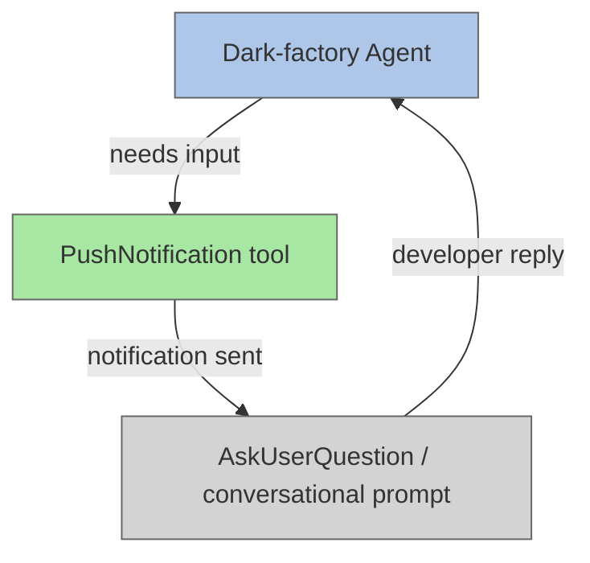

# Desktop Notification Before User Input

## Metadata

- System type: `flow`

## System Intent

- What this is: A cross-cutting instrumentation pattern applied to every dark-factory agent that requests developer input. Whenever an agent is about to block on a developer reply, it first calls the `PushNotification` tool so the developer receives an OS-level desktop notification.

## Mermaid Diagram



## Flows

### Flow: `notifyThenAsk`

- Core files: all 9 agent instruction files listed in the Application Sites table below

#### Types

```txt
PushNotificationPayload {
  title: string  (short label, e.g. "Input Required")
  message: string (one sentence describing what the agent needs)
}

NotifyThenAskInput {
  context: string  (what the agent was doing when it needs input)
  question: string (the exact question being asked of the developer)
}

NotifyThenAskOutput {
  developerReply: string
}

StandardError {
  message: string (human-readable description of what went wrong)
}
```

#### Paths

| path | input | output | path-type | notes |
| --- | --- | --- | --- | --- |
| `notifyThenAsk.success` | `NotifyThenAskInput` | `NotifyThenAskOutput` | happy path | PushNotification fires, developer replies |
| `notifyThenAsk.notificationIgnored` | `NotifyThenAskInput` | `NotifyThenAskOutput` | happy path | Developer misses notification but still replies — behavior is identical |

#### Pseudocode

```
function notifyThenAsk(title, message, question):
  PushNotification(title=title, message=message)
  reply = ask(question)   // conversational or AskUserQuestion tool
  return reply
```

## Application Sites

Every location where the pattern is applied:

| Agent file | Trigger condition | PushNotification title | PushNotification message |
|---|---|---|---|
| `agents/featurework/agents/feature-agent.md` | Before plan-approval prompt | `"Plan Approval Required"` | `"A plan is ready for your review and requires approval to proceed."` |
| `agents/featurework/planning/agents/planning-agent.md` | Before each stage-gate approval | `"Plan Review Required"` | `"A planning stage is ready for your review and approval."` |
| `agents/featurework/execution/skills/deviation-protocol/SKILL.md` | Before conflict-decision prompt | `"Developer Decision Required"` | `"A plan conflict was encountered and requires your decision to continue."` |
| `agents/featurework/execution/agents/execution-agent.md` | Before hard-stop wait | `"Execution Paused — Input Required"` | `"Plan execution has been paused due to a hard-stop. Review the plan and reply when ready to resume."` |
| `agents/fix-flow/agents/fix-flow-orchestrator.md` | Missing flow-name argument | `"Input Required"` | `"The fix-flow orchestrator needs a flow name to proceed."` |
| `agents/fix-flow/agents/ralph-fix-and-push.md` | Debugger-agent stuck on repeated root cause | `"Debugging Stuck — Input Required"` | `"The debugger-agent is stuck on a repeated root cause and needs your guidance to proceed."` |
| `agents/dark-factory/agents/dark-factory-agent.md` | Ambiguous task classification | `"Clarification Required"` | `"The dark-factory agent needs one clarification before it can route your request."` |
| `agents/documentation/agents/detect-drift-agent.md` | Unresolvable `wrong` drift items | `"Documentation Drift — Input Required"` | `"The detect-drift agent found items it cannot resolve automatically and needs your guidance."` |
| `agents/documentation/agents/update-documentation-agent.md` | Missing plan-path argument | `"Input Required"` | `"The update-documentation agent needs a plan path to proceed."` |

## Logs

| Source | Location |
|--------|----------|
| N/A | No log sinks — all changes are agent instruction text only |

## Deployment

- Mechanism: `local only`
- Deploy command:
  ```bash
  # No deployment needed — changes are .md instruction files only
  ```
- Notes: All changes are to agent instruction `.md` files. No code is compiled or deployed. Changes take effect immediately when an agent reads its updated instructions.
