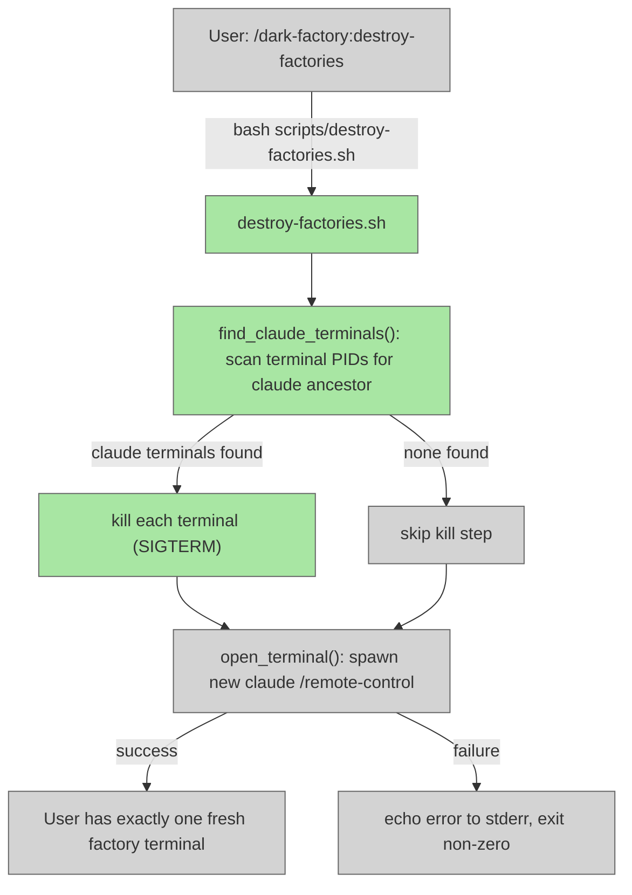

# destroy-factories

## Metadata

- System type: `flow`
- Owner: dark-factory plugin
- Source files: `commands/destroy-factories.md`, `scripts/destroy-factories.sh`
- Test files: `tests/test_destroy_factories.py`

## System Intent

- What this is: A slash command and companion shell script that terminates all other running Claude / dark-factory terminal sessions and spawns one fresh factory terminal, leaving the user with exactly one active terminal. Safe by design: only terminals whose process tree contains a `claude` descendant process are targeted; unrelated terminals are never touched.
- Primary consumer(s): Developers who want to reset all running dark-factory sessions back to a single clean state. Invoked via `/dark-factory:destroy-factories`.
- Boundary: `commands/destroy-factories.md` is the slash command entrypoint (thin stub). All logic runs in `scripts/destroy-factories.sh`, which is responsible for finding Claude terminals, killing them, and spawning a fresh one. Platform: Linux only (same platform as `reopen-remote-control.sh`).

## Mermaid Diagram



## Flows

### Flow: `destroy-factories`

- Test files: `tests/test_destroy_factories.py`
- Core files: `commands/destroy-factories.md`, `scripts/destroy-factories.sh`

#### Types

```txt
DestroyFactoriesInput {
  name: string (optional, default: "dark factory" — remote-control session name for the new terminal)
}

DestroyFactoriesOutput {
  void (side effects: all Claude terminals killed, one new factory terminal spawned)
}

StandardError {
  message: string (written to stderr)
}
```

#### Paths

| path | input | output | path-type | notes |
| --- | --- | --- | --- | --- |
| `destroy-factories.success` | `DestroyFactoriesInput` | `DestroyFactoriesOutput` | `happy path` | All Claude terminals found and killed; new factory terminal spawned successfully |
| `destroy-factories.none-found` | `DestroyFactoriesInput` | `DestroyFactoriesOutput` | `happy path` | No other Claude terminals found; new factory terminal spawned (no kills needed) |
| `destroy-factories.kill-failed` | `DestroyFactoriesInput` | `StandardError` | `degraded` | One or more terminals could not be killed (permission error); warns to stderr, continues to spawn |
| `destroy-factories.spawn-failed` | `DestroyFactoriesInput` | `StandardError` | `error` | New terminal could not be opened (no emulator found or emulator returned non-zero); exits non-zero |

#### Pseudocode

```
NAME = argv[1] ?? "dark factory"

# Step 1: Find terminal emulator processes that have a claude descendant
find_claude_terminals():
  own_ancestor_pid = find_terminal_ancestor($$)   # walk up process tree
  for each terminal_pid in all_terminal_emulator_pids():
    if terminal_pid == own_ancestor_pid: skip      # never kill self
    if has_claude_descendant(terminal_pid):
      yield terminal_pid

# Step 2: Kill each found terminal
KILLED = 0
for pid in find_claude_terminals():
  kill pid || warn("could not kill PID $pid")
  KILLED += 1

# Step 3: Spawn fresh factory (reusing open_terminal logic from reopen-remote-control.sh)
open_terminal(NAME) || { echo error; exit 1 }
```

#### Key implementation details

- `all_terminal_emulator_pids()` — uses `pgrep -x` for each of: `gnome-terminal`, `gnome-terminal-server`, `xterm`, `konsole`, `x-terminal-emulator`.
- `has_claude_descendant(pid)` — recursively walks child processes via `pgrep -P`; returns 0 if any descendant's `comm` field equals `claude`.
- `find_terminal_ancestor(pid)` — walks up the process tree from `$$` to find the nearest terminal emulator ancestor; used to determine which terminal to skip (our own terminal).
- `open_terminal()` — tries terminal emulators in order: `gnome-terminal`, `x-terminal-emulator`, `xterm`, `konsole`. Returns 0 on first success; returns 1 if none found.
- Kill is non-fatal: a failed `kill` emits a warning to stderr but the flow continues to spawn the new terminal.
- Structured log format: `destroy-factories | <flow> | <step> | <data>` written to stderr.

## Logs

| Source | Location |
|--------|----------|
| script stderr | terminal session running the destroy-factories command (structured logs: `destroy-factories | <flow> | <step> | <data>`) |

## Deployment

- Mechanism: `local only`
- Deploy command:
  ```bash
  # Called automatically by the /dark-factory:destroy-factories slash command.
  # Can also be invoked directly:
  bash scripts/destroy-factories.sh "dark factory"
  ```
- Notes: Linux only (same platform support as `reopen-remote-control.sh`). Requires at least one of: `gnome-terminal`, `x-terminal-emulator`, `xterm`, or `konsole`. The script is safe by design — it only kills terminals whose process tree contains a `claude` descendant.
