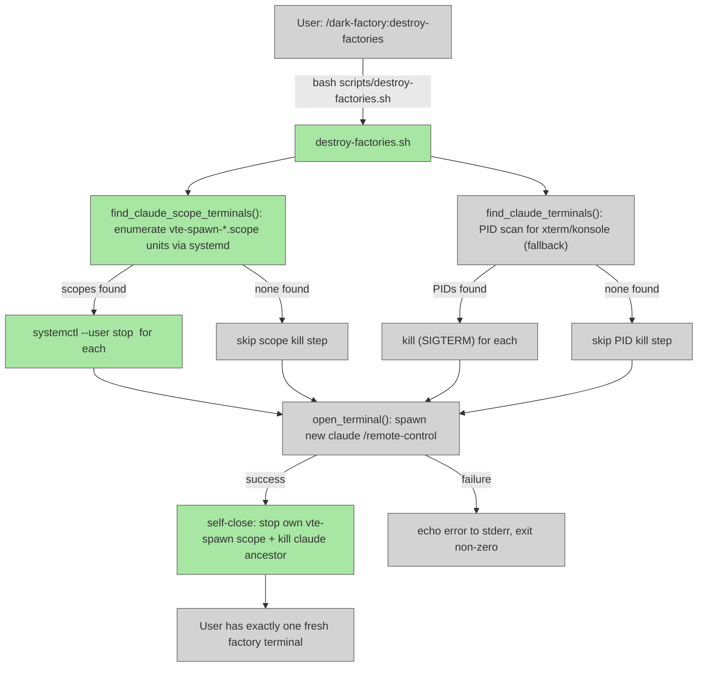

# destroy-factories

## Metadata

- System type: `flow`
- Owner: dark-factory plugin
- Source files: `commands/destroy-factories.md`, `scripts/destroy-factories.sh`
- Test files: `tests/test_destroy_factories.py`

## System Intent

- What this is: A slash command and companion shell script that terminates all other running Claude / dark-factory terminal sessions and spawns one fresh factory terminal, leaving the user with exactly one active terminal. Safe by design: only terminals whose process tree contains a `claude` descendant process are targeted; unrelated terminals are never touched.
- Primary consumer(s): Developers who want to reset all running dark-factory sessions back to a single clean state. Invoked via `/dark-factory:destroy-factories`.
- Boundary: `commands/destroy-factories.md` is the slash command entrypoint (thin stub). All logic runs in `scripts/destroy-factories.sh`, which is responsible for finding Claude terminals, killing them, spawning a fresh one, and then self-closing. Platform: Linux only (same platform as `reopen-remote-control.sh`). GNOME terminals are identified via systemd vte-spawn cgroup scopes; non-GNOME terminals use PID-based detection as a fallback.

## Mermaid Diagram



## Flows

### Flow: `destroy-factories`

- Test files: `tests/test_destroy_factories.py`
- Core files: `commands/destroy-factories.md`, `scripts/destroy-factories.sh`

#### Types

```txt
DestroyFactoriesInput {
  name: string (optional, default: "dark factory" — remote-control session name for the new terminal)
}

DestroyFactoriesOutput {
  void (side effects: all Claude terminals killed, one new factory terminal spawned)
}

StandardError {
  message: string (written to stderr)
}
```

#### Paths

| path | input | output | path-type | notes |
| --- | --- | --- | --- | --- |
| `destroy-factories.success` | `DestroyFactoriesInput` | `DestroyFactoriesOutput` | `happy path` | All Claude terminals found and killed; new factory terminal spawned successfully |
| `destroy-factories.none-found` | `DestroyFactoriesInput` | `DestroyFactoriesOutput` | `happy path` | No other Claude terminals found; new factory terminal spawned (no kills needed) |
| `destroy-factories.kill-failed` | `DestroyFactoriesInput` | `StandardError` | `degraded` | One or more terminals could not be killed (permission error); warns to stderr, continues to spawn |
| `destroy-factories.spawn-failed` | `DestroyFactoriesInput` | `StandardError` | `error` | New terminal could not be opened (no emulator found or emulator returned non-zero); exits non-zero |

#### Pseudocode

```
NAME = argv[1] ?? "dark factory"

# Step 1a: Find GNOME terminal windows via vte-spawn systemd scopes (primary path)
find_claude_scope_terminals():
  SELF_SCOPE = grep vte-spawn-*.scope from /proc/$$/cgroup   # own window's scope
  for each scope in systemctl --user list-units vte-spawn-*:
    if scope == SELF_SCOPE: skip                              # never kill self
    main_pid = systemctl --user show scope --property=MainPID
    if has_claude_descendant(main_pid):
      yield scope

# Step 1b: Find non-GNOME terminals via PID scan (fallback path)
find_claude_terminals():
  for each terminal_pid in pgrep xterm, konsole, x-terminal-emulator:
    if terminal_pid == own_pid: skip
    if has_claude_descendant(terminal_pid):
      yield terminal_pid

# Step 2: Stop / kill each found terminal
KILLED = 0
for scope in find_claude_scope_terminals():
  systemctl --user stop scope || warn("could not stop scope $scope")
  KILLED += 1
for pid in find_claude_terminals():
  kill pid || warn("could not kill PID $pid")
  KILLED += 1

# Step 3: Spawn fresh factory
open_terminal(NAME) || { echo error; exit 1 }

# Step 4: Self-close this terminal
SELF_SCOPE = grep vte-spawn-*.scope from /proc/$$/cgroup
if SELF_SCOPE:
  systemctl --user stop SELF_SCOPE
# also kill own claude ancestor process
walk up process tree from $$:
  if process name == "claude": kill it; break
```

#### Key implementation details

- `all_vte_scopes()` — runs `systemctl --user list-units --type=scope 'vte-spawn-*'` to enumerate all active GNOME terminal window scopes. Each gnome-terminal window/tab gets its own unique `vte-spawn-<uuid>.scope` in the user's systemd session; this avoids the problem of all windows sharing a single `gnome-terminal-server` daemon PID.
- `scope_main_pid(scope)` — runs `systemctl --user show <scope> --property=MainPID --value` to get the lead PID of a scope; filters out `0` (scope already stopped).
- `find_claude_scope_terminals()` — identifies this terminal's own scope from `/proc/$$/cgroup`, then iterates all vte-spawn scopes, skips self, and yields scopes whose main PID has a claude descendant.
- `find_claude_terminals()` — PID-based fallback for `xterm`, `konsole`, `x-terminal-emulator` (gnome-terminal is handled by the scope path and excluded here).
- `has_claude_descendant(pid)` — recursively walks child processes via `pgrep -P`; returns 0 if any descendant's `comm` field equals `claude`.
- `open_terminal()` — tries terminal emulators in order: `gnome-terminal`, `x-terminal-emulator`, `xterm`, `konsole`. Returns 0 on first success; returns 1 if none found.
- Kill/stop is non-fatal: a failed stop or kill emits a warning to stderr but the flow continues to spawn the new terminal.
- Self-close (Step 4): after spawning the fresh terminal, the script stops its own vte-spawn scope and kills its own claude ancestor process so the originating session fully terminates.
- Structured log format: `destroy-factories | <flow> | <step> | <data>` written to stderr.

## Logs

| Source | Location |
|--------|----------|
| script stderr | terminal session running the destroy-factories command (structured logs: `destroy-factories | <flow> | <step> | <data>`) |

## Deployment

- Mechanism: `local only`
- Deploy command:
  ```bash
  # Called automatically by the /dark-factory:destroy-factories slash command.
  # Can also be invoked directly:
  bash scripts/destroy-factories.sh "dark factory"
  ```
- Notes: Linux only (same platform support as `reopen-remote-control.sh`). Requires at least one of: `gnome-terminal`, `x-terminal-emulator`, `xterm`, or `konsole`. On GNOME systems the script uses `systemd` vte-spawn cgroup scopes to identify individual gnome-terminal windows; on non-GNOME systems it falls back to PID-based detection. The script is safe by design — it only stops/kills terminals whose process tree contains a `claude` descendant. After spawning a fresh terminal, the script self-closes: it stops its own vte-spawn scope and kills its own `claude` ancestor process.
