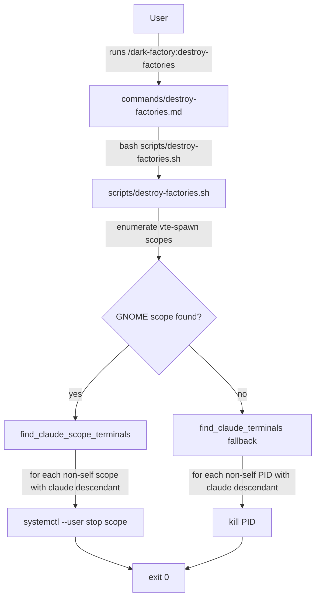

# destroy-factories

## Metadata

- System type: `command`

## System Intent

- What this is: A Claude Code slash command that kills all other terminal emulator windows running a `claude` process, without spawning any new terminal or performing any install. Safe by design: only terminals whose process tree contains a `claude` descendant are targeted. The calling terminal is never killed.

## Mermaid Diagram



## Flows

### Flow: `destroy-factories`

- Core files: `commands/destroy-factories.md`, `scripts/destroy-factories.sh`
- Test files: `tests/test_destroy_factories.py`, `tests/test_destroy_factories_kills_other_windows.py`

#### Types

```txt
Input {
  (none) — command takes no arguments
}

Output {
  side-effect: all other Claude terminals killed; calling terminal untouched
}
```

#### Paths

| path | input | output | path-type | notes |
| --- | --- | --- | --- | --- |
| `destroy-factories.success` | none | other Claude terminals stopped/killed; exits 0 | `happy path` | GNOME: uses systemctl scope stop; fallback: kill by PID |
| `destroy-factories.none-found` | none | no kills performed; exits 0 | `happy path` | loop iterates over empty list; no error |
| `destroy-factories.kill-failed` | none | warns to stderr; continues; exits 0 | `error` | kill or scope stop failure is non-fatal |

#### Pseudocode

```
# Primary path: GNOME vte-spawn scope targeting
SELF_SCOPE = own vte-spawn scope from /proc/$$/cgroup

for each vte-spawn scope in systemctl user units:
    skip if scope == SELF_SCOPE
    main_pid = scope_main_pid(scope)
    if has_claude_descendant(main_pid):
        systemctl --user stop scope || warn

# Fallback path: PID-based for xterm/konsole/x-terminal-emulator
for each terminal (xterm, konsole, x-terminal-emulator):
    for each PID running that terminal:
        skip if PID == own PID
        if has_claude_descendant(PID):
            kill PID || warn

exit 0
```

## Logs

| Source | Location |
|--------|----------|
| kill/stop events | stderr of the calling claude session (`destroy-factories \| <flow> \| <step> \| <data>`) |
| kill failures | stderr warning: `Warning: could not stop/kill ...` |

## Deployment

- Mechanism: `local only`
- Deploy command:
  ```bash
  # No deployment needed; the command and script ship with the plugin.
  # Install via:
  /dark-factory:install
  ```
- Notes: This command only kills other Claude terminals. It does not spawn a new terminal, does not install anything, and does not close itself. Requires Linux with systemd (GNOME) or at least one of `xterm`, `konsole`, `x-terminal-emulator` for the fallback path.
