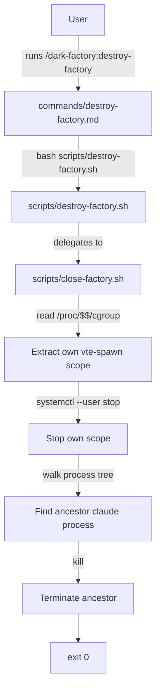

# destroy-factory

## Metadata

- System type: `command`

## System Intent

- What this is: A Claude Code slash command that closes the current terminal/factory session by stopping its vte-spawn cgroup scope and killing the ancestor `claude` process. Only affects the terminal the command is run from — does not affect any other terminals or sessions.

## Mermaid Diagram



## Flows

### Flow: `destroy-factory`

- Core files: `commands/destroy-factory.md`, `scripts/destroy-factory.sh`, `scripts/close-factory.sh`
- Test files: `tests/test_destroy_factory.py`, `tests/test_destroy_factory_kills_other_windows.py`

#### Types

```txt
Input {
  (none) — command takes no arguments
}

Output {
  side-effect: current terminal's vte-spawn scope stopped; ancestor claude process killed
}
```

#### Paths

| path | input | output | path-type | notes |
| --- | --- | --- | --- | --- |
| `destroy-factory.success` | none | current terminal closed cleanly; exits 0 | `happy path` | Stops own vte-spawn scope via systemctl; kills ancestor claude |

#### Pseudocode

```
# Self-close only: target current terminal only
SCOPE = own vte-spawn scope from /proc/$$/cgroup

# Stop the scope
systemctl --user stop "$SCOPE"

# Walk process tree and kill ancestor claude
PPID = parent of $$
while PPID is not 1:
    PNAME = name of process PPID
    if PNAME == "claude":
        kill PPID
        break
    PPID = parent of PPID

exit 0
```

## Logs

| Source | Location |
|--------|----------|
| scope stop/kill events | stderr of the calling claude session (`destroy-factory \| <flow> \| <step> \| <data>`) |

## Deployment

- Mechanism: `local only`
- Deploy command:
  ```bash
  # No deployment needed; the command and script ship with the plugin.
  # Install via:
  /dark-factory:install
  ```
- Notes: This command only closes the terminal it is run from. It does not spawn a new terminal, does not install anything, and does not affect other terminals. Requires Linux with systemd (GNOME) or similar cgroup-based terminal management.
