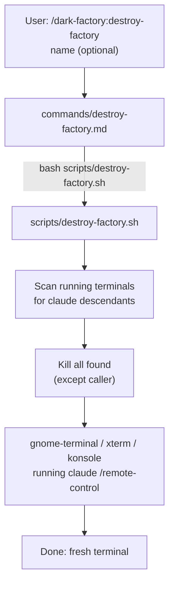

# /dark-factory:destroy-factory

Terminates all other running Claude/dark-factory terminal sessions and spawns one fresh factory terminal.

## Flow

## See also

- scripts/destroy-factory.sh — terminal detection and cleanup
- [/dark-factory:build-factory](build-factory.md) — opens one additional terminal without cleanup
